# 🎓 CvSU Document Generator — Knowledge Hub

Welcome to the central knowledge repository and technical documentation vault for the **CvSU Document Generator**, an institutional desktop application designed for Cavite State University faculty members to automate academic document generation.

```mermaid
graph TD
    MOC["[[CvSU Document Generator MOC]]"]
    Arch["[[System Architecture]]"]
    Bridge["[[PyWebView Bridge]]"]
    Pipeline["[[Generator Pipeline]]"]
    Orch["[[Orchestrator Lifecycle]]"]
    UI["[[UI Architecture]]"]

    Gens["[[Generators Overview]]"]
    CEITGen["[[CEIT Generator]]"]
    AttGen["[[Attendance Generator]]"]
    GradeGen["[[Grading Generator]]"]

    Templates["[[Template Guidelines]]"]
    CEITTpl["[[CEIT Templates]]"]
    AttTpl["[[Attendance Templates]]"]
    GradeTpl["[[Grading Templates]]"]

    Guides["[[User Manual]]"]
    Inputs["[[Input File Conventions]]"]
    Trouble["[[Troubleshooting]]"]

    Dev["[[Development Workflow]]"]
    TestStrat["[[Testing Strategy]]"]
    BuildPkg["[[Build & Packaging]]"]

    Release["[[v1.0.1]]"]

    MOC --> Arch
    MOC --> Gens
    MOC --> Templates
    MOC --> Guides
    MOC --> Dev
    MOC --> Release

    Arch --> Bridge
    Arch --> Pipeline
    Arch --> Orch
    Arch --> UI

    Gens --> CEITGen
    Gens --> AttGen
    Gens --> GradeGen

    Templates --> CEITTpl
    Templates --> AttTpl
    Templates --> GradeTpl

    Guides --> Inputs
    Guides --> Trouble

    Dev --> TestStrat
    Dev --> BuildPkg
```

---

## 🧭 Vault Navigation

### 🏗️ 01 - Architecture & Design
- **[[System Architecture]]**: High-level application architecture, PyWebView runtime, and subprocess isolation.
- **[[PyWebView Bridge]]**: Modular `ScriptAPI` mixin structure (`ScheduleRosterMixin`, `ConfigMixin`, `TemplateMixin`, `SystemMixin`, `GenerationMixin`).
- **[[Generator Pipeline]]**: Data parsing, class matching, and generator routing pipeline.
- **[[Orchestrator Lifecycle]]**: Threading, progress telemetry, cancellation tokens, and error aggregation in `process_all`.
- **[[UI Architecture]]**: Responsive 6-step workflow stepper, themes, toast engine, and accessibility (WCAG 2.1 AA).

### ⚙️ 02 - Document Generators
- **[[Generators Overview]]**: Technical comparison and contracts across the 3 document generation engines.
- **[[CEIT Generator]]**: Document generation for official CEIT department forms (`ceit_gen.py`).
- **[[Attendance Generator]]**: Dynamic calendar parsing and monthly attendance sheets (`attendance_gen.py`).
- **[[Grading Generator]]**: Official Excel grading sheets with formula preservation (`grade_gen.py`).

### 📋 03 - Templates & Schemas
- **[[Template Guidelines]]**: Global template architecture, bundle mechanisms, and font auto-scaling safeguards.
- **[[CEIT Templates]]**: Word `.docx` table layout schemas and placeholder replacement keys.
- **[[Attendance Templates]]**: Attendance `.docx` column structures and calendar cells.
- **[[Grading Templates]]**: Excel `.xlsx` Lecture and Lecture & Lab workbook layouts and formula ranges.

### 📖 04 - User Guides & Operations
- **[[User Manual]]**: Comprehensive 6-step guide for faculty members using the graphical interface.
- **[[Input File Conventions]]**: Faculty schedule spreadsheets and student roster naming rules.
- **[[Troubleshooting]]**: Windows SmartScreen resolution, publisher certificates, and error diagnostics.

### 🛠️ 06 - Development & Operations
- **[[Development Workflow]]**: Branching strategy (`dev` vs `main`), commit rules, and versioning.
- **[[Testing Strategy]]**: Automated test suites in `tests/`, Pytest fixtures, Playwright UI testing, and vault verification.
- **[[Build & Packaging]]**: PyInstaller standalone executable bundling, PE metadata, and Authenticode signing.

### 🚀 05 - Releases & Changelogs
- **[[v1.0.1]]**: Release notes for version 1.0.1 (Visual Stepper, Cancellation Engine, Toast Notifications, Playwright E2E).

---

## ⚡ Quick Reference
- **Author & Publisher**: Dan Joseph Ortega (© 2026 Dan Joseph Ortega. All rights reserved.)
- **Application Repository**: `C:\Users\danjo\OneDrive\CVSU GENERATORS` (`DrinkBoooz/cvsu-generators`)
- **Active Development Branch**: `dev`
- **Documentation Vault**: `C:\Users\danjo\OneDrive\cvsu-generator_documentation` (Companion workspace repository, Git-tracked)
