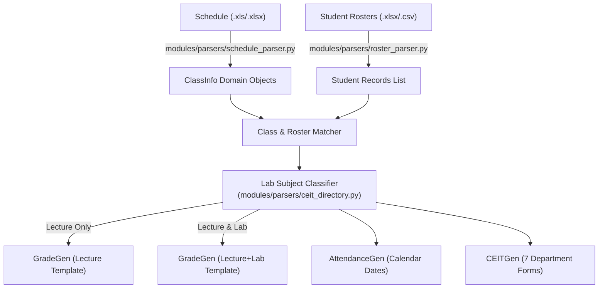

# Generator Pipeline

The **Generator Pipeline** is responsible for transforming raw input spreadsheets into clean domain models, matching class sections with their corresponding student rosters, and dispatching tasks to document generators.

Related notes:
- [[CvSU Document Generator MOC]]
- [[System Architecture]]
- [[Orchestrator Lifecycle]]
- [[Generators Overview]]
- [[Input File Conventions]]

---

## 🔄 End-to-End Pipeline Stages

---

## 1. Schedule Parsing (`modules/parsers/schedule_parser.py`)
- Reads the official Faculty Timetable Schedule using `openpyxl` or `xlrd`.
- Identifies:
  - Instructor full name and college title.
  - Semester and Academic Year (e.g. `1st Semester A.Y. 2026-2027`).
  - Table grid rows: Course Code, Course Title, Section (`BSCS 1-4`), Schedule Code (`202612040`), Room, Contact Hours (Lec / Lab), Days of week (`M`, `T`, `W`, `TH`, `F`, `S`), and Meeting Times.
- Cleans and consolidates multi-block schedules (e.g. separate Lecture and Lab sessions for the same class section).

## 2. Roster Parsing (`modules/parsers/roster_parser.py`)
- Reads student rosters exported from the CvSU Registrar portal.
- Extracts:
  - Student Full Name (Column A)
  - Student Number (Column B)
- Strips portal metadata columns, empty trailing rows, and normalizes capitalization.
- Pairs with schedule blocks using the standard naming pattern:
  `{Course/Sec} List of Students for {ScheduleCode}-{Subject}.xlsx`

## 3. Lab Classification (`modules/parsers/ceit_directory.py`)
- Analyzes syllabus lab hours and cross-references against `KNOWN_LAB_SUBJECT_CODES` (e.g. `ITEC 50`, `DCIT 21`, `COSC 60`).
- Flags classes requiring the 4-tab Excel grading workbook (`GRADING_LECTURE_LAB_TEMPLATE.xlsx`) versus standard lecture courses (`GRADING_LECTURE_TEMPLATE.xlsx`).
- Provides fallback user overrides configured in Step 3 of the UI.
