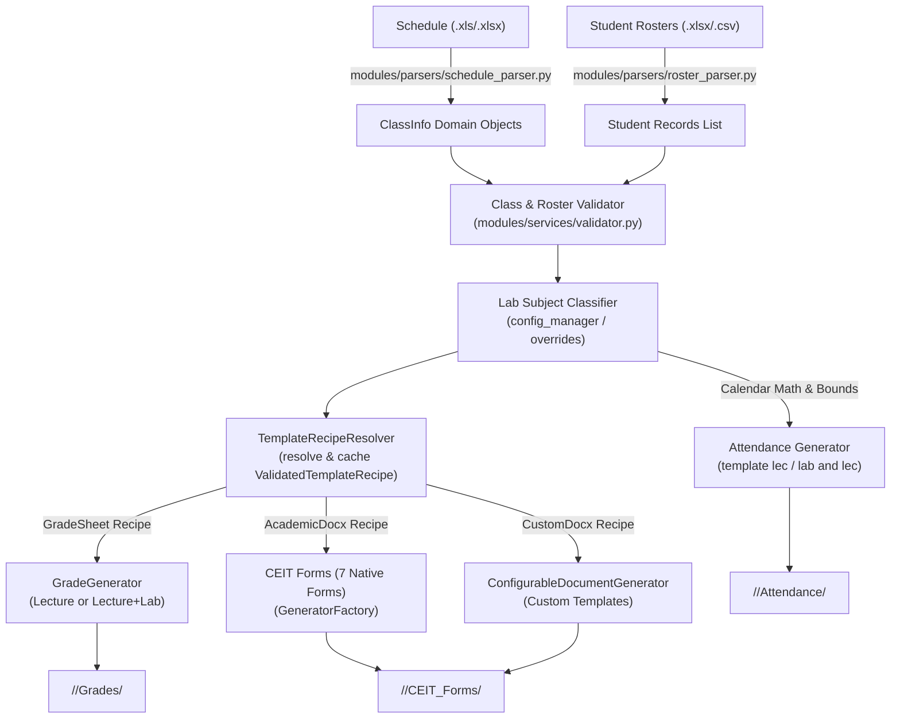

# Generator Pipeline

The **Generator Pipeline** is responsible for transforming raw input spreadsheets into clean domain models, matching class sections with their corresponding student rosters, resolving authoritative template recipes, and dispatching tasks to document generators.

Related notes:
- [[CvSU Document Generator MOC]]
- [[System Architecture]]
- [[Template Discovery Pipeline]]
- [[Orchestrator Lifecycle]]
- [[Generators Overview]]
- [[Input File Conventions]]

---

## 🔄 End-to-End Pipeline Stages

---

## 1. Schedule Parsing (`modules/parsers/schedule_parser.py`)
- Reads the official Faculty Timetable Schedule using `openpyxl` or `xlrd`.
- Identifies:
  - Instructor full name and college title.
  - Semester and Academic Year (e.g. `1st Semester A.Y. 2026-2027`).
  - Table grid rows: Course Code, Course Title, Section (`BSCS 1-4`), Schedule Code (`202612040`), Room, Contact Hours (Lec / Lab), Days of week (`M`, `T`, `W`, `TH`, `F`, `S`), and Meeting Times.
- Cleans and consolidates multi-block schedules (e.g. separate Lecture and Lab sessions for the same class section) into single `ClassInfo` instances.

## 2. Roster Parsing (`modules/parsers/roster_parser.py`)
- Reads student rosters exported from the CvSU Registrar portal.
- Extracts:
  - Student Full Name (using heuristic or explicit column configuration).
  - Student Number (using heuristic or explicit column configuration).
- Strips portal metadata columns, empty trailing rows, and normalizes capitalization.
- Pairs with schedule blocks using either:
  1. Standard naming pattern (e.g. `{Course/Sec} List of Students for {ScheduleCode}-{Subject}.xlsx`).
  2. Manual `linked_schedule_code` configured via the UI.

## 3. Validation & Matching (`modules/services/validator.py`)
- Takes the parsed `ClassInfo` models and the parsed rosters and validates the intersection.
- Determines which rosters are orphaned (no matching schedule) and which schedule blocks lack a roster.
- Ensures all minimum requirements for generation (valid instructor, valid student rows, valid schedule matrix) are met before passing data to the Orchestrator.

## 4. Lab Classification & Dispatch
- Analyzes syllabus lab hours and cross-references against `KNOWN_LAB_SUBJECT_CODES` (defined in the central `cvsu_parser_config.json`).
- If `"LAB"` or `"LABORATORY"` appears in the subject string, it is automatically flagged.
- Flags classes requiring the 4-tab Excel grading workbook (`GRADING_LECTURE_LAB_TEMPLATE.xlsx`) versus standard lecture courses (`GRADING_LECTURE_TEMPLATE.xlsx`), and attendance `template lab and lec.docx` versus `template lec.docx`.
- Supports user overrides configured in Step 3 of the UI (passed as `type_overrides` to `process_all`).

## 5. Recipe Resolution & Generation Execution
- **CEIT & Custom Forms**: `GeneratorFactory` queries `TemplateRecipeResolver.get_instance()` to obtain `ValidatedTemplateRecipe` instances, rendering 7 native forms plus custom configurable documents to `<Output>/<Course_Sec>/CEIT_Forms/`.
- **Attendance Sheets**: `generate_attendance_for_month()` evaluates calendar meeting days, returning `"generated"` on file creation or `"skipped_empty"` if 0 meeting days fall within semester bounds, writing to `<Output>/<Course_Sec>/Attendance/`.
- **Grading Sheets**: `GradeGenerator` resolves `grade_sheet_xlsx` recipe via `TemplateRecipeResolver`, clamps rosters to validated capacity (40 students), preserves formulas via `data_only=False`, and saves atomically to `<Output>/<Course_Sec>/Grades/`.
