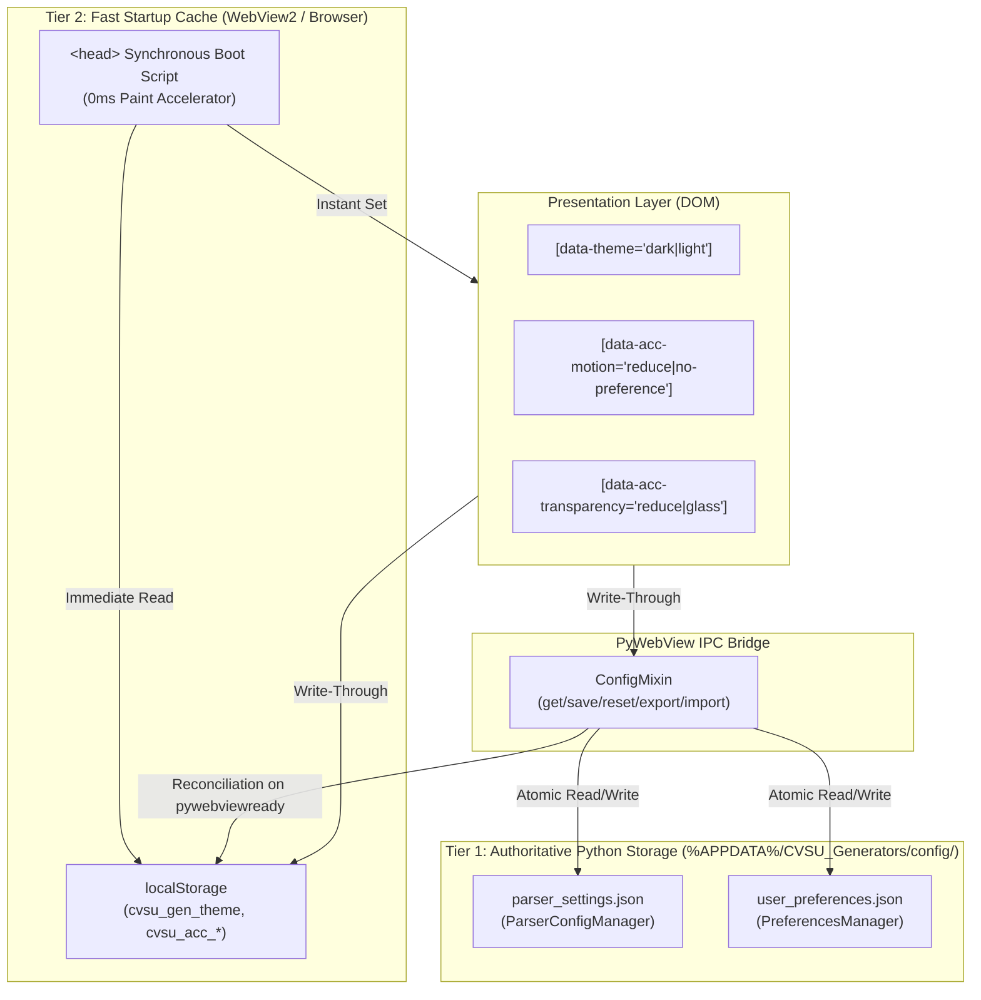

# Persistent State Architecture

This document defines the authoritative persistence architecture for the CvSU Document Generator. It specifies the canonical separation between **Application Configuration**, **User Preferences**, and **Transient UI State**, establishing the storage mechanisms, startup synchronization, reset semantics, and corruption safety guarantees.

Related notes:
- [[CvSU Document Generator MOC]]
- [[System Architecture]]
- [[PyWebView Bridge]]
- [[UI Architecture]]
- [[Testing Strategy]]

---

## 🏛️ Architectural Model: Model C (Two-Tier Dedicated Architecture)

The system enforces **Model C: Dedicated Two-Tier Architecture**, strictly isolating academic/parser business logic from personal ergonomic preferences while leveraging a high-speed browser cache for flicker-free rendering.



---

## 📦 State Categorization & Inventory

| Category | Canonical Store | Schema / Keys | Portability / Export | Reset Scope |
|---|---|---|---|---|
| **Application Configuration** | `%APPDATA%/CVSU_Generators/config/parser_settings.json` | `ceit_prefix_map`, `base_subject_prefixes`, `known_lab_subjects`, `program_aliases`, `roster_keywords`, `schedule_config` | Exportable via `export_parser_config()` (`cvsu_parser_config.json`) | "Reset Configuration" button resets parser only |
| **User Preferences** | `%APPDATA%/CVSU_Generators/config/user_preferences.json` | `version` (`"1.0"`), `theme` (`"dark"` \| `"light"`), `accessibility.motion` (`"system"` \| `"reduce"` \| `"full"`), `accessibility.transparency` (`"system"` \| `"reduce"` \| `"glass"`) | Exportable via `export_user_preferences()` (`cvsu_user_preferences.json`). Strictly canonical schema. | Reset via `reset_user_preferences()`; isolated from parser; updates cache and sets `cvsu_prefs_migrated="true"` |
| **Transient UI State** | In-Memory (DOM / JavaScript variables) | Active stepper tab, toast notifications queue, progress bar percentage, generation cancellation tokens, file picker dialog handles | Never persisted; reset on window reload/exit | Naturally discarded upon window close |

---

## 🔑 Comprehensive `localStorage` Key Inventory

The application inventories all keys accessed in `localStorage`, classifying their authority, owner, and lifecycle:

| Key | Classification | Owner | Canonical Authority | Upward Migration? | Reset / Clear Behavior |
|---|---|---|---|---|---|
| `cvsu_gen_theme` | Tier 2 Startup Cache | `theme.js` | `user_preferences.json` (`theme`) | Migrated once on initial upgrade if disk absent and `cvsu_prefs_migrated` is unset | Updated on `reset_user_preferences()` to `"dark"` |
| `cvsu_acc_motion` | Tier 2 Startup Cache | `theme.js` | `user_preferences.json` (`accessibility.motion`) | Migrated once on initial upgrade if disk absent and `cvsu_prefs_migrated` is unset | Updated on `reset_user_preferences()` to `"system"` |
| `cvsu_acc_transparency` | Tier 2 Startup Cache | `theme.js` | `user_preferences.json` (`accessibility.transparency`) | Migrated once on initial upgrade if disk absent and `cvsu_prefs_migrated` is unset | Updated on `reset_user_preferences()` to `"system"` |
| `cvsu_prefs_migrated` | Migration & Reset Marker | `theme.js` / `settings.js` | N/A (Marker flag) | Set to `"true"` when initial migration finishes OR when preferences are reset | Set to `"true"` upon reset to permanently prevent resurrecting wiped preferences |
| `cvsu_output_dir` | Transient UI Session Cache | `app.js` | Client Session | No | Cleared or overwritten on user selection |
| `cvsu_startDate` | Transient UI Workflow State | `app.js` | Client Session | No | Cleared or overwritten on attendance date change |
| `cvsu_endDate` | Transient UI Workflow State | `app.js` | Client Session | No | Cleared or overwritten on attendance date change |
| `cvsu_roster_mappings` | Transient UI Cache | `app.js` | Client Session | No | Stored wizard column mappings |
| `cvsu_parsing_rules` | Transient UI Cache | `app.js` | Client Session | No | Stored regex pattern overrides |
| `classTypeOverrides` | Transient UI Table State | `app.js` | Client Session | No | Per-session lecture/lab overrides |

---

## ⚡ Role of `localStorage` (Classification & Convergence)

`localStorage` is explicitly classified as a **Tier 2 Startup Cache & Accelerated Paint Buffer**, **NOT** an independent conflicting authority.

1. **Why `localStorage` is Retained**:
   - WebView2 loads HTML and executes `<head>` scripts before the Python bridge (`window.pywebview.api`) finishes COM initialization (`pywebviewready` event).
   - If theme/accessibility were loaded exclusively via asynchronous Python IPC before first paint, the WebView would flash default white/unstyled content during startup.
   - Synchronous reading of `localStorage` in the `<head>` tag guarantees **0ms visual stability** with zero layout shift or theme flash.
2. **Authority & Cache Convergence**:
   - The authoritative source of truth on disk is `%APPDATA%/CVSU_Generators/config/user_preferences.json`.
   - On the `pywebviewready` lifecycle event, `theme.js` queries `window.pywebview.api.get_user_preferences(true)`.
   - **Disk Always Wins**: If `localStorage` differs from `user_preferences.json` (e.g. external edits or stale cache), the disk values immediately overwrite `localStorage` and reconcile the DOM attributes.
   - Stale cache is acknowledged as a paint acceleration trade-off, but authoritative state is converged within milliseconds of bridge readiness.
3. **Upward Migration**:
   - For existing installations upgrading from previous versions, if `user_preferences.json` is absent on disk and `cvsu_prefs_migrated` is not set, the application inspects `localStorage`.
   - If valid legacy keys (`cvsu_gen_theme`, `cvsu_acc_motion`, `cvsu_acc_transparency`) exist in `localStorage`, they are migrated upward to `user_preferences.json` via `save_user_preferences()`, and `cvsu_prefs_migrated` is stamped.

---

## 📄 Canonical Schema vs. Diagnostic Metadata

The preference store enforces a strict separation between canonical user preferences and internal diagnostic metadata:

### Canonical Schema (Pure Document)
Always returned by `get_preferences()` and written to `user_preferences.json`:
```json
{
  "version": "1.0",
  "theme": "dark",
  "accessibility": {
    "motion": "system",
    "transparency": "system"
  }
}
```

### Diagnostic Metadata (`_persisted`)
- Returned ONLY when calling `get_preferences_with_metadata()` or `get_user_preferences(include_metadata=True)`.
- Indicates whether `user_preferences.json` exists as a durable file on disk (`_persisted: true|false`).
- **Invariant**: `_persisted` is strictly transient. It is **NEVER** written to `user_preferences.json` on disk and is **NEVER** included in exported files (`export_user_preferences()`). Any imported payload containing `_persisted` has that key stripped and discarded during schema normalization.

---

## ✍️ Explicit Save vs. Update Semantics

To eliminate accidental resetting of unspecified fields, `PreferencesManager` provides two distinct operations:

1. **`save_preferences(prefs: dict)` (Complete Replacement)**:
   - Expects a **complete preference document**.
   - Requires top-level key `theme` and subkeys `motion` and `transparency` under `accessibility`.
   - Rejects partial documents missing these required keys by raising a `ValueError`.
   - Protects against accidental defaults reset from careless callers.
2. **`update_preferences(partial_prefs: dict)` (Partial Merge)**:
   - Designed for callers wanting to update a single preference (e.g. toggling theme only).
   - Deep-merges the partial dictionary against the current canonical document and atomically writes the merged result to disk.

---

## 🛡️ Fault Tolerance & Corruption Handling

Both `ParserConfigManager` and `PreferencesManager` implement rigorous defensive persistence patterns:

1. **Atomic Disk Writes**:
   - File updates are written to a unique temporary file (`tempfile.mkstemp`) in the target directory and finalized using atomic replace (`os.replace`).
   - If the application is abruptly killed or power is lost mid-write, the existing settings file remains completely uncorrupted.
2. **Corrupted Disk Store Behavior**:
   - If `user_preferences.json` contains invalid JSON syntax or unparseable byte sequences, `load_preferences()` logs an error and returns canonical safe defaults.
   - **Authority Inversion Prevention**: The system **NEVER** treats stale `localStorage` as authority to overwrite a corrupt disk store. Stale cache is rewritten with the safe canonical defaults upon bridge synchronization.
3. **Schema Versioning**:
   - Current schema version is `"1.0"`.
   - The `version` field is explicitly reserved for future schema migrations.
   - Missing version strings default to `"1.0"`. Unknown or future versions are logged and normalized safely.
4. **Thread & Concurrency Safety**:
   - `PreferencesManager` protects read/write operations and listener notifications with a `threading.Lock()`, guaranteeing thread safety across bridge calls, async threads, and UI callbacks.
5. **Preference Listeners**:
   - Listeners receive immutable deep copies of the canonical preference document.
   - Exceptions thrown by listeners are caught and logged; a failing listener cannot interrupt or corrupt preference persistence.

---

## 🔄 Reset Semantics & Resurrection Prevention

To prevent accidental erasure of user ergonomic accommodations and prevent resurrecting deleted preferences:

1. **Reset Configuration (`reset_parser_config()`)**:
   - Scoped strictly to curriculum rules, department maps, subject prefixes, lab codes, and schedule presets.
   - Restores `parser_settings.json` to factory defaults.
   - **Does NOT** alter `theme`, `motion`, or `transparency` user preferences.
2. **Reset User Preferences (`reset_user_preferences()`)**:
   - Scoped strictly to theme and accessibility settings.
   - Removes `user_preferences.json` and resets cached preferences to factory defaults (`theme: "dark"`, `motion: "system"`, `transparency: "system"`).
   - **Resurrection Prevention**: The reset lifecycle executes `window.applyUserPreferencesReset()` in the WebView, resetting the DOM attributes, clearing cached theme/accessibility in `localStorage`, and explicitly setting `cvsu_prefs_migrated = "true"`. This prevents legacy migration logic from ever resurrecting wiped preferences on subsequent cold restarts.
   - **Does NOT** alter custom course codes, prefix mappings, or template definitions.

---

## 🧪 Verification & Automated Test Coverage

The architecture is covered by automated regression and integration test suites:

- `tests/test_user_preferences_architecture.py`:
  - `test_preferences_manager_defaults`: Verifies canonical default schema.
  - `test_preferences_manager_save_and_reload`: Verifies atomic disk writes and schema retention.
  - `test_preferences_manager_validation_and_fallbacks`: Validates partial invalid value fallback without sibling corruption.
  - `test_preferences_manager_corrupted_file_recovery`: Tests malformed JSON recovery and log generation.
  - `test_preferences_manager_reset_isolation`: Proves resetting preferences does not touch parser config.
  - `test_preferences_manager_export_import`: Verifies portable JSON import/export and validation.
  - `test_export_preferences_pure_canonical_schema`: Asserts `_persisted` is never exported.
  - `test_save_preferences_enforces_complete_document`: Enforces rejection of partial documents.
  - `test_update_preferences_merges_partial_updates`: Tests partial merging against canonical state.
  - `test_corrupt_disk_store_does_not_invert_authority`: Confirms safe defaults on disk corruption.
  - `test_schema_version_handling`: Tests version default, valid, and future version normalization.
  - `test_import_strips_persisted_and_unknown_metadata`: Proves metadata sanitization on import.
  - `test_listener_safety_and_exception_isolation`: Verifies listener isolation and copy immutability.
  - `test_reset_user_preferences_prevents_stale_cache_resurrection`: Asserts resurrection marker is set.
- `tests/test_accessibility_settings.py`:
  - `test_playwright_disk_authority_wins_over_local_storage_scenario_a`: Validates disk authority over conflicting `localStorage` cache.
- `tests/test_packaged_executable_persistence.py`:
  - Spawns the compiled and signed `CvSU Gen.exe` binary across multiple cold restart cycles.
  - Proves that mutated theme, motion, transparency, and parser config survive native Windows process termination and cold boot.
