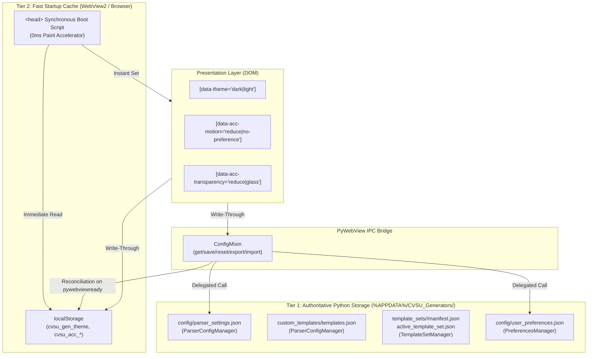

# Persistent State Architecture

This document defines the authoritative persistence architecture for the CvSU Document Generator. It specifies the canonical separation between **Application Configuration**, **User Preferences**, **Transient UI State**, and **Cache / Compatibility**, establishing the storage mechanisms, startup synchronization, reset semantics, and corruption safety guarantees.

Related notes:
- [[CvSU Document Generator MOC]]
- [[System Architecture]]
- [[PyWebView Bridge]]
- [[UI Architecture]]
- [[Testing Strategy]]

---

## 🏛️ Architectural Model: Model C (Two-Tier Dedicated Architecture)

The system enforces **Model C: Dedicated Two-Tier Architecture**, strictly isolating academic/parser business logic from personal ergonomic preferences while leveraging a high-speed browser cache for flicker-free rendering.



---

## 📦 Classification Model & Inventory

State in the repository is strictly partitioned into the **Four Canonical Model C Categories**, with diagnostic logs explicitly segregated outside the application-state model:

1. **Application Configuration (Model C)**:
   - Controls document generation behavior, curriculum parsing rules, prefix mappings, lab subjects, program aliases, custom templates, and template sets.
   - **Canonical Stores & Owners**:
     - `%APPDATA%/CVSU_Generators/config/parser_settings.json` (owned and written exclusively by `ParserConfigManager` via `save_config()`).
     - `%APPDATA%/CVSU_Generators/custom_templates/templates.json` and `*.docx` (owned and written exclusively by `ParserConfigManager` via `save_custom_template()`, `toggle_custom_template()`, `delete_custom_template()`).
     - `%APPDATA%/CVSU_Generators/template_sets/<set_id>/manifest.json` and `templates/` (owned and written exclusively by `TemplateSetManager` via `_save_manifest()` and `delete_template_set()`).
     - `%APPDATA%/CVSU_Generators/active_template_set.json` (owned and written exclusively by `TemplateSetManager` via `activate_template_set()`).
2. **User Preferences (Model C)**:
   - Controls personal ergonomic experience (theme, accessibility motion, accessibility transparency).
   - **Canonical Store & Owner**:
     - `%APPDATA%/CVSU_Generators/config/user_preferences.json` (owned and written exclusively by `PreferencesManager` via `save_preferences()` / `update_preferences()`, reset via `reset_preferences()`).
3. **Transient UI State (Model C)**:
   - Ephemeral UI or workflow state not intended to survive application restart (active wizard step, toast queues, progress bars, cancellation tokens, dialog handles) or client-side session memory (output directory, date pickers, column mappings).
   - **Canonical Owner**: Client UI Session / DOM Memory.
4. **Cache / Compatibility (Model C)**:
   - Temporary acceleration or legacy migration support (0ms startup paint cache in `localStorage`, migration marker flags).
   - **Canonical Owner**: `localStorage` (governed by `theme.js` and converged from `user_preferences.json`). Must **NEVER** accidentally become a new authority.
5. **Diagnostic Artifact (Outside Model C State)**:
   - Operational runtime diagnostics and crash logs.
   - `%APPDATA%/CVSU_Generators/logs/generator.log` (all application log records, DEBUG and above, managed by `logger.py` via `RotatingFileHandler`).
   - `%APPDATA%/CVSU_Generators/logs/crash.log` (critical and unhandled exception records, managed by `logger.py` via `RotatingFileHandler`).
   - Diagnostic reports generated via CLI flags (`--diag-theme`, `--diag-persistence`).
   - These files provide forensic observability and are strictly separated from application configuration and user preferences.

| Category | Canonical Store | Schema / Keys | Portability / Export | Reset Scope |
|---|---|---|---|---|
| **Application Configuration** | `%APPDATA%/CVSU_Generators/config/parser_settings.json` | `ceit_prefix_map`, `base_subject_prefixes`, `known_lab_subjects`, `program_aliases`, `roster_keywords`, `schedule_config` | Exportable via `export_parser_config()` (`cvsu_parser_config.json`) | "Reset Configuration" button resets parser settings only |
| **Application Configuration** | `%APPDATA%/CVSU_Generators/custom_templates/templates.json` | Array of template metadata entries (`id`, `title`, `suffix`, `filename`, `enabled`, `recipe`) | User `.docx` and recipes | Removed individually or reset via custom template manager |
| **Application Configuration** | `%APPDATA%/CVSU_Generators/template_sets/` | Set manifest (`manifest.json`) and template files | Exportable as `.zip` template set bundles | Built-in set is immutable; custom sets deleted via `TemplateSetManager` |
| **User Preferences** | `%APPDATA%/CVSU_Generators/config/user_preferences.json` | `version` (`"1.0"`), `theme` (`"dark"` \| `"light"`), `accessibility.motion` (`"system"` \| `"reduce"` \| `"full"`), `accessibility.transparency` (`"system"` \| `"reduce"` \| `"glass"`) | Exportable via `export_user_preferences()` (`cvsu_user_preferences.json`). Strictly canonical schema. | Reset via `reset_user_preferences()`; isolated from parser; updates cache and sets `cvsu_prefs_migrated="true"` |
| **Transient UI State** | In-Memory (DOM / JavaScript variables) & Client Session | Active stepper tab, toast notifications queue, progress bar percentage, generation cancellation tokens, file picker dialog handles | Never exported; reset on window reload/exit | Naturally discarded upon window close |
| **Cache / Compatibility** | `localStorage` (`cvsu_gen_theme`, `cvsu_acc_*`, `cvsu_prefs_migrated`) | Sanitized strings (`"dark"`, `"light"`, `"system"`, `"reduce"`, `"full"`, `"glass"`, `"true"`) | Never exported; local device acceleration only | Synchronized from disk authority on `pywebviewready` or cleared on reset |
| **Diagnostic Artifact** | `%APPDATA%/CVSU_Generators/logs/` | Log text and exception stack traces | Local device only | Rotated automatically; unaffected by settings reset |

---

## 🔑 Comprehensive `localStorage` Key Inventory

Every key accessed in `localStorage` across the frontend code (`executable_test/`) is inventoried and categorized:

| Key | Purpose | Classification | Canonical Owner | Read By | Written By | Reset Behavior |
|---|---|---|---|---|---|---|
| `cvsu_gen_theme` | 0ms startup paint acceleration cache for active theme | Cache / Compatibility | `user_preferences.json` (`theme`) | `<head>` inline boot script, `theme.js` | `theme.js` (sync/toggle) | Reset to `"dark"` on `reset_user_preferences()`; converged from disk on `pywebviewready` |
| `cvsu_acc_motion` | 0ms startup paint acceleration cache for accessibility motion | Cache / Compatibility | `user_preferences.json` (`accessibility.motion`) | `<head>` inline boot script, `theme.js` | `theme.js`, `settings.js` | Reset to `"system"` on `reset_user_preferences()`; converged from disk on `pywebviewready` |
| `cvsu_acc_transparency` | 0ms startup paint acceleration cache for accessibility transparency | Cache / Compatibility | `user_preferences.json` (`accessibility.transparency`) | `<head>` inline boot script, `theme.js` | `theme.js`, `settings.js` | Reset to `"system"` on `reset_user_preferences()`; converged from disk on `pywebviewready` |
| `cvsu_prefs_migrated` | Migration and reset marker flag preventing stale cache resurrection | Cache / Compatibility | `localStorage` marker | `theme.js` | `theme.js` (on migration or reset) | Stamped to `"true"` upon reset to permanently prevent resurrecting wiped preferences |
| `cvsu_output_dir` | Client session convenience cache for last chosen output directory | Transient UI State | Client UI Session | `state.js` | `state.js` | Overwritten on user selection; not affected by config or preference reset |
| `cvsu_startDate` | Client workflow cache for user selected attendance start date | Transient UI State | Client UI Session | `step2.js` | `step2.js` | Cleared on `clearDatePresets()`; not affected by config or preference reset |
| `cvsu_endDate` | Client workflow cache for user selected attendance end date | Transient UI State | Client UI Session | `step2.js` | `step2.js` | Cleared on `clearDatePresets()`; not affected by config or preference reset |
| `cvsu_roster_mappings` | Client workflow cache for per-file CSV column mapping presets | Transient UI State | Client UI Session | `state.js` | `state.js` | Preserved across session reloads; not affected by config or preference reset |
| `cvsu_parsing_rules` | Client workflow cache for remembering similar table parsing rules | Transient UI State | Client UI Session | `step2.js` | `step2.js` | Preserved across session reloads; not affected by config or preference reset |
| `classTypeOverrides` | Client workflow cache for manual lecture vs lecture_lab overrides | Transient UI State | Client UI Session | `step2.js` | `step2.js` | Preserved across session reloads; not affected by config or preference reset |

---

## 🔒 Single-Owner Write Paths & Complete-Document Import Contracts

To eliminate duplicate authorities, cross-subsystem contamination, and destructive partial imports:

1. **User Preferences Ownership**:
   - `PreferencesManager` is the **sole writer** of `%APPDATA%/CVSU_Generators/config/user_preferences.json`.
   - No frontend script, PyWebView API method, or parser component writes directly to this file.
   - All theme and accessibility mutations flow strictly through `PreferencesManager.save_preferences()`, `PreferencesManager.update_preferences()`, or `PreferencesManager.reset_preferences()`.
   - Internal persistence uses `_persist_locked()` via atomic `tempfile.mkstemp` + `os.replace`.
2. **Parser Configuration & Custom Template Ownership**:
   - `ParserConfigManager` is the **sole writer** of `%APPDATA%/CVSU_Generators/config/parser_settings.json` via `save_config()` (atomic `tempfile.mkstemp` + `os.replace`).
   - Custom templates are owned and written exclusively by `ParserConfigManager`:
     - `save_custom_template()`: copies `.docx` files via `shutil.copy2` and updates `%APPDATA%/CVSU_Generators/custom_templates/templates.json` via atomic `tempfile.NamedTemporaryFile` + `os.replace`.
     - `toggle_custom_template()`: updates `templates.json` via atomic `tempfile.NamedTemporaryFile` + `os.replace`.
     - `delete_custom_template()`: removes `.docx` files via `os.remove` and updates `templates.json` via atomic `tempfile.NamedTemporaryFile` + `os.replace`.
3. **Template Set Ownership**:
   - `TemplateSetManager` is the **sole writer** of `%APPDATA%/CVSU_Generators/template_sets/<set_id>/manifest.json` via `_save_manifest()` (atomic `tempfile.NamedTemporaryFile` + `os.replace`), and deletes sets via `delete_template_set()` (`shutil.rmtree`).
   - `TemplateSetManager` is the **sole writer** of `%APPDATA%/CVSU_Generators/active_template_set.json` via `activate_template_set()` (atomic `tempfile.NamedTemporaryFile` + `os.replace`).
4. **Strict Complete-Document Import Contract & Exact Byte-for-Byte Preservation**:
   - Given the explicit architecture distinguishing complete replacement (`save_*()`) from partial merging (`update_*()`), all external file imports follow the **complete-document contract**:
     - `import_parser_config()` requires a complete canonical parser configuration document containing all six required canonical keys (`ceit_prefix_map`, `base_subject_prefixes`, `known_lab_subjects`, `program_aliases`, `roster_keywords`, `schedule_config`) with valid types. Incomplete documents (e.g. providing only prefixes) or unsupported versions (`version != "1.0"`) are rejected with a clear error without mutating active state.
     - `import_user_preferences()` requires a complete canonical preference document containing `theme` and `accessibility` (with both `motion` and `transparency`). When a `version` key is present, it must explicitly match `"1.0"`. Unsupported/future versions (`"2.0"`, `99`) or invalid values are rejected with a clear error without mutating active state.
     - Cross-domain imports (e.g. importing preferences into parser manager or parser config into preferences manager) are rejected cleanly with an error status.
     - **Exact Byte-for-Byte Preservation**: Automated tests prove that rejected imports preserve exact file bytes (`open(..., 'rb').read() == bytes_before`) as well as in-memory semantic state. If the canonical file does not exist on disk initially, a rejected import creates zero new files.
     - **Startup Safe Fallback vs. Explicit Import Rejection**: While startup initialization safely recovers a corrupt or unsupported disk file to canonical defaults to guarantee visual launch stability, explicit user file imports NEVER silently convert an unsupported file into defaults or mutate the active store.
5. **Static Persistent-State Governance Scope & Limits**:
   - The test suite (`tests/test_persistent_state_authority_inventory.py`) performs static source governance via AST and regex scanning:
     - Scans all application `.html` and `.js` files recursively under `executable_test/` (excluding virtual environments `venv/`, test fixtures, and build artifacts).
     - Statically recovers string literals, bracket access, `window.localStorage.*`, and statically resolved top-level identifier constants (`const KEY = "val"`).
     - Proves 0 occurrences of `sessionStorage` or `IndexedDB` across all frontend assets.
     - Proves single authoritative writer modules for all six canonical native stores.
     - Self-validates registry symbols against the actual Python AST.
     - **Explicit Boundary**: The test verifies static source governance and cannot provide mathematical proof against arbitrary runtime dynamic writes (e.g. dynamic `eval()`, dynamic key concatenation, or binary injections).
6. **Startup Synchronization Order**:
   ```text
   HTML <head>
       ↓
   localStorage cache (cvsu_gen_theme, cvsu_acc_*)
       ↓
   0ms first paint (no flash of unstyled content)
       ↓
   pywebviewready event (COM initialization complete)
       ↓
   Native disk authority (user_preferences.json via get_user_preferences)
       ↓
   Reconciliation (disk unconditionally wins; cache & DOM updated)
   ```
   At no point can stale cache overwrite or reverse canonical disk state.


---

## ⚡ Role of `localStorage` (Classification, Sanitization & Convergence)

`localStorage` is explicitly classified as a **Tier 2 Startup Cache & Accelerated Paint Buffer**, **NOT** an independent conflicting authority.

1. **Why `localStorage` is Retained**:
   - WebView2 loads HTML and executes `<head>` scripts before the Python bridge (`window.pywebview.api`) finishes COM initialization (`pywebviewready` event).
   - If theme/accessibility were loaded exclusively via asynchronous Python IPC before first paint, the WebView would flash default white/unstyled content during startup.
   - Synchronous reading of `localStorage` in the `<head>` tag guarantees **0ms visual stability** with zero layout shift or theme flash.
2. **Defensive Cache Sanitization**:
   - All values read from `localStorage` are treated as untrusted cache data and normalized via explicit frontend sanitizers before use, presentation, UI sync, or upward migration:
     - `sanitizeThemePreference(val)`: Allowed: `"dark"`, `"light"`. Invalid/unsupported values (e.g. `"banana"`) resolve deterministically to `"dark"`.
     - `sanitizeMotionPreference(val)`: Allowed: `"system"`, `"reduce"`, `"full"`. Invalid/unsupported values resolve deterministically to `"system"`.
     - `sanitizeTransparencyPreference(val)`: Allowed: `"system"`, `"reduce"`, `"glass"`. Invalid/unsupported values resolve deterministically to `"system"`.
   - Any malformed cache entries discovered during runtime synchronization are normalized in-place in `localStorage` without throwing errors or causing presentation corruption.
3. **Authority & Cache Convergence Matrix**:
   - The authoritative source of truth on disk is `%APPDATA%/CVSU_Generators/config/user_preferences.json`.
   - On the `pywebviewready` lifecycle event, `theme.js` queries `window.pywebview.api.get_user_preferences(true)`.
   - **Case A (Valid Custom Cache vs. Valid Disk)**: Disk authority unconditionally wins. If `localStorage` differs from `user_preferences.json` (e.g. external edits or stale cache), disk values overwrite `localStorage` and converge the DOM attributes.
   - **Case B (Invalid Cache Values)**: Corrupt or unrecognized cache values (e.g. `"banana"`) are normalized to safe supported defaults. No crash occurs, no invalid DOM state is applied, and malformed cache values are never upward-migrated to the native store.
   - **Case C (Corrupt Disk Store)**: If the physical disk store exists but contains corrupted JSON, `PreferencesManager` deterministically falls back to safe canonical defaults (`theme: "dark"`, `motion: "system"`, `transparency: "system"`). Because the disk store is present, stale legacy `localStorage` is never permitted to resurrect discarded preferences; instead, local cache is rewritten with the safe canonical defaults upon synchronization.
4. **Upward Migration**:
   - For existing installations upgrading from previous versions, if `user_preferences.json` is physically absent on disk and `cvsu_prefs_migrated` is not set, the application inspects `localStorage`.
   - If valid, non-default custom keys (`cvsu_gen_theme`, `cvsu_acc_motion`, `cvsu_acc_transparency`) exist in `localStorage`, they are migrated upward to `user_preferences.json` via `save_user_preferences()`, and `cvsu_prefs_migrated` is stamped.

---

## 📄 Canonical Schema vs. Diagnostic Metadata

The preference store enforces a strict separation between canonical user preferences and internal diagnostic metadata:

### Canonical Schema (Pure Document)
Always returned by `get_preferences()` and written to `user_preferences.json`:
```json
{
  "version": "1.0",
  "theme": "dark",
  "accessibility": {
    "motion": "system",
    "transparency": "system"
  }
}
```

### Diagnostic Metadata (`_persisted`)
- Returned ONLY when calling `get_preferences_with_metadata()` or `get_user_preferences(include_metadata=True)`.
- Indicates whether `user_preferences.json` exists as a durable file on disk (`_persisted: true|false`).
- **Invariant**: `_persisted` is strictly transient. It is **NEVER** written to `user_preferences.json` on disk and is **NEVER** included in exported files (`export_user_preferences()`). Any imported payload containing `_persisted` or unknown metadata has those keys stripped and discarded during schema normalization.

---

## ✍️ Explicit Save vs. Update Semantics

To eliminate accidental resetting of unspecified fields and prevent concurrent read-modify-write races, `PreferencesManager` provides two distinct operations:

1. **`save_preferences(prefs: dict)` (Complete Replacement)**:
   - Expects a **complete preference document**.
   - Requires top-level key `theme` and subkeys `motion` and `transparency` under `accessibility`.
   - Rejects partial documents missing these required keys by returning an error result directing callers to `update_preferences()`.
   - Protects against accidental defaults reset from careless callers.
2. **`update_preferences(partial_prefs: dict)` (Serialized Partial Merge)**:
   - Designed for callers wanting to update a single preference or subset of fields (e.g. toggling theme only).
   - Executes as a **single serialized read-modify-write transaction** under `self._lock`:
     ```text
     acquire lock
       read current canonical state from memory cache (loading from disk if uninitialized)
       merge partial update fields (theme, accessibility.motion, accessibility.transparency)
       validate merged payload against canonical constraints
       atomically persist merged document to disk via tempfile + os.replace
       update in-memory cache
     release lock
     notify listeners outside lock
     ```
   - This transaction serializes concurrent calls, eliminating the read-modify-write race where independent partial updates (e.g. simultaneous theme and accessibility motion updates from separate worker threads or event dispatches) would overwrite and silently drop sibling fields.

---

## 🛡️ Fault Tolerance & Corruption Handling

Both `ParserConfigManager` and `PreferencesManager` implement rigorous defensive persistence patterns:

1. **Atomic Disk Writes**:
   - File updates are written to a unique temporary file (`tempfile.mkstemp`) in the target directory and finalized using atomic replace (`os.replace`).
   - If the application is abruptly killed or power is lost mid-write, the existing settings file remains completely uncorrupted.
2. **Corrupted Disk Store Behavior**:
   - If `user_preferences.json` contains invalid JSON syntax or unparseable byte sequences, `load_preferences()` logs a warning and returns canonical safe defaults.
   - **Authority Inversion Prevention**: The system **NEVER** treats stale `localStorage` as authority to overwrite a corrupt disk store. Stale cache is rewritten with the safe canonical defaults upon bridge synchronization.
3. **Schema Versioning Semantics**:
   - Current supported schema version is `"1.0"`.
   - Missing version strings default to `"1.0"`.
   - Exact version `"1.0"` is accepted.
   - Unsupported or future versions (e.g. `"2.0"`, `"2.5-beta"`), or invalid data types (e.g. list/dict) deterministically fall back to safe canonical defaults with a logged warning.
   - The system makes no false claim of having "migrated" an unrecognised future schema; a formal structural migration system will be required before supporting future schema revisions.
4. **Thread & Concurrency Safety (In-Process Scoping)**:
   - Concurrency guarantees are **explicitly scoped to in-process manager serialization plus atomic file replacement**.
   - `PreferencesManager` serializes all partial updates, reads, and in-memory cache synchronizations using a process-local reentrant lock (`threading.RLock()`).
   - Atomic disk replacement (`tempfile.mkstemp` + `os.replace`) ensures filesystem write integrity against abrupt termination.
   - The application does not implement cross-process file locks or distributed mutexes; if an external process modifies `user_preferences.json`, filesystem integrity relies on OS-level atomic replace semantics.
   - The initialization/read path in `get_preferences()` is clean and explicit: if `_cached_preferences is None`, it initializes under lock via `_load_under_lock()`, and returns an independent defensive copy (`deepcopy(self._cached_preferences)`) without no-op locking blocks.
   - Callback listeners are dispatched strictly outside the lock to prevent deadlocks with foreign subscriber logic.
5. **Preference Listeners Contract**:
   - Listeners receive independent defensive copies of the canonical preference document. Mutating a listener payload cannot mutate manager state.
   - Another subscriber will still receive an unaffected canonical copy.
   - Exceptions thrown by listeners are caught and logged; a failing listener cannot interrupt or abort preference persistence.

---

## 🔄 Reset Semantics & Resurrection Prevention

To prevent accidental erasure of user ergonomic accommodations and prevent resurrecting deleted preferences:

1. **Reset Configuration (`reset_parser_config()`)**:
   - Scoped strictly to curriculum rules, department maps, subject prefixes, lab codes, and schedule presets.
   - Restores `parser_settings.json` to factory defaults.
   - **Does NOT** alter `theme`, `motion`, or `transparency` user preferences or touch `user_preferences.json`.
2. **Reset User Preferences (`reset_user_preferences()`)**:
   - Scoped strictly to theme and accessibility settings.
   - Removes `user_preferences.json` and resets cached preferences to factory defaults (`theme: "dark"`, `motion: "system"`, `transparency: "system"`).
   - **Resurrection Prevention**: The reset lifecycle executes `window.applyUserPreferencesReset()` in the WebView, resetting the DOM attributes, clearing cached theme/accessibility in `localStorage`, and explicitly setting `cvsu_prefs_migrated = "true"`. This prevents legacy migration logic from ever resurrecting wiped preferences on subsequent cold restarts.
   - **Does NOT** alter custom course codes, prefix mappings, or template definitions in `parser_settings.json`.

---

## 🧪 Verification & Automated Test Coverage

The architecture is covered by automated regression and integration test suites:

- `tests/test_user_preferences_architecture.py`:
  - `test_preferences_manager_defaults`: Verifies canonical default schema.
  - `test_preferences_manager_save_and_reload`: Verifies atomic disk writes and schema retention.
  - `test_preferences_manager_schema_validation_and_fallback`: Validates partial invalid value fallback without sibling corruption.
  - `test_preferences_manager_corrupted_file_recovery`: Tests malformed JSON recovery and log generation.
  - `test_preferences_manager_reset_to_defaults`: Verifies disk removal and cache reset.
  - `test_preferences_manager_export_and_import`: Verifies portable JSON import/export and validation.
  - `test_reset_parser_config_does_not_mutate_preferences`: Proves parser reset preserves user preferences.
  - `test_script_api_user_preferences_lifecycle`: Validates complete PyWebView API bridge round-trip.
  - `test_corrupted_user_preferences_file_starts_with_defaults_scenario_b`: Confirms safe defaults on disk corruption.
  - `test_parser_reset_preserves_preferences_removes_prefix_scenario_c`: Proves prefix removal while preserving user theme/motion.
  - `test_user_preference_reset_preserves_parser_config_scenario_d`: Proves user preference reset preserves parser settings.
  - `test_export_preferences_produces_exact_canonical_schema_without_metadata`: Asserts `_persisted` is never exported.
  - `test_save_preferences_enforces_complete_document_contract`: Enforces rejection of partial documents for complete save.
  - `test_update_preferences_merges_partial_update_correctly`: Tests partial merging against canonical state for individual and combined fields.
  - `test_concurrent_partial_updates_do_not_lose_independent_fields`: Proves serialized read-modify-write transaction across concurrent threads updating theme, motion, and transparency simultaneously via thread barriers.
  - `test_schema_version_handling`: Tests version default, valid 1.0, future versions (2.0, 2.5-beta), and invalid types safely falling back to canonical defaults.
  - `test_import_strips_unknown_metadata`: Proves metadata and unknown key sanitization on import.
  - `test_listener_defensive_copies_and_exception_safety`: Verifies listener payload independence, manager immunity to listener mutation, sibling listener isolation, and exception isolation.
  - `test_reset_lifecycle_prevents_stale_local_storage_resurrection`: Asserts resurrection marker is set and cold restart starts fresh.
  - `test_disk_store_state_distinction_missing_valid_corrupt`: Proves explicit distinction between missing disk store, valid disk store, and corrupt disk store.
- `tests/test_accessibility_settings.py`:
  - `test_playwright_disk_authority_wins_over_local_storage_scenario_a`: Validates disk authority over conflicting `localStorage` cache.
  - `test_playwright_invalid_local_storage_cache_sanitization_scenario_b`: Validates that invalid cache (`"banana"`) is normalized without crash, invalid DOM, or corrupt persistence.
  - `test_playwright_corrupt_disk_store_falls_back_to_defaults_scenario_c`: Validates that corrupt disk store deterministically converges cache and DOM to defaults without resurrecting stale cache.
  - `test_playwright_motion_full_override_executes_waapi`: Validates iris View Transition animation execution under full motion.
  - `test_playwright_motion_system_default_with_reduced_motion_skips_waapi`: Validates clean animation suppression under reduced motion.
  - `test_playwright_reduced_transparency_visual_surfaces`: Validates solid opaque surface tokens when transparency is reduced.
- `tests/test_packaged_executable_persistence.py`:
  - Spawns the compiled and signed `CvSU Gen.exe` binary across multiple cold restart cycles.
  - Proves that mutated theme, motion, transparency, and parser config survive native Windows process termination and cold boot.

