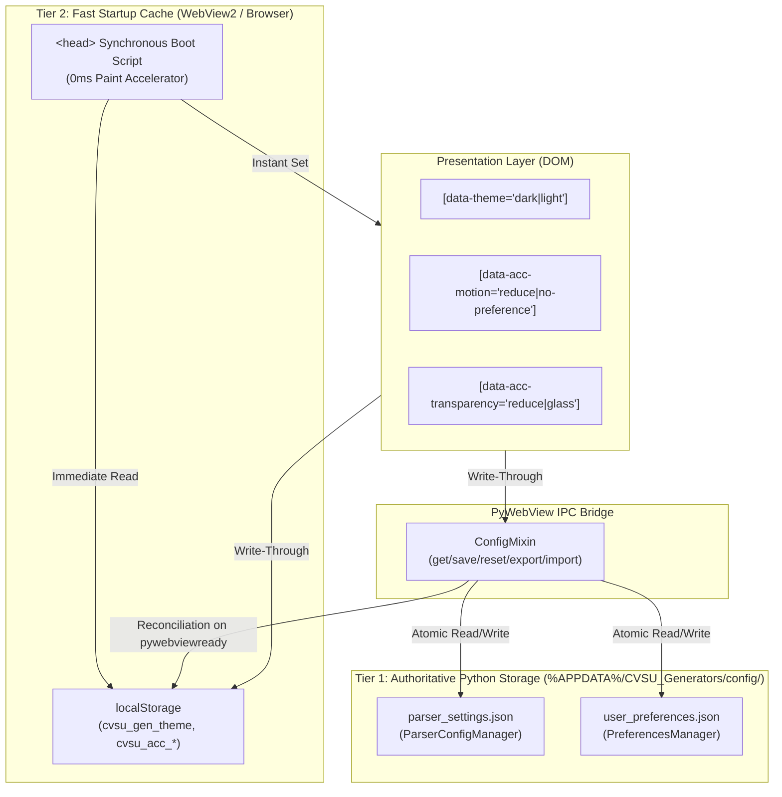

# Persistent State Architecture

This document defines the authoritative persistence architecture for the CvSU Document Generator. It specifies the canonical separation between **Application Configuration**, **User Preferences**, and **Transient UI State**, establishing the storage mechanisms, startup synchronization, reset semantics, and corruption safety guarantees.

Related notes:
- [[CvSU Document Generator MOC]]
- [[System Architecture]]
- [[PyWebView Bridge]]
- [[UI Architecture]]
- [[Testing Strategy]]

---

## 🏛️ Architectural Model: Model C (Two-Tier Dedicated Architecture)

The system enforces **Model C: Dedicated Two-Tier Architecture**, strictly isolating academic/parser business logic from personal ergonomic preferences while leveraging a high-speed browser cache for flicker-free rendering.

---

## 📦 State Categorization & Inventory

| Category | Canonical Store | Schema / Keys | Portability / Export | Reset Scope |
|---|---|---|---|---|
| **Application Configuration** | `%APPDATA%/CVSU_Generators/config/parser_settings.json` | `ceit_prefix_map`, `base_subject_prefixes`, `known_lab_subjects`, `program_aliases`, `roster_keywords`, `schedule_config` | Exportable via `export_parser_config()` (`cvsu_parser_config.json`) | "Reset Configuration" button resets parser only |
| **User Preferences** | `%APPDATA%/CVSU_Generators/config/user_preferences.json` | `version`, `theme` (`"dark"` \| `"light"`), `accessibility.motion` (`"system"` \| `"reduce"` \| `"full"`), `accessibility.transparency` (`"system"` \| `"reduce"` \| `"glass"`) | Exportable via `export_user_preferences()` (`cvsu_user_preferences.json`) | Reset via `reset_user_preferences()`; isolated from parser |
| **Transient UI State** | In-Memory (DOM / JavaScript variables) | Active stepper tab, toast notifications queue, progress bar percentage, generation cancellation tokens, file picker dialog handles | Never persisted; reset on window reload/exit | Naturally discarded upon window close |

---

## ⚡ Role of `localStorage` (Classification)

`localStorage` is explicitly classified as a **Tier 2 Startup Cache & Accelerated Paint Buffer**, **NOT** an independent conflicting authority.

1. **Why `localStorage` is Retained**:
   - WebView2 loads HTML and executes `<head>` scripts before the Python bridge (`window.pywebview.api`) finishes COM initialization (`pywebviewready` event).
   - If theme/accessibility were loaded exclusively via asynchronous Python IPC before first paint, the WebView would flash default white/unstyled content during startup.
   - Synchronous reading of `localStorage` in the `<head>` tag guarantees **0ms visual stability** with zero layout shift or theme flash.
2. **Authority & Reconciliation**:
   - The authoritative source of truth on disk is `%APPDATA%/CVSU_Generators/config/user_preferences.json`.
   - On the `pywebviewready` lifecycle event, `theme.js` queries `window.pywebview.api.get_user_preferences()`.
   - If disk preferences exist, they take precedence and re-sync `localStorage` and DOM attributes.
3. **Upward Migration**:
   - For existing installations upgrading from previous versions, if `user_preferences.json` is absent on disk, the application inspects `localStorage`.
   - If valid legacy keys (`cvsu_gen_theme`, `cvsu_acc_motion`, `cvsu_acc_transparency`) exist in `localStorage`, they are automatically migrated upward to `user_preferences.json` via `save_user_preferences()`.

---

## 🛡️ Fault Tolerance & Corruption Handling

Both `ParserConfigManager` and `PreferencesManager` implement rigorous defensive persistence patterns:

1. **Atomic Disk Writes**:
   - File updates are written to a unique temporary file (`tempfile.mkstemp`) in the target directory and finalized using atomic replace (`os.replace`).
   - If the application is abruptly killed or power is lost mid-write, the existing settings file remains completely uncorrupted.
2. **Missing / Unreadable File Fallback**:
   - If the configuration file does not exist, factory defaults are returned without throwing runtime exceptions.
3. **Malformed / Corrupt JSON**:
   - If a file contains invalid JSON syntax or unparseable byte sequences, `load_preferences()` logs a warning and gracefully falls back to default settings without crashing the application.
4. **Partial Field Validation**:
   - Input dictionaries are validated field-by-field.
   - If an invalid value is supplied for a single setting (e.g. `{"theme": "neon-glow", "accessibility": {"motion": "reduce"}}`), the invalid field (`theme`) safely falls back to default (`dark`), while the valid sibling field (`motion: "reduce"`) is strictly preserved.

---

## 🔄 Reset Semantics

To prevent accidental erasure of user ergonomic accommodations:

1. **Reset Configuration (`reset_parser_config()`)**:
   - Scoped strictly to curriculum rules, department maps, subject prefixes, lab codes, and schedule presets.
   - Restores `parser_settings.json` to factory defaults.
   - **Does NOT** alter `theme`, `motion`, or `transparency` user preferences.
2. **Reset User Preferences (`reset_user_preferences()`)**:
   - Scoped strictly to theme and accessibility settings.
   - Removes `user_preferences.json` and resets cached preferences to `{ "theme": "dark", "accessibility": { "motion": "system", "transparency": "system" } }`.
   - **Does NOT** alter custom course codes, prefix mappings, or template definitions.

---

## 🧪 Verification & Automated Test Coverage

The architecture is covered by automated regression and integration test suites:

- `tests/test_user_preferences_architecture.py`:
  - `test_preferences_manager_defaults`: Verifies canonical default schema.
  - `test_preferences_manager_save_and_reload`: Verifies atomic disk writes and schema retention.
  - `test_preferences_manager_validation_and_fallbacks`: Validates partial invalid value fallback without sibling corruption.
  - `test_preferences_manager_corrupted_file_recovery`: Tests malformed JSON recovery.
  - `test_preferences_manager_reset_isolation`: Proves resetting preferences does not touch parser config.
  - `test_preferences_manager_export_import`: Verifies portable JSON import/export and validation.
  - `test_upward_migration_from_local_storage_payload`: Tests cold upgrade path from legacy cache.
  - `test_script_api_user_preferences_lifecycle`: Tests full pywebview bridge bindings.
- `tests/test_packaged_executable_persistence.py`:
  - Spawns the compiled and signed `CvSU Gen.exe` binary across multiple cold restart cycles.
  - Proves that mutated theme, motion, transparency, and parser config survive native Windows process termination and cold boot.
