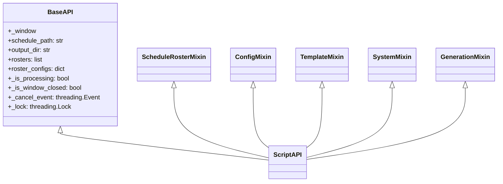

# PyWebView Bridge

The **PyWebView Bridge** forms the communication layer between the frontend JavaScript UI and the Python runtime. It is exposed to the browser window as `window.pywebview.api` and composed from a mixin-based architecture assembled in `executable_test/api/__init__.py`.

Related notes:
- [[CvSU Document Generator MOC]]
- [[System Architecture]]
- [[Orchestrator Lifecycle]]
- [[UI Architecture]]

---

## 🔌 Architecture of `ScriptAPI`

`ScriptAPI` is a composite class inheriting from five domain mixins plus `BaseAPI`. All state and thread primitives live in `BaseAPI`; each mixin is stateless relative to the others.



---

## 1. `BaseAPI` (`executable_test/api/base.py`)

Holds the shared state that all mixins read/write:

| Field | Type | Purpose |
|---|---|---|
| `_window` | pywebview Window | JS evaluation handle |
| `schedule_path` | `str` | Resolved path to active master schedule |
| `output_dir` | `str` | Selected output directory |
| `rosters` | `list[str]` | Ordered list of roster file paths |
| `roster_configs` | `dict` | Per-roster column override mappings |
| `_is_processing` | `bool` | Mutex guard: only one generation may run |
| `_is_window_closed` | `bool` | Suppresses JS callbacks after window close |
| `_cancel_event` | `threading.Event` | Cooperative cancellation signal |
| `_lock` | `threading.Lock` | Guards `_is_processing` writes |

Utility functions: `sanitize_filename(filename)`, `get_resource_path(relative_path)`.

---

## 2. `ScheduleRosterMixin` (`executable_test/api/schedule_roster.py`)

| Method | Description |
|---|---|
| `browse_schedule()` | Launches Windows file picker (`.xls`, `.xlsx`, `.xlsm`), stores path in `self.schedule_path`, returns `{cancelled, path, metadata, validation}` |
| `handle_dropped_schedule(filename, original_path, base64_data)` | Resolves native path or decodes base64 to `%TEMP%/cvsu_cache/schedules/`; stores path, returns same schema as `browse_schedule()` |
| `clear_schedule()` | Empties `self.schedule_path`; re-validates existing rosters |
| `browse_rosters(roster_configs)` | Multi-file picker; merges without duplicates into `self.rosters`; returns `{cancelled, count, rosters, validation}` |
| `handle_dropped_rosters(files_payload, roster_configs)` | Resolves native paths or decodes base64 roster payloads to `%TEMP%/cvsu_cache/rosters/`; appends to `self.rosters` |
| `remove_roster(path_or_index, roster_configs)` | Removes roster by index or exact path |
| `clear_rosters()` | Empties `self.rosters` |
| `validate_rosters(roster_configs)` | Calls `modules.services.validator.validate_rosters`; returns validation report list |
| `inspect_roster(path_or_filename, overrides)` | Calls `roster_parser.inspect_roster`; returns column detection report |
| `detect_classes(roster_configs)` | Calls `modules.services.validator.detect_classes`; returns matched class list |
| `inspect_schedule(path)` | Calls `schedule_parser.inspect_schedule_file`; returns schedule metadata |

---

## 3. `ConfigMixin` (`executable_test/api/config.py`)

| Method | Description |
|---|---|
| `get_ceit_prefix_directory()` | Returns the CEIT prefix map from `config_manager` |
| `get_parser_config()` | Returns full config dict (all keys: prefix map, lab codes, aliases, keywords, schedule config) |
| `save_parser_config(config_dict)` | Persists new config; triggers re-validation and re-detection; returns `{status, validation, detected_classes}` |
| `reset_parser_config()` | Resets all settings to factory defaults; re-validates |
| `export_parser_config()` | Opens Save dialog; writes `cvsu_parser_config.json` |
| `import_parser_config()` | Opens file picker; imports and merges JSON config |

---

## 4. `TemplateMixin` (`executable_test/api/templates.py`)

| Method | Description |
|---|---|
| `browse_custom_template()` | Opens `.docx` file picker; calls `inspect_custom_template` |
| `handle_dropped_custom_template(filename, original_path)` | Validates native path; calls `inspect_custom_template` |
| `inspect_custom_template(file_path)` | Runs `TemplateInspector.inspect_docx(file_path)`; returns `{status, file_path, recipe}` |
| `save_custom_template(file_path, title, suffix, recipe)` | Saves template + recipe via `config_manager.save_custom_template` |
| `get_custom_templates()` | Returns list of registered custom templates |
| `toggle_custom_template(template_id, enabled)` | Enables or disables a custom template |
| `delete_custom_template(template_id)` | Removes registration and deletes the file |

---

## 5. `SystemMixin` (`executable_test/api/system.py`)

| Method | Description |
|---|---|
| `browse_output()` | Opens native folder picker; stores result in `self.output_dir`; returns path string |
| `open_output_folder(folder_path)` | Calls `os.startfile(path)` to open Windows Explorer at output dir |
| `open_file(file_path)` | Calls `os.startfile(path)` to open a specific generated file |
| `get_recent_logs(lines=120)` | Reads last N lines from `%APPDATA%/CVSU_Generators/logs/generator.log` |
| `open_log_folder()` | Opens the log directory in Explorer |

---

## 6. `GenerationMixin` (`executable_test/api/generation.py`)

The generation mixin is the most operationally significant component. It implements the full thread lifecycle.

### `run_generation(type_overrides, date_overrides, class_filter, engine_filter, roster_configs)`

**Pre-flight guards** (executed synchronously before thread spawn):
1. Acquires `self._lock` — returns error if already processing.
2. Validates that `schedule_path`, `rosters`, and `output_dir` are all set.

**Thread spawn pattern:**
```python
# Token capture (before thread): reads window._activeGenerationId from JS
active_gen_id = self._window.evaluate_js("window._activeGenerationId")

def _progress_hook(info):
    # Injects generation_id into every progress payload
    js_code = f"if (window.onGenerationProgress) window.onGenerationProgress({json.dumps(info)}, {json.dumps(active_gen_id)});"
    self._window.evaluate_js(js_code)

def _thread_target():
    results = process_all(...)
    # On completion:
    js_code = f"if (window.onGenerationComplete) window.onGenerationComplete({json.dumps(payload)}, {json.dumps(active_gen_id)});"
    self._window.evaluate_js(js_code)

threading.Thread(target=_thread_target, daemon=True).start()
return None  # synchronous return; JS callback signals completion
```

### `cancel_generation()`

Sets `self._cancel_event` under `self._lock`. The orchestrator polls this event at the start of each class iteration and each document step. Returns immediately; cancellation propagates asynchronously.

### Telemetry Contracts

**Progress callback shape** (sent to `window.onGenerationProgress`):
```json
{
    "percent": 47,
    "current_class": "BSCS1-4",
    "current_task": "Created SYLLABUS_ACCEPTANCE",
    "step": 3,
    "total_steps": 21,
    "generation_id": "<active_gen_id>"
}
```

**Completion payload** (sent to `window.onGenerationComplete`):
```json
{
    "status": "success | error | cancelled",
    "message": "Generation complete! 21 files generated successfully.",
    "stats": {"generated": 21, "errors": 0, "skipped": 2},
    "details": { ... full results dict from process_all ... },
    "output_dir": "C:/Users/.../Documents/Output",
    "generation_id": "<active_gen_id>"
}
```

---

## 🔒 Thread Safety Notes

- `self._is_processing` is written exclusively under `self._lock`.
- `self._cancel_event` is a `threading.Event` — `set()` and `is_set()` are inherently thread-safe.
- `self._window.evaluate_js(...)` is called from the worker thread; pywebview marshals these calls back to the UI thread.
- All JS callbacks are no-ops if `self._is_window_closed` is `True` (set by the `closing` and `closed` window events).
