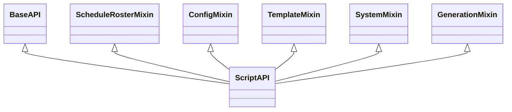

# PyWebView Bridge

The **PyWebView Bridge** forms the communication layer between the frontend JavaScript UI and the Python runtime environment. It is exposed to the browser window as `window.pywebview.api`.

Related notes:
- [[CvSU Document Generator MOC]]
- [[System Architecture]]
- [[Orchestrator Lifecycle]]
- [[UI Architecture]]

---

## 🔌 Architecture of `ScriptAPI`

Rather than a monolithic controller class, the Python API is structured into modular mixins unified under `ScriptAPI` in `executable_test/api/__init__.py`:

### 1. `BaseAPI` (`executable_test/api/base.py`)
- Manages reference to the PyWebView window instance (`_window`).
- Holds common thread locks (`self._lock = threading.Lock()`) and state flags (`_is_processing`, `_cancel_event`).
- Utility functions: `sanitize_filename`, `get_resource_path`.

### 2. `ScheduleRosterMixin` (`executable_test/api/schedule_roster.py`)
- `select_schedule()`: Launches native Windows file picker for master schedule (`.xls`, `.xlsx`).
- `select_rosters()`: Launches multi-file picker for student rosters.
- `handle_dropped_files(paths)`: Handles native drag-and-drop file paths routed from the frontend dropzone.
- `parse_schedule_file()`: Invokes parser and returns instructor name, semester, and detected classes.
- `match_roster_files()`: Matches roster files against detected schedule codes.

### 3. `ConfigMixin` (`executable_test/api/config.py`)
- Manages user-defined semester date boundaries (`start_date`, `end_date`).
- Persists and retrieves custom configuration settings using `ConfigManager`.

### 4. `TemplateMixin` (`executable_test/api/templates.py`)
- Provides template inspection APIs.
- Checks validity and presence of required template files in `templates/` and `attendance/`.

### 5. `SystemMixin` (`executable_test/api/system.py`)
- `select_output_folder()`: Launches native Windows directory browser.
- `open_output_folder(path)`: Launches Windows Explorer focused on the specified folder using `explorer.exe`.

### 6. `GenerationMixin` (`executable_test/api/generation.py`)
- `run_generation(type_overrides, date_overrides, class_filter, engine_filter, roster_configs)`: Spawns the worker thread executing `process_all`.
- `cancel_generation()`: Sets `self._cancel_event` to trigger immediate termination of the generation loop.
- `_progress_hook(info)`: Marshals telemetry dictionary into JavaScript calls: `window.onGenerationProgress(info, activeGenId)`.
