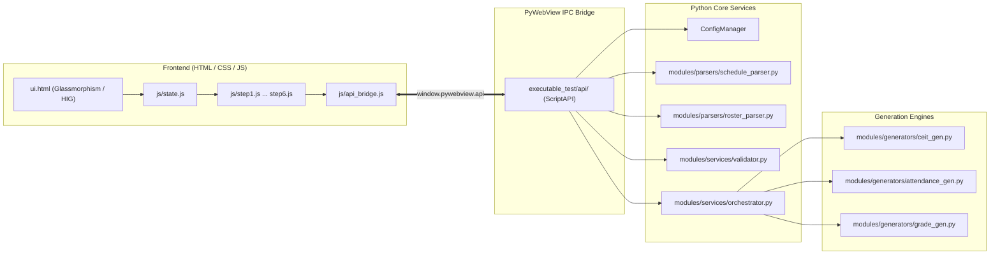

# System Architecture

The **CvSU Document Generator** is engineered as a hybrid desktop application combining a rich modern frontend rendered via **PyWebView** (Edge Chromium / WebView2 on Windows) with a multi-threaded Python backend.

Related notes:
- [[CvSU Document Generator MOC]]
- [[PyWebView Bridge]]
- [[Generator Pipeline]]
- [[Orchestrator Lifecycle]]
- [[UI Architecture]]
- [[Generators Overview]]

---

## 🏛️ High-Level Architectural Flow

---

## 🧩 Architectural Subsystems

### 1. Presentation Layer (`executable_test/`)
- Single-page application hosted in `executable_test/ui.html`.
- Modular vanilla JavaScript components loaded in strict dependency order. This UI modularization (Commit `91`) split the monolithic logic into focused controllers:
  - `state.js`: Central reactive state store (`AppState`).
  - `theme.js`: Dark / Light theme transition manager.
  - `stepper.js`: Workflow navigation and step progression.
  - `toast.js`: Non-blocking, accessible alert engine.
  - `step1.js` &ndash; `step6.js`: Individual workflow step controllers.
  - `api_bridge.js`: Wrapper providing fallback mock support for browser testing alongside real `pywebview` IPC.

### 2. IPC Layer ([[PyWebView Bridge]])
- Located in `executable_test/api/`.
- Implements a composite `ScriptAPI` using modular Python mixins introduced to enforce a strict modular architecture (Commit `88`):
  - `ScheduleRosterMixin`: File dialogs, drop payloads, and parsing triggers.
  - `ConfigMixin`: Parser configurations, keywords, and semester boundaries.
  - `TemplateMixin`: Custom template `.docx` recipes and inspection.
  - `SystemMixin`: Native OS directory exploration and shell launching.
  - `GenerationMixin`: Worker thread instantiation, telemetry hook, and cancellation.

### 3. Native Integration (`executable_test/native/dnd.py`)
- Overrides the default PyWebView window window procedure (WndProc).
- Implements `IDropTarget` OLE interface to allow native Windows file drag-and-drop directly onto the webview, bypassing Edge Chromium's restricted file-drop behaviors.
- Routes payloads back to `api_bridge.js` which then calls the IPC layer.

### 4. Processing & Extraction ([[Generator Pipeline]])
- Parses schedule spreadsheets (`modules/parsers/schedule_parser.py`) and maps class sections against student rosters (`modules/parsers/roster_parser.py`).
- Employs a validator (`modules/services/validator.py`) to match schedules to rosters and enforce data requirements.

### 5. Generation Core ([[Orchestrator Lifecycle]])
- Threaded execution in `modules/services/orchestrator.py:process_all`.
- Pushes live step progress and status messages back to the UI via `window.onGenerationProgress` callbacks.
- Supports instant, clean cancellation via thread-safe `threading.Event`.
