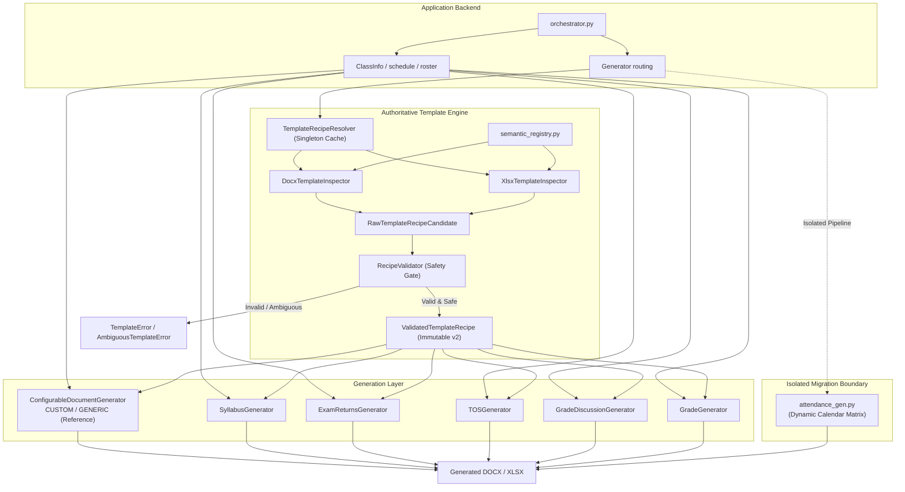

# Template Discovery Pipeline

The **Template Discovery Pipeline** is the authoritative subsystem responsible for dynamically scanning, validating, and binding Microsoft Word (`.docx`) and Excel (`.xlsx`) document templates. The recipe-driven CEIT DOCX and grading XLSX paths replace their structural positional bindings with an immutable, validated recipe lifecycle. The attendance generator remains an explicitly isolated migration boundary.

Related notes:
- [[CvSU Document Generator MOC]]
- [[System Architecture]]
- [[Generator Pipeline]]
- [[Orchestrator Lifecycle]]
- [[CEIT Generator]]
- [[Generic Document Generator]]
- [[Attendance Generator]]

---

## 🏛️ Target Architecture Overview

The system enforces the fundamental architectural invariant:
> **"The inspector determines WHERE. The generator determines WHAT."**



---

## 🏛️ Architectural Hierarchy

The pipeline operates across four decoupled layers:

```
┌────────────────────────────────────────────────────────┐
│               INSPECTION & DISCOVERY LAYER             │
│  - modules/parsers/template_inspector.py               │
│  - DocxTemplateInspector & XlsxTemplateInspector       │
│  - Scans layout, measures evidence, scores heuristics  │
│  - Emits RawTemplateRecipeCandidate (NON-AUTHORITATIVE)│
└──────────────────────────┬─────────────────────────────┘
                           │ (Submits Candidates to Validator)
                           ▼
┌────────────────────────────────────────────────────────┐
│                 RECIPE VALIDATION LAYER                │
│  - modules/parsers/recipe_validator.py                 │
│  - RecipeValidator.validate() (SOLE AUTHORITY)         │
│  - Enforces GeneratorProfile required/prohibited rules │
│  - Evaluates collisions, ties, and safety thresholds   │
│  - Constructs immutable ValidatedTemplateRecipe        │
└──────────────────────────┬─────────────────────────────┘
                           │ (Supplies ValidatedTemplateRecipe)
                           ▼
┌────────────────────────────────────────────────────────┐
│                 FIELD RESOLUTION LAYER                 │
│  - modules/generators/field_resolver.py                │
│  - FieldResolver.resolve_field_value()                 │
│  - ClassInfo mapping, aliases, derived formats         │
│  - Safe empty string defaults; never fabricates        │
└──────────────────────────┬─────────────────────────────┘
                           │ (Provides Values to Execution Engine)
                           ▼
┌────────────────────────────────────────────────────────┐
│                   GENERATOR CONTROLS                   │
│  - document_generator.py & grade_gen.py                │
│  - Pure recipe execution with zero coordinate binding  │
│  - Clamps student rosters to verified capacity_limit   │
│  - Font auto-scaling and overflow prevention           │
└────────────────────────────────────────────────────────┘
```

---

## 🔄 The Shared Recipe Resolution Service (`TemplateRecipeResolver`)

All generator instantiation paths—including `GeneratorFactory` (for CEIT forms) and `process_all` in `orchestrator.py` (for grading sheets)—utilize the centralized singleton resolver:

```python
resolver = TemplateRecipeResolver.get_instance()
recipe = resolver.resolve(template_path, profile_id)
```

### Cache Identity & Invalidation Semantics
The resolver caches validated recipes using a 3-tuple identity:
```python
cache_key = (absolute_template_path, profile_id, sha256_fingerprint)
```
- **Stale Invalidation (E9)**: When a template file is modified on disk, its SHA-256 fingerprint changes. The resolver detects the fingerprint mismatch, evicts the stale cache entry, re-inspects with the appropriate inspector, re-validates against the authoritative profile, and updates the cache.
- **Strict Schema Version**: Strictly accepts `schema_version == RECIPE_SCHEMA_VERSION == 2`. Legacy v1, unversioned dicts, and unknown future schemas are rejected with `InvalidRecipeError`.

---

## 📐 Generator Integration & Pure Recipe Execution

### Phase 4 Workflow Boundaries
- Enabled custom `.docx` templates are surfaced in the main CEIT package workflow and are included by `GeneratorFactory` during CEIT generation. Their persisted recipe metadata remains authoritative for suffix and output-folder routing.
- Start-date and end-date inputs are optional; they refine attendance generation when supplied but do not block the overall workflow readiness state.
- Attendance-shaped matrix templates remain outside the generic `custom_docx` profile contract. The native attendance engine owns calendar/date-matrix generation; custom generic forms use the recipe-driven static document path.
- XLSX signature discovery prefers merged structural geometry. The bounded proximity/offset fallback remains a compatibility path for legacy sheets without a discoverable merged signature box and is covered by a focused regression test.

### 1. Academic & CEIT Forms (`modules/generators/document_generator.py`, `ceit_gen.py`)
- The DOCX execution engine no longer contains an inline field-to-ClassInfo mapping. Field semantics are centralized in `FieldResolver`.
- Base class `DocumentGenerator` requires `(template_path: str, recipe: ValidatedTemplateRecipe)`.
- Metadata values are resolved through `FieldResolver.resolve_field_value(field_name, info, recipe)`.
- Metadata is written by inspecting `recipe.header_bindings`, targeting specific cells `(table_idx, row_idx, col_idx)` or paragraph indices.
- Roster insertion uses `recipe.roster_binding`:
  - `table_index`: dynamically discovered roster table (ambiguity checked against multi-table collision).
  - `first_data_row_index`: dynamic starting row (accommodates multi-row headers and subheaders).
  - `name_col`, `id_col`, `index_col`: dynamically mapped columns.

### 2. Grading Sheet Workbooks (`modules/generators/grade_gen.py`)
- `GradeGenerator` strictly requires `(template_path: str, recipe: ValidatedTemplateRecipe)`.
- Zero hardcoded coordinates:
  - Header discrete fields are discovered from the `Lecture` sheet layout and written through recipe bindings.
  - Institutional College banner at `Grading Sheet!A9` is dynamically resolved.
  - Student roster rows start dynamically (`first_data_row_index` = 11 for lecture, 12 for lecture/lab, or shifted by sub-headers).
  - The roster worksheet name, row, columns, and capacity are carried by the validated `RosterBinding`; the inspector scans the worksheet structure rather than a fixed row/column window.
  - Student roster is clamped to `recipe.roster_binding.capacity_limit` (40 for canonical templates).
- **Structural Merged Cell Signature Discovery (Mutation M8)**:
  Signature targets (`BI57` in Lecture, `AO59` in Lab, `J56` in Consolidated) are discovered by identifying the merged label range containing `"INSTRUCTOR"` (`BI60:BR62`), and scanning worksheet merged cell ranges for the structural block directly above it (`min_col == label.min_col`, `max_col == label.max_col`, `max_row == label.min_row - 1`). The discovery is immune to row insertions or position shifts.

---

## 🛡️ Enforceable Construction Guard & AST Regression Rules

1. **Private Construction Sentinel**:
   `ValidatedTemplateRecipe` requires `_construction_token is _PRIVATE_CONSTRUCTION_SENTINEL`. Any direct instantiation outside `RecipeValidator` raises `PermissionError`.
2. **Serialization Isolation**:
   `recipe.to_dict()` strictly omits `_construction_token`. `validate_dict()` rejects any externally supplied `_construction_token` with `InvalidRecipeError`.
3. **AST Static Analysis (`tests/test_ast_rules.py`)**:
   Enforces that no production generator or service directly calls `ValidatedTemplateRecipe(...)`, uses hardcoded coordinates (`ws['C1']`, `tables[0]`), or instantiates generators without a validated recipe.

---

## 📊 Production Generator Migration Matrix

The authoritative binding status across all generator engines:

| Generator Class | Template Family & File | Current Binding Mechanism | Uses Recipe Discovery? | Remaining Heuristic / Positional Assumptions | Target Recipe Binding | Migration Status | Tests Proving Resilience |
| :--- | :--- | :--- | :---: | :--- | :--- | :---: | :--- |
| **`ConfigurableDocumentGenerator`** | Custom DOCX (Any user `.docx`) | Dynamic `ValidatedTemplateRecipe` | **Yes** | None (Architectural reference) | `HeaderCellBinding`, `RosterBinding`, `placeholders` | **Migrated (Reference)** | `test_custom_template_pipeline.py`, `test_diverse_templates.py` |
| **`SyllabusGenerator`** | Academic DOCX (`template_syllabus.docx`) | `DocumentGenerator` base class via `ValidatedTemplateRecipe` | **Yes** | None (Obsolete heuristics eliminated) | `recipe.header_bindings`, `recipe.roster_binding` | **Migrated** | `test_template_mutations.py::test_m1`, `test_m2`, `test_m3`, `test_invalid_templates.py` |
| **`ExamReturnsGenerator`** | Academic DOCX (`template_exam_midterm.docx`, `template_exam_finals.docx`) | `DocumentGenerator` base class via `ValidatedTemplateRecipe` | **Yes** | None (Obsolete heuristics eliminated) | `recipe.header_bindings`, `recipe.roster_binding` | **Migrated** | `test_template_mutations.py::test_m4_exam_swap_roster_columns`, `test_ast_rules.py` |
| **`TOSGenerator`** | Academic DOCX (`template_tos_midterm.docx`, `template_tos_finals.docx`) | `DocumentGenerator` base class via `ValidatedTemplateRecipe` | **Yes** | None (Obsolete heuristics eliminated) | `recipe.header_bindings`, `recipe.roster_binding` | **Migrated** | `test_modules_generation.py`, `test_ast_rules.py` |
| **`GradeDiscussionGenerator`** | Academic DOCX (`Midterm-Grade-Discussion_LATEST.docx`, `Final-Grade-Discussion_LATEST.docx`) | `DocumentGenerator` base class via `ValidatedTemplateRecipe` | **Yes** | None (Obsolete heuristics eliminated) | `recipe.header_bindings`, `recipe.roster_binding` | **Migrated** | `test_template_mutations.py::test_m5_grade_discussion_2col_layout`, `test_ast_rules.py` |
| **`GradeGenerator`** | Grading Sheet XLSX (`GRADING_LECTURE_TEMPLATE.xlsx`, `GRADING_LECTURE_LAB_TEMPLATE.xlsx`) | Dynamic Openpyxl cell binding via `ValidatedTemplateRecipe` | **Yes** | None (Zero hardcoded coordinates) | `recipe.header_bindings` (cells), `recipe.roster_binding` (worksheet, start row, cols, capacity), `recipe.signature_bindings` (structural boxes) | **Migrated** | `test_template_mutations.py::test_m6`, `test_m7`, `test_m8`, `test_m9`, `test_m10`, `test_grade_generator.py` |
| **`AttendanceGenerator` (`build_attendance_sheet`)** | Attendance DOCX (`template lec.docx`, `template lab and lec.docx`) | Positional table index (`tables[0]`, `tables[1]`) & XML column reconstruction | **No** | Requires `tables[0]` for info, `tables[1]` for attendance matrix, fixed pct widths | **Isolated Migration Boundary** (Dynamic calendar ISO week matrix) | **Isolated (Boundary)** | `test_attendance_schedule_parsing.py`, `test_attendance_name_scaling.py` |

