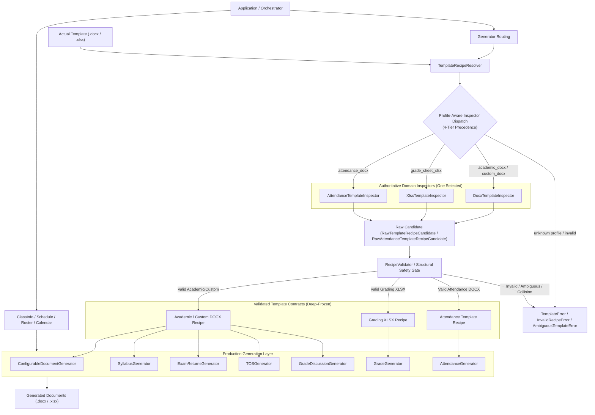

# Template Discovery Pipeline

The **Template Discovery Pipeline** is the authoritative subsystem responsible for dynamically scanning, validating, and binding Microsoft Word (`.docx`) and Excel (`.xlsx`) document templates. All production document generators—academic CEIT forms, custom generic DOCX, grading sheets (`.xlsx`), and attendance sheets (`.docx`)—are bound authoritatively through validated template recipes, completely eliminating hardcoded cell and table coordinates. Attendance is a specialized dynamic template contract under the same authoritative discovery → validation → recipe → generator model, not an architectural exception.

Related notes:
- [[CvSU Document Generator MOC]]
- [[System Architecture]]
- [[Generator Pipeline]]
- [[Orchestrator Lifecycle]]
- [[CEIT Generator]]
- [[Generic Document Generator]]
- [[Attendance Generator]]
- [[Grading Generator]]

---

## 🏛️ Target Architecture Overview

The system enforces the fundamental architectural invariants:
> **"The inspector determines WHERE. The generator determines WHAT."**
> **"No production generator may establish, repair, or guess a template binding independently of a validated recipe."**



---

## 🏛️ Architectural Hierarchy

The pipeline operates across four strictly decoupled layers:

```
┌────────────────────────────────────────────────────────┐
│               INSPECTION & DISCOVERY LAYER             │
│  - modules/parsers/template_inspector.py               │
│  - DocxTemplateInspector, XlsxTemplateInspector,       │
│    AttendanceTemplateInspector                         │
│  - Scans layout, measures evidence, scores heuristics  │
│  - Emits RawTemplateRecipeCandidate or                 │
│    RawAttendanceTemplateRecipeCandidate (NON-AUTH)     │
└──────────────────────────┬─────────────────────────────┘
                           │ (Submits Candidates to Validator)
                           ▼
┌────────────────────────────────────────────────────────┐
│                 RECIPE VALIDATION LAYER                │
│  - modules/parsers/recipe_validator.py                 │
│  - RecipeValidator.validate() (SOLE AUTHORITY)         │
│  - Enforces GeneratorProfile required/prohibited rules │
│  - Evaluates collisions, ties, and safety thresholds   │
│  - Constructs immutable ValidatedTemplateRecipe or     │
│    ValidatedAttendanceTemplateRecipe (Deep Frozen)     │
└──────────────────────────┬─────────────────────────────┘
                           │ (Supplies Validated Recipes)
                           ▼
┌────────────────────────────────────────────────────────┐
│                 FIELD RESOLUTION LAYER                 │
│  - modules/generators/field_resolver.py                │
│  - FieldResolver.resolve_field_value()                 │
│  - ClassInfo mapping, aliases, derived formats         │
│  - AttendanceInfoBinding & AttendanceMatrixBinding     │
│  - Safe empty string defaults; never fabricates        │
└──────────────────────────┬─────────────────────────────┘
                           │ (Provides Bindings to Execution Engine)
                           ▼
┌────────────────────────────────────────────────────────┐
│                   GENERATOR CONTROLS                   │
│  - document_generator.py, grade_gen.py, attendance_gen │
│  - Pure recipe execution with zero coordinate binding  │
│  - Clamps student rosters to verified capacity_limit   │
│  - Attendance capacity policy: DATE_W >= 25 failsafe   │
│  - Font auto-scaling and overflow prevention           │
└────────────────────────────────────────────────────────┘
```

---

## 🔄 The Shared Recipe Resolution Service (`TemplateRecipeResolver`)

All generator instantiation paths—including `GeneratorFactory` (for CEIT forms), `process_all` in `orchestrator.py` (for grading sheets), and `generate_attendance_for_month` / `AttendanceGenerator` (for attendance sheets)—utilize the centralized singleton resolver:

```python
resolver = TemplateRecipeResolver.get_instance()
recipe = resolver.resolve(template_path, profile_id)
```

### Profile-Aware Dispatch Hierarchy
The resolver dispatches inspectors using an authoritative 4-tier profile-aware precedence order:
1. **Exact `(extension, profile_id)` Registration Override**: Checked against `self._exact_inspectors`. Allows explicit, intentional overrides for specific profile and extension pairs.
2. **Canonical Inspector Declared by Profile Registry**: Looked up directly via `PROFILE_REGISTRY[prof].canonical_inspector`:
   - `(.docx, "academic_docx")` / `(.docx, "custom_docx")` → `DocxTemplateInspector`
   - `(.docx, "attendance_docx")` / `(.docx, "attendance")` → `AttendanceTemplateInspector`
   - `(.xlsx, "grade_sheet_xlsx")` / `(.xlsx, "grade_sheet")` → `XlsxTemplateInspector`
3. **Narrowly Defined Legacy Extension Fallback Only Where Safe**: `self._inspectors[ext]`. Guarded strictly so that an extension-only registration (e.g. `.docx`) cannot silently override canonical attendance dispatch.
4. **Otherwise Fail Closed (`TemplateError`)**: Any unknown profile ID or unsupported profile/extension combination immediately raises `TemplateError` before any inspection or disk parsing occurs.

### Cache Identity & Invalidation Semantics
The resolver caches validated recipes using a 4-tuple identity:
```python
cache_key = (absolute_template_path, profile_id, sha256_fingerprint, RECIPE_SCHEMA_VERSION)
```
- **Stale Invalidation (E9)**: When a template file is modified on disk, its SHA-256 fingerprint changes. The resolver detects the fingerprint mismatch, evicts the stale cache entry, re-inspects with the appropriate inspector, re-validates against the authoritative profile, and updates the cache.
- **Strict Schema Version**: Strictly accepts `schema_version == RECIPE_SCHEMA_VERSION == 2`. Legacy v1, unversioned dicts, and unknown future schemas are rejected with `InvalidRecipeError`.

### Recursive Deep Immutability
All validated recipe classes inherit from `ValidatedRecipeBase`:
- Implemented with `__slots__` and mutation traps preventing dynamic attribute assignment (`__setattr__` and `__delattr__` raise `AttributeError`).
- Attributes are frozen recursively via `freeze_value()`: dictionaries become read-only `MappingProxyType`, lists become `tuple`, and sets become `frozenset`.
- Non-destructive metadata overrides must be performed via `RecipeValidator.with_metadata(recipe, extra_metadata)`.

---

## 📐 Generator Integration & Pure Recipe Execution

### 1. Academic & CEIT Forms (`modules/generators/document_generator.py`, `ceit_gen.py`)
- The DOCX execution engine no longer contains an inline field-to-ClassInfo mapping. Field semantics are centralized in `FieldResolver`.
- Base class `DocumentGenerator` strictly requires `(template_path: str, recipe: ValidatedTemplateRecipe)`.
- Metadata values are resolved through `FieldResolver.resolve_field_value(field_name, info, recipe)`.
- Metadata is written by inspecting `recipe.header_bindings`, targeting specific cells `(table_idx, row_idx, col_idx)` or paragraph indices.
- Roster insertion uses `recipe.roster_binding`:
  - `table_index`: dynamically discovered roster table (ambiguity checked against multi-table collision).
  - `first_data_row_index`: dynamic starting row (accommodates multi-row headers and subheaders).
  - `name_col`, `id_col`, `index_col`: dynamically mapped columns.

### 2. Grading Sheet Workbooks (`modules/generators/grade_gen.py`)
- `GradeGenerator` strictly requires `(template_path: str, recipe: ValidatedTemplateRecipe)`.
- Zero hardcoded coordinates:
  - Header discrete fields are discovered from the `Lecture` sheet layout and written through recipe bindings.
  - Institutional College banner at `Grading Sheet!A9` is dynamically resolved.
  - Student roster rows start dynamically (`first_data_row_index` = 11 for lecture, 12 for lecture/lab, or shifted by sub-headers).
  - The roster worksheet name, row, columns, and capacity are carried by the validated `RosterBinding`; the inspector scans the worksheet structure rather than a fixed row/column window.
  - Student roster is clamped to `recipe.roster_binding.capacity_limit` (40 for canonical templates).
- **Structural Merged Cell Signature Discovery (Mutation M8)**:
  Signature targets (`BI57` in Lecture, `AO59` in Lab, `J56` in Consolidated) are discovered by identifying the merged label range containing `"INSTRUCTOR"` (`BI60:BR62`), and scanning worksheet merged cell ranges for the structural block directly above it (`min_col == label.min_col`, `max_col == label.max_col`, `max_row == label.min_row - 1`). The discovery is immune to row insertions or position shifts.

### 3. Attendance Sheets (`modules/generators/attendance_gen.py`)
- `AttendanceGenerator` strictly requires `(template_path: str, recipe: ValidatedAttendanceTemplateRecipe)`.
- **Zero hardcoded table indices (`tables[0]`, `tables[1]`) or fixed cell coordinates**.
- **Dynamic Header Info Binding (`recipe.info_binding`)**:
  - `table_index`: Discovered by scanning tables where field coverage matches >= 3 (`course_code_title`, `month_year`, `class_schedule`, `semester_ay`, `room_assignment`, `instructor`).
  - Target cell coordinates are bound dynamically and written via `set_para_text`.
- **Dynamic Matrix Binding (`recipe.matrix_binding`)**:
  - `table_index`: Discovered by header evaluation containing `NO.`, `NAME`, `STUDENT NUMBER`, `WEEK`, and summary columns (`LB`, `LC`, `R`).
  - `no_col`, `name_col`, `id_col`: Discovered dynamically, robust against column reordering (Mutation M13).
  - `student_template_row_index`: Discovered prototype student row, robust against decorative guidance banners (Mutation M15, M20).
  - `date_columns_start`: Discovered from week/date headers, robust against inserted columns (Mutation M19).
  - Structural coordinates: `week_template_cell_col`, `summary_header0_cell_col`, `date_template_cell_col`, `summary_column_indices`, `summary_header1_cell_cols`, `student_date_template_cell_col`, `student_summary_cell_cols`.
  - `template_session_capacity` & `template_student_row_capacity`: Measured dynamically from template geometry.
- **Capacity Policy & Over-Capacity Safety**:
  - Non-date column percentage width total: $248 (\text{NO}) + 1277 (\text{NAME}) + 499 (\text{STNUM}) + 212 (\text{LB}) + 208 (\text{LC}) + 133 (\text{R}) = 2577$ pct units.
  - Available date pool width: $\text{DATE\_POOL} = 5000 - 2577 = 2423$ pct units.
  - Date column width is calculated as $\text{DATE\_W} = \max(1, \text{date\_pool} // \text{n\_date\_cols})$.
  - **Failsafe Limit**: If $\text{DATE\_W} < 25$ (representing ~360 dxa width, insufficient for readable two-digit dates), `AttendanceGenerator` raises `TemplateError(f"Schedule requires {n_date_cols} date columns which exceeds printable page width capacity.")`.
  - **Discovered vs Requested vs Rendering Dimensions**:
    - `template_session_capacity`: The structural date column capacity discovered in the template (e.g. 4 columns in canonical template).
    - `required_session_columns`: Requested class meeting dates ($n\_weeks \times sessions\_per\_week$). If required dates exceed template capacity, legally expands grid columns provided $\text{DATE\_W} \ge 25$.
    - `template_student_row_capacity`: Physical student row slots discovered in template.
    - `GENERATOR_MIN_STUDENT_ROWS = 40`: Generator rendering floor ensuring minimum 40 rows are output even with small rosters.

---

## 🛡️ Enforceable Construction Guard & AST Regression Rules

1. **Private Construction Sentinel**:
   Both `ValidatedTemplateRecipe` and `ValidatedAttendanceTemplateRecipe` require `_construction_token is _PRIVATE_CONSTRUCTION_SENTINEL`. Any direct instantiation outside `RecipeValidator` raises `PermissionError`.
2. **Serialization Isolation**:
   `recipe.to_dict()` strictly omits `_construction_token`. `validate_dict()` rejects any externally supplied `_construction_token` with `InvalidRecipeError`.
3. **AST Static Analysis (`tests/test_ast_rules.py`)**:
   Enforces that no production generator or service directly calls `ValidatedTemplateRecipe(...)` or `ValidatedAttendanceTemplateRecipe(...)`, uses hardcoded coordinates (`ws['C1']`, `tables[0]`, `tables[1]`), or instantiates generators without a validated recipe.

---

## 📊 Production Generator Migration Matrix

The authoritative binding status across all generator engines:

| Generator Class | Template Family & File | Current Binding Mechanism | Uses Recipe Discovery? | Remaining Heuristic / Positional Assumptions | Target Recipe Binding | Migration Status | Tests Proving Resilience |
| :--- | :--- | :--- | :---: | :--- | :--- | :---: | :--- |
| **`ConfigurableDocumentGenerator`** | Custom DOCX (Any user `.docx`) | Dynamic `ValidatedTemplateRecipe` | **Yes** | None (Architectural reference) | `HeaderCellBinding`, `RosterBinding`, `placeholders` | **Migrated (Reference)** | `test_custom_template_pipeline.py`, `test_diverse_templates.py` |
| **`SyllabusGenerator`** | Academic DOCX (`template_syllabus.docx`) | `DocumentGenerator` base class via `ValidatedTemplateRecipe` | **Yes** | None (Obsolete heuristics eliminated) | `recipe.header_bindings`, `recipe.roster_binding` | **Migrated** | `test_template_mutations.py::test_m1`, `test_m2`, `test_m3`, `test_invalid_templates.py` |
| **`ExamReturnsGenerator`** | Academic DOCX (`template_exam_midterm.docx`, `template_exam_finals.docx`) | `DocumentGenerator` base class via `ValidatedTemplateRecipe` | **Yes** | None (Obsolete heuristics eliminated) | `recipe.header_bindings`, `recipe.roster_binding` | **Migrated** | `test_template_mutations.py::test_m4_exam_swap_roster_columns`, `test_ast_rules.py` |
| **`TOSGenerator`** | Academic DOCX (`template_tos_midterm.docx`, `template_tos_finals.docx`) | `DocumentGenerator` base class via `ValidatedTemplateRecipe` | **Yes** | None (Obsolete heuristics eliminated) | `recipe.header_bindings`, `recipe.roster_binding` | **Migrated** | `test_modules_generation.py`, `test_ast_rules.py` |
| **`GradeDiscussionGenerator`** | Academic DOCX (`Midterm-Grade-Discussion_LATEST.docx`, `Final-Grade-Discussion_LATEST.docx`) | `DocumentGenerator` base class via `ValidatedTemplateRecipe` | **Yes** | None (Obsolete heuristics eliminated) | `recipe.header_bindings`, `recipe.roster_binding` | **Migrated** | `test_template_mutations.py::test_m5_grade_discussion_2col_layout`, `test_ast_rules.py` |
| **`GradeGenerator`** | Grading Sheet XLSX (`GRADING_LECTURE_TEMPLATE.xlsx`, `GRADING_LECTURE_LAB_TEMPLATE.xlsx`) | Dynamic Openpyxl cell binding via `ValidatedTemplateRecipe` | **Yes** | None (Zero hardcoded coordinates) | `recipe.header_bindings` (cells), `recipe.roster_binding` (worksheet, start row, cols, capacity), `recipe.signature_bindings` (structural boxes) | **Migrated** | `test_template_mutations.py::test_m6`, `test_m7`, `test_m8`, `test_m9`, `test_m10`, `test_grade_generator.py` |
| **`AttendanceGenerator` (`build_attendance_sheet`)** | Attendance DOCX (`template lec.docx`, `template lab and lec.docx`) | Dynamic XML table and column binding via `ValidatedAttendanceTemplateRecipe` | **Yes** | None (Zero hardcoded `tables[0]`/`tables[1]`, dynamic info bindings, dynamic matrix column discovery, dynamic prototype student row) | `recipe.info_binding`, `recipe.matrix_binding` | **Migrated (Complete)** | `test_template_mutations.py::test_m11`..`test_m20`, `test_invalid_templates.py::test_e11`..`test_e18`, `test_ast_rules.py` |
