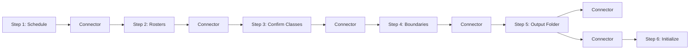

# UI Architecture

The frontend architecture of the **CvSU Document Generator** is built with modern vanilla web standards (HTML5, Vanilla CSS, Vanilla JavaScript ES6+) optimized for high performance, smooth micro-animations, and full accessibility compliance (WCAG 2.1 AA).

Related notes:
- [[CvSU Document Generator MOC]]
- [[System Architecture]]
- [[PyWebView Bridge]]
- [[User Manual]]
- [[v1.0.1]]

---

## 🎨 Design System & Aesthetics

- **Visual Style**: Modern institutional Apple Human Interface Guidelines (HIG) aesthetic with frosted glassmorphism overlays (`backdrop-filter: blur(20px)`), curated HSL palettes, and subtle elevation shadows.
- **Typography**: Clean system font stacks defaulting to `-apple-system, BlinkMacSystemFont, "Segoe UI", Roboto, Inter`.
- **Dynamic Theming (`js/theme.js`)**:
  - Smooth 300ms CSS variable transitions between Dark and Light mode.
  - Automatically queries `prefers-color-scheme` and stores user preference in `localStorage`.

---

## 🧭 Workflow Stepper Bar

The navigation flow is structured as a linear 6-step progression:

### Component Breakdown:
- `#workflowStepper`: Sticky progress bar displaying 6 interactive step chips (`#chipStep1` to `#chipStep6`).
- Step Chips: Display step number, icon, and dynamic completion badges (`statusStep1` &ndash; `statusStep6`).
- Connectors: Animated status connectors (`#connector1to2`, etc.) highlighting completed progression tracks.

---

## 🖱️ Native Drag-and-Drop (DnD)

To provide a seamless desktop experience, the UI relies on a hybrid drag-and-drop system:
- **Frontend Dropzones**: Defined in HTML with `js/dnd_handlers.js` intercepting standard DOM `dragenter`/`dragleave`/`drop` events.
- **Native OLE Intercept (`executable_test/native/dnd.py`)**: Windows Edge WebView2 often blocks or sandboxes direct file drops. The Python backend overrides the Windows window procedure to act as a native OLE `IDropTarget`. 
- **Payload Routing**: When files are dropped, the native layer routes them through `api_bridge.js` directly to the `ScheduleRosterMixin` or `TemplateMixin` to be ingested exactly as if picked via a standard file dialog.

---

## 🔔 Toast Notification Engine (`js/toast.js`)

Non-modal notification system replacing blocking dialog alerts:
- Host Element: `

`
- Variants: `success`, `error`, `info`.
- Accessibility: Accessible live regions (`role="status"`, `aria-live="polite"`).

---

## ♿ Accessibility Compliance (WCAG 2.1 AA)

- **Skip Navigation**: Direct skip-to-content anchor (`<a href="#mainContent" class="skip-link">Skip to main content</a>`).
- **Full Keyboard Navigation**: All buttons, inputs, dropzones, and drawer toggles have clear visible focus rings (`:focus-visible`).
- **Semantic Landmark Regions**: Header (`<header>`), navigation (`<nav>`), main (`<main id="mainContent">`), drawers (`<aside>`), and footer dock (`<footer>`).
- **Live Telemetry Regions**: Progress bar and generation status text are wired with `aria-live="polite"` to announce real-time background status to screen readers.
