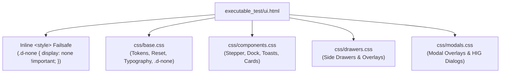
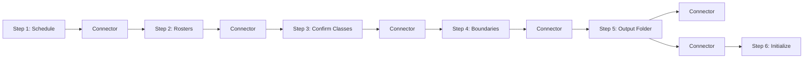

# UI Architecture

The frontend architecture of the **CvSU Document Generator** is built with modern vanilla web standards (HTML5, Vanilla CSS, Vanilla JavaScript ES6+) optimized for high performance, smooth micro-animations, resilient asset loading, and full accessibility compliance (WCAG 2.1 AA).

Related notes:
- [[CvSU Document Generator MOC]]
- [[System Architecture]]
- [[PyWebView Bridge]]
- [[Testing Strategy]]
- [[User Manual]]
- [[v1.0.1]]

---

## 🚀 Document Transport Architecture (`file:///`)

In Commit `138`, the desktop runtime transport was migrated from an implicit localhost HTTP server to an explicit resolved file URI scheme:

```python
# executable_test/main.py
document_url = Path(html_template).resolve().as_uri()
window = webview.create_window(..., url=document_url)
```

### Forensic Root Cause & Motivation
Under the legacy localhost HTTP transport, PyWebView spun up an internal WSGI/Bottle server (`http://localhost:<random_port>/`). Forensic benchmarking revealed:
1. **Concurrency Pressure**: During cold desktop boot, WebView2 initiated concurrent GET requests for 20 CSS/JS assets plus `ui.html`. The internal WSGI server (`request_queue_size = 5`) suffered connection queueing and latency spikes.
2. **Asset Starvation**: In failing launches, asset requests (specifically `drawers.css` and `modals.css`) were stalled or dropped prior to HTTP response generation. Because `.d-none` was originally bundled inside `drawers.css`, the missing stylesheet caused off-canvas side drawers and modals to render exposed across the screen before CSS evaluation completed.
3. **Transport Immunity**: Migrating to `file:///` resolves all assets directly through the local Windows filesystem using the native OS file cache. It eliminates TCP socket binding, loopback port contention, and web server thread saturation. Parity benchmarks established 0/20 failures under `file:///` (versus 14/20 under cold localhost HTTP), with 100% parity across native bridge IPC and OLE Drag-and-Drop functionality.

---

## 🎨 Design System & CSS Architecture

The application styling is structured into decoupled, modular CSS layers to prevent single-point cascade failures:



### 1. Critical Visibility Inline Failsafe
To guard against any network or filesystem delay, `executable_test/ui.html` embeds a synchronous inline stylesheet in its `<head>` before any external `<link>` tags:
```html
<style>
    .d-none { display: none !important; }
</style>
```
This guarantees that the browser engine applies hiding rules during initial layout passes before external stylesheets finish parsing.

### 2. Modular Stylesheets:
- **`css/base.css`**: Core typography, HSL design tokens, global resets, and authoritative layout utilities (including `.d-none { display: none !important; }`).
- **`css/components.css`**: Decoupled UI components including the workflow stepper bar, floating action dock, status badges, chips, and toast containers.
- **`css/drawers.css`**: Dedicated off-canvas side drawer styles (`#helpDrawer`, `#logDrawer`) with localized fallback visibility safeguards.
- **`css/modals.css`**: Dialog overlays and modal windows for settings and column mapping.
- **Dynamic Theming (`js/theme.js`)**: Smooth 300ms CSS variable transitions between Dark and Light modes, querying `prefers-color-scheme` and storing preferences in `localStorage`.

---

## 🧭 Workflow Stepper Bar

The navigation flow is structured as a linear 6-step progression:



### Component Breakdown:
- `#workflowStepper`: Sticky progress bar displaying 6 interactive step chips (`#chipStep1` to `#chipStep6`).
- Step Chips: Display step number, icon, and dynamic completion badges (`statusStep1` &ndash; `statusStep6`).
- Connectors: Animated status connectors (`#connector1to2`, etc.) highlighting completed progression tracks.

---

## ⚡ JavaScript Initialization Lifecycle (`js/app.js`)

To ensure deterministic initialization across varied WebView2 engine versions and desktop environments, application bootstrapping is managed by `bootstrapApp()`:

```javascript
function bootstrapApp() {
    if (window.__app_initialized__) return;
    window.__app_initialized__ = true;
    window.__app_bootstrap_runs = (window.__app_bootstrap_runs || 0) + 1;

    initTheme();
    initStepper();
    initBridge();
    initDrawers();
    initModals();
    initSettings();
    initSteps();
}

if (document.readyState === 'loading') {
    document.addEventListener('DOMContentLoaded', bootstrapApp);
} else {
    bootstrapApp();
}
```

### Observability Sentinels:
- `window.__app_initialized__`: Boolean sentinel asserting successful initialization.
- `window.__app_bootstrap_runs`: Counter confirming that bootstrap executed exactly once without double-binding event listeners.

---

## 🖱️ Native Drag-and-Drop (DnD)

To provide a seamless desktop experience, the UI relies on a hybrid drag-and-drop system:
- **Frontend Dropzones**: Defined in HTML with `js/bridge.js` intercepting standard DOM `dragenter`/`dragleave`/`drop` events.
- **Native OLE Intercept (`executable_test/native/dnd.py`)**: Windows Edge WebView2 often blocks or sandboxes direct file drops. The Python backend overrides the Windows window procedure to act as a native OLE `IDropTarget`. 
- **Payload Routing**: When files are dropped, the native layer routes them through `api_bridge.js` directly to the `ScheduleRosterMixin` or `TemplateMixin` to be ingested exactly as if picked via a standard file dialog.

---

## 🗔 Dialogs, Modals & Drawers

Configuration and auxiliary user flows are handled out-of-band to prevent interrupting the main workflow stepper:
- **Drawers**: Off-canvas side panels used for Help/Documentation (`js/drawers.js`) and execution Diagnostics (Logs).
- **Modals**: Centered overlays for settings configuration (`js/settings.js`), manual column mapping, and critical HIG-style confirmations.
- **Settings Modal Uniformity & Responsiveness**:
  - **Uniform Geometry**: `#modalParserSettingsBackdrop .modal-dialog-custom` (`modal-dialog-settings`) maintains a fixed uniform desktop bounding box (`width: min(920px, calc(100vw - 32px)); height: min(680px, 88vh); min-height: 520px;`) across all 6 configuration sections (Subject Prefixes, Lab Courses, Degree Aliases, Roster Keywords, Faculty Defaults, Custom Forms). Tab navigation operates entirely within a flexbox body (`min-height: 0; overflow-y: auto;`) with zero jumping or vertical jitter.
  - **Tablet Adaptation (`<= 820px`)**: Segmented navigation tabs seamlessly transform into a 3x2 responsive grid, preventing horizontal tab clipping and maintaining accessible touch targets.
  - **Mobile Adaptation (`<= 480px`)**: Tabs transition to a 2x3 grid, internal multi-column forms collapse to single-column card flows, and the modal footer stacks utility actions above primary dialog buttons with zero horizontal scroll.
  - **Short Viewport Resilience (`<= 640px height`)**: The modal dialog automatically caps at `94vh` with reduced backdrop padding (`8px`) ensuring all scrollable controls and dialog buttons remain accessible.

---

## 🔔 Toast Notification Engine (`js/toast.js`)

Non-modal notification system replacing blocking dialog alerts:
- Host Element: `<div id="toastContainer" class="toast-container" role="region" aria-label="System notifications"></div>`
- Variants: `success`, `error`, `info`.
- Accessibility: Accessible live regions (`role="status"`, `aria-live="polite"`).

---

## ♿ Accessibility Compliance (WCAG 2.1 AA)

- **Skip Navigation**: Direct skip-to-content anchor (`<a href="#mainContent" class="skip-link">Skip to main content</a>`).
- **Full Keyboard Navigation**: All buttons, inputs, dropzones, and drawer toggles have clear visible focus rings (`:focus-visible`).
- **Semantic Landmark Regions**: Header (`<header>`), navigation (`<nav>`), main (`<main id="mainContent">`), drawers (`<aside>`), and footer dock (`<footer>`).
- **Live Telemetry Regions**: Progress bar and generation status text are wired with `aria-live="polite"` to announce real-time background status to screen readers.
