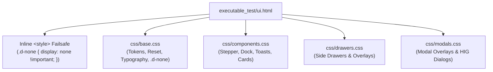
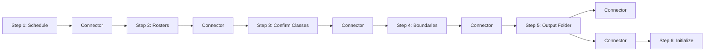

# UI Architecture

The frontend architecture of the **CvSU Document Generator** is built with modern vanilla web standards (HTML5, Vanilla CSS, Vanilla JavaScript ES6+) optimized for high performance, smooth micro-animations, resilient asset loading, and full accessibility compliance (WCAG 2.1 AA).

Related notes:
- [[CvSU Document Generator MOC]]
- [[System Architecture]]
- [[PyWebView Bridge]]
- [[Testing Strategy]]
- [[User Manual]]
- [[v1.0.1]]

---

## 🚀 Document Transport Architecture (`file:///`)

In Commit `138`, the desktop runtime transport was migrated from an implicit localhost HTTP server to an explicit resolved file URI scheme:

```python
# executable_test/main.py
document_url = Path(html_template).resolve().as_uri()
window = webview.create_window(..., url=document_url)
```

### Forensic Root Cause & Motivation
Under the legacy localhost HTTP transport, PyWebView spun up an internal WSGI/Bottle server (`http://localhost:<random_port>/`). Forensic benchmarking revealed:
1. **Concurrency Pressure**: During cold desktop boot, WebView2 initiated concurrent GET requests for 20 CSS/JS assets plus `ui.html`. The internal WSGI server (`request_queue_size = 5`) suffered connection queueing and latency spikes.
2. **Asset Starvation**: In failing launches, asset requests (specifically `drawers.css` and `modals.css`) were stalled or dropped prior to HTTP response generation. Because `.d-none` was originally bundled inside `drawers.css`, the missing stylesheet caused off-canvas side drawers and modals to render exposed across the screen before CSS evaluation completed.
3. **Transport Immunity**: Migrating to `file:///` resolves all assets directly through the local Windows filesystem using the native OS file cache. It eliminates TCP socket binding, loopback port contention, and web server thread saturation. Parity benchmarks established 0/20 failures under `file:///` (versus 14/20 under cold localhost HTTP), with 100% parity across native bridge IPC and OLE Drag-and-Drop functionality.

---

## 🎨 Design System & CSS Architecture

The application styling is structured into decoupled, modular CSS layers to prevent single-point cascade failures:


```mermaid
graph TD
    HTML["executable_test/ui.html"]
    Inline["Inline &lt;style&gt; Failsafe<br>(.d-none { display: none !important; })"]
    Base["css/base.css<br>(Tokens, Reset, Typography, .d-none)"]
    Comp["css/components.css<br>(Stepper, Dock, Toasts, Cards)"]
    Drawers["css/drawers.css<br>(Side Drawers & Overlays)"]
    Modals["css/modals.css<br>(Modal Overlays & HIG Dialogs)"]

    HTML --> Inline
    HTML --> Base
    HTML --> Comp
    HTML --> Drawers
    HTML --> Modals
```

### 1. Critical Visibility Inline Failsafe
To guard against any network or filesystem delay, `executable_test/ui.html` embeds a synchronous inline stylesheet in its `<head>` before any external `<link>` tags:
```html
<style>
    .d-none { display: none !important; }
</style>
```
This guarantees that the browser engine applies hiding rules during initial layout passes before external stylesheets finish parsing.

### 2. Modular Stylesheets:
- **`css/base.css`**: Core typography, HSL design tokens, global resets, and authoritative layout utilities (including `.d-none { display: none !important; }`).
- **`css/components.css`**: Decoupled UI components including the workflow stepper bar, floating action dock, status badges, chips, and toast containers.
- **`css/drawers.css`**: Dedicated off-canvas side drawer styles (`#helpDrawer`, `#logDrawer`) with localized fallback visibility safeguards.
- **`css/modals.css`**: Dialog overlays and modal windows for settings and column mapping.
- **Dynamic Theming (`js/theme.js`)**: Smooth CSS variable transitions between Dark and Light modes with View Transition circular reveals, querying `prefers-color-scheme` and storing preferences in `localStorage`.

---

## 🌓 View Transition Theming & Packaged Runtime Architecture

The theme management subsystem (`executable_test/js/theme.js`) provides dynamic switching between Dark Mode and Light Mode with a circular View Transition reveal and native accessibility awareness:

```text
document.startViewTransition()
        ↓
await transition.ready
        ↓
document.documentElement.animate(...) [WAAPI]
        ↓
target: ::view-transition-new(root)
clipPath: circle(0px at x y) → circle(endRadius at x y)
```

### 1. View Transition Engine Architecture
- **WAAPI Iris Ownership**: The Web Animations API (WAAPI) is the sole owner of the circular iris reveal geometry (`THEME_TRANSITION_DURATION_MS = 450ms`, `cubic-bezier(0.2, 0, 0, 1)`).
- **CSS Specular Styling**: `executable_test/css/modals.css` applies a restrained specular edge filter to `::view-transition-new(root)` without competing keyframe animations.
- **Timing Synchronization**: WAAPI execution strictly awaits `transition.ready` before invoking `.animate()`. Animating before `.ready` would target an unmounted pseudo-element.

### 2. Packaged Desktop Runtime Environment (`CvSU Gen.exe`)
In the packaged Windows desktop binary:
- **Container**: PyWebView `6.2.1` using WinForms + Microsoft Edge WebView2 Evergreen Runtime.
- **Active Engine**: Evergreen WebView2 Runtime (`154.0.4258.37`) running in EdgeChromium mode.
- **API Capabilities**: Natively supports `document.startViewTransition`, `Element.prototype.animate`, and `::view-transition-new(root)` pseudo-element WAAPI animations. All promises (`updateCallbackDone`, `ready`, `finished`) resolve with 0 errors.

### 3. Forensic Runtime Diagnosis & Accessibility Interaction (Commit 200)
When running the compiled `CvSU Gen.exe`, the application toggles theme successfully but may display no iris animation on certain host machines:
- **Root Cause**: `theme.js` queries `window.matchMedia("(prefers-reduced-motion: reduce)").matches` to honor user accessibility preferences.
- **OS Synchronization**: Edge WebView2 synchronizes `prefers-reduced-motion` with the Windows host setting `SPI_GETCLIENTAREAANIMATION` (Windows Settings > Accessibility > Visual Effects > **Animation effects**).
- **Behavior Parity**:
  - When Windows **Animation effects** is **Off**, `prefers-reduced-motion: reduce` evaluates to `true`. Per accessibility design (Apple HIG & WCAG), `theme.js` immediately applies the theme without large-scale spatial motion.
  - In Playwright browser tests, the browser context defaults to `no-preference` (`false`), allowing the 450ms iris to animate.
  - When reduced motion is bypassed or Windows Animation effects is enabled, `CvSU Gen.exe` plays the full circular iris animation with zero exceptions.

---

## 🧭 Workflow Stepper Bar

The navigation flow is structured as a linear 6-step progression:


```mermaid
graph LR
    S1["Step 1: Schedule"] --> C1["Connector"]
    C1 --> S2["Step 2: Rosters"]
    S2 --> C2["Connector"]
    C2 --> S3["Step 3: Confirm Classes"]
    S3 --> C3["Connector"]
    C3 --> S4["Step 4: Boundaries"]
    S4 --> C4["Connector"]
    C4 --> S5["Step 5: Output Folder"]
    S5 --> C5["Connector"]
    S5 --> C6["Connector"]
    C6 --> S6["Step 6: Initialize"]
```

### Component Breakdown:
- `#workflowStepper`: Sticky progress bar displaying 6 interactive step chips (`#chipStep1` to `#chipStep6`).
- Step Chips: Display step number, icon, and dynamic completion badges (`statusStep1` &ndash; `statusStep6`).
- Connectors: Animated status connectors (`#connector1to2`, etc.) highlighting completed progression tracks.

---

## ⚡ JavaScript Initialization Lifecycle (`js/app.js`)

To ensure deterministic initialization across varied WebView2 engine versions and desktop environments, application bootstrapping is managed by `bootstrapApp()`:

```javascript
function bootstrapApp() {
    if (window.__app_initialized__) return;
    window.__app_initialized__ = true;
    window.__app_bootstrap_runs = (window.__app_bootstrap_runs || 0) + 1;

    initTheme();
    initStepper();
    initBridge();
    initDrawers();
    initModals();
    initSettings();
    initSteps();
}

if (document.readyState === 'loading') {
    document.addEventListener('DOMContentLoaded', bootstrapApp);
} else {
    bootstrapApp();
}
```

### Observability Sentinels:
- `window.__app_initialized__`: Boolean sentinel asserting successful initialization.
- `window.__app_bootstrap_runs`: Counter confirming that bootstrap executed exactly once without double-binding event listeners.

---

## 🖱️ Native Drag-and-Drop (DnD)

To provide a seamless desktop experience, the UI relies on a hybrid drag-and-drop system:
- **Frontend Dropzones**: Defined in HTML with `js/bridge.js` intercepting standard DOM `dragenter`/`dragleave`/`drop` events.
- **Native OLE Intercept (`executable_test/native/dnd.py`)**: Windows Edge WebView2 often blocks or sandboxes direct file drops. The Python backend overrides the Windows window procedure to act as a native OLE `IDropTarget`. 
- **Payload Routing**: When files are dropped, the native layer routes them through `api_bridge.js` directly to the `ScheduleRosterMixin` or `TemplateMixin` to be ingested exactly as if picked via a standard file dialog.

---

## 🗔 Dialogs, Modals & Drawers

Configuration and auxiliary user flows are handled out-of-band to prevent interrupting the main workflow stepper:
- **Drawers**: Off-canvas side panels used for Help/Documentation (`js/drawers.js`) and execution Diagnostics (Logs).
- **Modals**: Centered overlays for settings configuration (`js/settings.js`), manual column mapping, and critical HIG-style confirmations.
- **Settings Modal Uniformity & Responsiveness**:
  - **Uniform Geometry**: `#modalParserSettingsBackdrop .modal-dialog-custom` (`modal-dialog-settings`) maintains a fixed uniform desktop bounding box (`width: min(920px, calc(100vw - 32px)); height: min(680px, 88vh); min-height: 520px;`) across all 6 configuration sections (Subject Prefixes, Lab Courses, Degree Aliases, Roster Keywords, Faculty Defaults, Custom Forms). Tab navigation operates entirely within a flexbox body (`min-height: 0; overflow-y: auto;`) with zero jumping or vertical jitter.
  - **Apple HIG Preferences Architecture**: Faculty Defaults adheres to Apple Human Interface Guidelines for System Settings via an Inset Grouped List (`.apple-hig-group`) featuring themed squircle icon tiles (👤 Instructor, 🏛️ College, 🗓️ Term), semibold titles with caption subtitles, right-aligned controls with smooth focus rings, and a macOS Quick Look-style **Document Header Live Preview** card that syncs typography and layout in real-time as defaults are edited.
  - **Inner Component Elasticity**: Data table wrappers (`#cfgPanePrefixes`, `#cfgPaneDegrees`) and keyword clouds (`#cfgPaneKeywords`) utilize `flex: 1; min-height: 180px; max-height: none;` without inline height clamping, filling the uniform dialog space down to the action footer.
  - **Dynamic Stepper Readiness**: The workflow stepper dynamically binds Step 4 (Dates) readiness to the presence of `startDate` and `endDate` boundaries, displaying a neutral `•` indicator until dates are configured or semester presets applied.
  - **Tablet Adaptation (`<= 820px`)**: Segmented navigation tabs seamlessly transform into a 3x2 responsive grid, preventing horizontal tab clipping and maintaining accessible touch targets.
  - **Mobile Adaptation (`<= 480px`)**: Tabs transition to a 2x3 grid, internal multi-column forms collapse to single-column card flows, and the modal footer stacks utility actions above primary dialog buttons with zero horizontal scroll.
  - **Short Viewport Resilience (`<= 640px height`)**: The modal dialog automatically caps at `94vh` with reduced backdrop padding (`8px`) ensuring all scrollable controls and dialog buttons remain accessible.

---

## 🔔 Toast Notification Engine (`js/toast.js`)

Non-modal notification system replacing blocking dialog alerts:
- Host Element: `<div id="toastContainer" class="toast-container" role="region" aria-label="System notifications"></div>`
- Variants: `success`, `error`, `info`.
- Accessibility: Accessible live regions (`role="status"`, `aria-live="polite"`).

---

## ♿ Accessibility Compliance (WCAG 2.1 AA)

- **Skip Navigation**: Direct skip-to-content anchor (`<a href="#mainContent" class="skip-link">Skip to main content</a>`).
- **Full Keyboard Navigation**: All buttons, inputs, dropzones, and drawer toggles have clear visible focus rings (`:focus-visible`).
- **Semantic Landmark Regions**: Header (`<header>`), navigation (`<nav>`), main (`<main id="mainContent">`), drawers (`<aside>`), and footer dock (`<footer>`).
- **Live Telemetry Regions**: Progress bar and generation status text are wired with `aria-live="polite"` to announce real-time background status to screen readers.

---

## 🌗 Theme Transition Subsystem (`js/theme.js` + `css/modals.css`)

The dark/light theme toggle uses the **CSS View Transitions API** (Chrome/Chromium) to produce a circular iris reveal originating from the click coordinates. The architecture enforces strict separation of responsibilities.

### Architecture (commit 197)

| Responsibility | Owner |
|---|---|
| Click-origin geometry (`x`, `y`, `endRadius`) | `theme.js` |
| CSS custom properties (`--vt-x`, `--vt-y`, `--vt-radius`, `--vt-duration`) | `theme.js` injects onto `:root` |
| Iris `clip-path` circular reveal animation | **`theme.js` via WAAPI** — sole owner |
| Iris timing duration (`THEME_TRANSITION_DURATION_MS = 450`) | `theme.js` — governs WAAPI iris only |
| Icon animation (`spin-morph-kf`) | `modals.css` — independent 280ms `@keyframes` (Option A) |
| Glass edge specular glow (`--vt-edge-specular`) | `modals.css` — static VT-native `filter` on `::view-transition-new(root)` |
| `prefers-reduced-motion` detection | `theme.js` — checked in JS *before* View Transition starts |
| `prefers-reduced-motion` fallback | `modals.css` + `theme.js` — JS skips WAAPI iris and icon animation; CSS provides crossfade |
| `prefers-reduced-transparency` opaque fallback | `modals.css` media query |
| `prefers-contrast: more` edge treatment | `modals.css` media query |

### WAAPI Iris Flow (commit 197)

```
document.startViewTransition(() => { applyTheme(); })
        ↓
transition.ready  ← CRITICAL: pseudo-elements do not exist until after this resolves
        ↓
document.documentElement.animate(
    { clipPath: [ "circle(0px at x y)", "circle(endRadius at x y)" ] },
    { duration: 450, easing: "cubic-bezier(0.25, 1, 0.5, 1)",
      fill: "both", pseudoElement: "::view-transition-new(root)" }
)
        ↓
await transition.finished
        ↓
cleanup (theme-transitioning removed in double requestAnimationFrame)
```

### Why WAAPI and not CSS `animation`

Commit 193 established CSS-only iris ownership (`appleThemeIrisReveal @keyframes`). Commit 195 continued with CSS animation. In the actual CvSU Gen runtime environment, the CSS-only approach did not produce a visible iris reveal. Commit 196 restored WAAPI-driven `clip-path` animation on the pseudo-element, which is the more explicit and widely-documented pattern and which has been runtime-verified to produce the expected growing circle.

Dual ownership (CSS animation + WAAPI simultaneously on the same property) causes competing animations and was the root cause of the earlier choppiness in commit 192. The solution is strict single ownership: WAAPI owns the geometry, CSS owns the static styling.

### View Transition Rendering Model & Visual Reality

The CSS View Transitions API defines a **dedicated VT layer** painted by the browser **after** the normal document is fully composited. No DOM element — regardless of z-index value — can be placed into or alongside this layer. Normal DOM z-index has no defined relationship to the VT rendering layer.

```
::view-transition           (browser VT layer — separate post-compositing pass)
  └─ ::view-transition-image-pair(root)
       ├─ ::view-transition-old(root)   z-index: 1  (old page snapshot, static)
       └─ ::view-transition-new(root)   z-index: 2  (new page, WAAPI clip-path grows)
            filter: var(--vt-edge-specular)          ← CSS-owned static glass edge treatment
```

**Specular Filter Reality (Verified via Headed Inspection):**
- In Chromium's compositing model, `filter: drop-shadow(...)` on `::view-transition-new(root)` is clipped by the circular `clip-path: circle(...)`.
- `filter` does not project an exterior halo beyond the aperture contour because `clip-path` discards all content outside the circular radius.
- Headed browser visual tests across multiple viewports (880×640, 1120×780, 1440×900) confirm the transition presents as a **crisp, razor-sharp circular geometric reveal (Apple-style clean iris wipe)** rather than a blurred halo, neon ring, or full-screen bloom.
- Normal application glassmorphism (`backdrop-filter: blur(...)`) remains active on UI cards, navigation headers, and floating docks, but operates independently of the View Transition snapshot pipeline.

### View Transition Pseudo-Tree Experimental Findings (commit 198)

An empirical investigation was conducted in Chromium 151+ to explore whether `backdrop-filter` or masking on VT pseudo-elements could produce a live frosted-glass annulus:

1. **`backdrop-filter` on `::view-transition-new(root)` (Exp A)**:
   - Evaluated `backdrop-filter: blur(16px) saturate(180%)`.
   - Result: **Zero visible change**. Because `::view-transition-new(root)` contains an opaque raster snapshot of the destination document, its opaque pixels cover whatever backdrop-filter renders underneath inside the circular clip. Outside the circle, `clip-path` discards the entire pseudo-element (content and filter alike).
2. **`backdrop-filter` on `::view-transition-image-pair(root)` (Exp B) & `::view-transition-group(root)` (Exp C)**:
   - Result: **Completely occluded**. Outside the circle, `old(root)` is 100% opaque. Inside the circle, `new(root)` is 100% opaque. Because `old` and `new` meet seamlessly with no gap, the container's backdrop is fully occluded everywhere across the viewport.
3. **Annulus / Ring Masking (Exp D)**:
   - Masking `new(root)` with a radial gradient punches out the center of the new theme, revealing the old theme in the interior. A single pseudo-element cannot simultaneously display an opaque interior disk AND a blurred translucent border without a second layer.
4. **Pseudo-Element Nesting (Exp E)**:
   - Attempting `::view-transition-new(root)::before` or `::view-transition-image-pair(root)::after` produces a CSS parse error. Pseudo-elements cannot be nested inside View Transition pseudo-elements.
5. **Conclusion**:
   - The current CSS View Transitions Level 1/2 specifications and browser implementations do not provide an independent layer for a secondary glass wavefront without introducing DOM overlays (which fail due to snapshot freezing and layer isolation).
   - The production architecture intentionally keeps the clean, compositor-friendly WAAPI circular reveal and monochrome specular filter without overengineering or faking glassmorphism.

### Captured Frosted-Glass Material Prototype Findings (commit 199)

In Commit 199, an isolated prototype investigation was conducted to determine whether a **captured/static frosted-glass material** masked to a moving annulus could create the visual impression of a glass edge moving with the iris.

#### Tested Approaches in Headed Chromium:
1. **Experiment A (Captured DOM Surface via VT Named Group)**:
   - Full-viewport DOM element with `backdrop-filter: blur(16px) saturate(1.35)` captured as `::view-transition-old(glass-annulus)`.
   - An animated radial-gradient mask on `::view-transition-group(glass-annulus)` restricted visibility to a 14px annulus ($R_{\text{outer}} = R, R_{\text{inner}} = \max(0, R - 14\text{px})$) synchronized with the WAAPI circular iris.
   - **Empirical Visual Result**: **Severe raster ghosting and text duplication (Rejected)**. Because the captured material is a frozen raster snapshot of the pre-transition document, revealing it through a moving ring slices stationary old-theme content into the ring. When moving over cards or headers, text ("Active Roster Configuration", toggle button, badges) appears severed and doubled. It resembles a circular tear revealing an old photograph rather than a moving glass lens.
2. **Experiment B (CSS Snapshot Material)**:
   - Applying `filter: blur(...)` to `::view-transition-old(root)`.
   - **Empirical Visual Result**: **Unrevealed viewport degradation (Rejected)**. Blurring `old(root)` blurs the entire viewport outside the expanding iris, muddying the previous theme before it is revealed.
3. **Experiment C (Decorative Annulus Wavefront Overlay)**:
   - An SVG/DOM stroke ring tracking the iris without raster capture.
   - **Empirical Visual Result**: **Synthetic neon ripple appearance (Rejected)**. Without live optical refraction of underlying pixels, the overlay looks like an artificial geometric ripple or halo rather than physical glass material.

#### Final Decision & Architectural Stance:
- **Outcome C (Visually Poor & Distracting)**: Integrating a captured frosted-glass annulus is definitively rejected. The visual artifacts (severed text, ghosting, raster parallax) severely degrade interface craft and violate Apple HIG guidelines (`liquid-glass.md` § Layer discipline & `motion.md` § Providing feedback).
- **Production Baseline Preserved**: Production code (`executable_test/js/theme.js`, `executable_test/css/modals.css`) strictly preserves the Commit 198 baseline:
  - WAAPI-driven circular reveal on `::view-transition-new(root)`.
  - Static monochrome specular filter (`--vt-edge-specular: drop-shadow(...)`).
  - Zero DOM wavefront layers, zero runaway cascade (`transitionstart` count $\equiv 0$).
  - Authentic `backdrop-filter` glassmorphism preserved exclusively on static/floating UI components (`.card`, `.header`, `.stepper-dock`).

### Icon Animation Contract (`spin-morph`)

In commit 197, `spin-morph` was refactored to **Option A (CSS `@keyframes` animation)**:
- While `.theme-transitioning * { transition: none !important }` suppresses all CSS transitions during theme switching, it does **not** suppress CSS `@keyframes` animations.
- The theme toggle icon is animated via `@keyframes spin-morph-kf` with an intentional **280ms** duration and spring easing `cubic-bezier(0.34, 1.56, 0.64, 1)`.
- The icon duration is completely decoupled from the WAAPI iris duration token (`THEME_TRANSITION_DURATION_MS = 450`).
- Under `prefers-reduced-motion: reduce`, the icon animation is bypassed in JavaScript and disabled in CSS via `@media (prefers-reduced-motion: reduce) { .theme-icon-container.spin-morph { animation: none; } }`.

### DOM Wavefront Eliminated (commit 195, confirmed commit 196/197)

Commits 194 and 195 explored a `.theme-glass-wavefront` DOM overlay. This approach failed on three counts and has been permanently eliminated:

1. **Snapshotted into old-page capture**: DOM elements created *before* `document.startViewTransition()` are captured in `::view-transition-old(root)` — not live overlays above the transition.
2. **z-index claim was false**: The VT layer is a separate rendering pass. DOM z-index has no defined relationship to it.
3. **backdrop-filter on snapshot**: `backdrop-filter` on a snapshotted element blurs frozen pixels, not live composited content.

### Accessibility

**Reduced Motion (`prefers-reduced-motion: reduce`)**
- WAAPI iris is JS-owned, so the reduced-motion bypass occurs in JS *before* starting the View Transition.
- When active: no WAAPI `clip-path` animation, no icon `spin-morph`, theme applied directly via a simple crossfade or direct DOM update.
- CSS `prefers-reduced-motion` block sets `filter: none` on the VT pseudo-elements for completeness.

**Reduced Transparency (`prefers-reduced-transparency: reduce`)**
- `modals.css` increases specular opacity and removes transparency-dependent decoration.

**Increased Contrast (`prefers-contrast: more`)**
- `modals.css` increases edge contrast, removes soft glow, strengthens border visibility.

### Zero Runaway Transitions

All DOM CSS transitions are suppressed during the VT via `.theme-transitioning * { transition: none !important }`, preventing cascade storms.
- Measurement window is strictly bounded to the VT lifecycle: `[click] → [transition.finished + double-rAF cleanup]`.
- Because `spin-morph` is an `@keyframes` animation and WAAPI does not fire DOM `transitionstart` events, the event count is **deterministically 0**.
- Automated performance testing verifies 0 runaway events across 5 consecutive back-and-forth toggles without flakiness.


