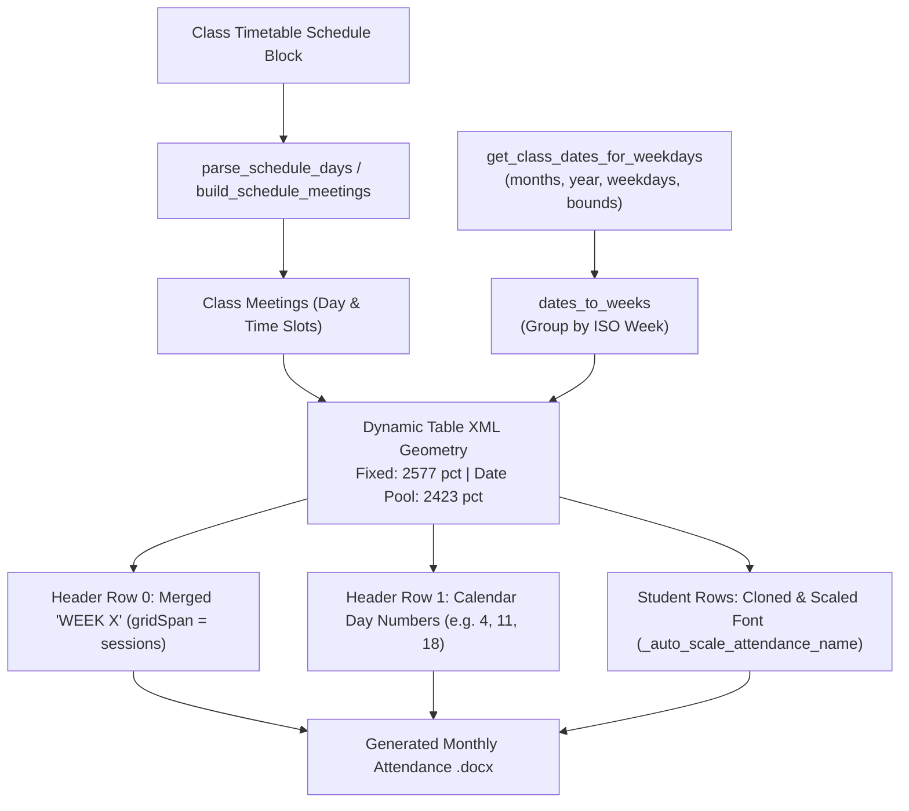

# Attendance Generator

The **Attendance Generator** (`modules/generators/attendance_gen.py`) builds monthly attendance rosters (CvSU Form VPAA-QF-09) dynamically tailored to class meeting days, calendar date ranges, and laboratory configurations.

Related notes:
- [[CvSU Document Generator MOC]]
- [[Generators Overview]]
- [[Attendance Templates]]
- [[Template Guidelines]]
- [[Template Discovery Pipeline]]

---

## 🚧 Architectural Isolation Boundary

While all academic CEIT forms (`SyllabusGenerator`, `ExamReturnsGenerator`, `TOSGenerator`, `GradeDiscussionGenerator`), generic custom documents (`ConfigurableDocumentGenerator`), and grading workbooks (`GradeGenerator`) are governed by the authoritative `ValidatedTemplateRecipe` pipeline (`TemplateRecipeResolver` → `Inspector` → `RecipeValidator`), the **Attendance Generator remains an intentionally isolated architectural boundary**:

1. **Dynamic ISO Calendar Week Calculations**:
   Attendance generation is intrinsically bound to calendar mathematics (`calendar.monthrange`, `dt.weekday()`, ISO week bucketing via `dates_to_weeks()`). The number of session columns cannot be determined statically by inspecting template structure; it varies dynamically per month, per day schedule, and per semester date boundary.
2. **Dynamic XML Grid Resizing & GridSpan**:
   Unlike static forms where rows/columns have fixed layout geometry, `attendance_gen.py` wipes and rebuilds the Word table XML grid `<w:tblGrid>` from scratch, calculating column widths from a pool (`5000 pct`) and assigning dynamic `<w:gridSpan>` to merged `WEEK X` header cells based on session meeting count.
3. **Schema Isolation**:
   The `ValidatedTemplateRecipe` schema (Schema Version 2) models static cell coordinates (`HeaderCellBinding`) and static table/column mappings (`RosterBinding`). Forcing dynamic calendar matrix generation into Schema v2 would require expanding the recipe contract with calendar-specific fields, coupling static document discovery to temporal scheduling rules.
4. **Preserved Reliability**:
   Isolating attendance ensures zero regression risk to the proven, production-grade calendar geometry engine. It is invoked directly by `orchestrator.py` via `generate_attendance_for_month()`.

---

## 📅 Architecture & Dynamic Calendar Geometry

Unlike fixed-table academic forms, the attendance generator dynamically constructs the Word table XML grid for each month:
1. **Calendar Computation**: Evaluates class meeting days against the monthly calendar and semester date boundaries.
2. **ISO Week Grouping**: Groups valid meeting dates by ISO calendar week (`dates_to_weeks`).
3. **Dynamic XML Grid Resizing**: Computes exact percentage widths for date columns from an available width pool, inserting dynamic `<w:gridCol>` elements and merged week header cells (`gridSpan`).
4. **Name Auto-Scaling**: Implements a dedicated 5-tier font reduction ladder to ensure student names fit within the ~1.76-inch column without expanding table row heights.



---

## 🔄 Orchestration Contract & Return Signature

The primary entry point invoked by `orchestrator.py` is `generate_attendance_for_month`:

```python
def generate_attendance_for_month(
    template_path: str,
    output_path: str,
    info: dict,
    students: list,
    month: str,
    year: str,
    class_day: str,
    start_bound: tuple = None,
    end_bound: tuple = None
) -> str
```

### Return Contract Invariant
`generate_attendance_for_month` returns a **status string**, **never an integer**:
- **`"generated"`**: The monthly attendance sheet had valid meeting dates within bounds and was successfully built and saved to disk.
- **`"skipped_empty"`**: Raised internally via `EmptyDateError` when no calendar meeting dates match the month and bounding range (e.g. month falls entirely outside semester bounds, or purely asynchronous days). The orchestrator catches this status and appends `f"{month_out_name} (0 days)"` to `results["skipped"]["attendance"]` without treating it as an error.

---

## 📋 Complete Generator-by-Generator Mapping (Targets 8 & 9)

Each generator target was audited against the comprehensive 23-attribute checklist, and any unavailable evidence is explicitly marked.

### Target 8: Attendance Generation — Lecture Only

- **Purpose**: Generates monthly student attendance tracking sheets for courses with pure lecture contact hours.
- **Actual entry point**: `generate_attendance_for_month(template_path, output_path, info, students, month, year, class_day, start_bound=None, end_bound=None) -> str`.
  - Underlying builder: `build_attendance_sheet(...)`.
- **Upstream caller**: Orchestrator `process_all()` in `modules/services/orchestrator.py`.
- **Input object/data**:
  - `template_path: str`: Path to `attendance/template lec.docx`.
  - `output_path: str`: Destination file path.
  - `info: dict`: Dictionary containing keys:
    - `"course"`: Course and section (e.g. `"CS1-4"`).
    - `"schedule"`: Formatted schedule string (e.g. `"Mon: 05:00PM-07:00PM"`).
    - `"semester"`: Semester string (e.g. `"1st Semester / 2026-2027"`).
    - `"room"`: Room assignment (e.g. `"LEC: ITC 402"`).
    - `"instructor"`: Instructor full name (e.g. `"DAN JOSEPH A. ORTEGA"`).
    - `"subject"`: Subject title (e.g. `"DCIT 21 - INTRODUCTION TO COMPUTING"`).
  - `students: list`: List of `(name, student_number)` tuples.
  - `month: str`: Full month name (e.g. `"August"`, `"September"`).
  - `year: str`: Calendar year string (e.g. `"2026"`).
  - `class_day: str`: Day names (e.g. `"Mon"`).
  - `start_bound: Optional[Tuple[int, int]]`: `(month, day)` boundary cutoff.
  - `end_bound: Optional[Tuple[int, int]]`: `(month, day)` boundary cutoff.
- **Accepted input forms**:
  - In orchestrator: dictionary `info`, list of student tuples.
  - CLI / Interactive: `attendance_gen.py main()` prompts for course, schedule, semester, room, instructor, month, year, class day, and `--csv` roster path.
- **Validation**:
  - Month parsing: `parse_months()` parses names, abbreviations, or ranges (e.g. `"February"`, `"Feb"`, `"2"`, `"2-3"`).
  - Weekday parsing: `parse_weekday()` validates day strings (0=Mon to 6=Sun).
  - Template table checks:
    - Tables count >= 2 (Table 0 = Info Table, Table 1 = Attendance Grid); raises `TemplateError` if < 2.
    - Info Table rows >= 5; raises `TemplateError` if < 5.
    - Attendance Grid rows >= 3 (Header 0, Header 1, Template Student Row); raises `TemplateError` if < 3.
  - Empty date check: If `get_class_dates_for_weekdays` finds 0 valid dates, raises `EmptyDateError`.
- **Normalization**:
  - `build_schedule_label`: Normalizes day and time meetings into standard format.
  - `month_label`: Formats single or multi-month headings (e.g. `"SEPTEMBER 2026"`).
  - Filename sanitization: Removes invalid path characters from course section, schedule code, and month names.
- **Processing/transformation logic**:
  1. Computes valid dates matching class weekdays within semester date boundaries.
  2. Partitions dates into ISO calendar weeks.
  3. Parses Table 0 (Info Table) and injects:
     - `info_cell_para(0, 1)`: Course Code and Subject Title (`shrink_threshold=40, shrink_sz="18"`).
     - `info_cell_para(0, 4)`: Month and Year label.
     - `info_cell_para(1, 1)`: Schedule label (`shrink_threshold=45, shrink_sz="18"`).
     - `info_cell_para(2, 1)`: Semester and Academic Year.
     - `info_cell_para(3, 1)`: Room Assignment.
     - `info_cell_para(4, 1)`: Instructor full name (`shrink_threshold=35, shrink_sz="18"`).
  4. Dynamically builds Table 1 (Attendance Grid):
     - Clears original rows and `<w:tblGrid>`.
     - Allocates column widths and appends new `<w:gridCol>` definitions.
     - Builds Header Row 0 with merged week columns (`"WEEK 1"`, `"WEEK 2"`).
     - Builds Header Row 1 with individual date numbers.
     - Clones student row for `max(40, len(students))` target rows.
     - Injects row number, scaled student name, student ID, and empty date cells.
  5. Serializes and saves document via `save_docx`.
- **Calculations**:
  - Fixed column widths: `NO_W = 248`, `NAME_W = 1277`, `STNUM_W = 499`, `LB_W = 212`, `LC_W = 208`, `R_W = 133` (Total fixed = 2577 pct).
  - Date pool: `5000 - 2577 = 2423 pct`.
  - Date column width: `DATE_W = 2423 // n_date_cols`. Remainder added to `NAME_W`.
  - Week header width: `WEEK_W = DATE_W * session_count`.
  - Summary column width: `SUM_W = LB_W + LC_W + R_W = 553 pct` (`gridSpan = 3`).
  - Dedicated student name font auto-scaling ladder (`_auto_scale_attendance_name`):
    - `<= 24` chars: 8pt (`sz="16"`, bold default)
    - `25–28` chars: 7pt (`sz="14"`)
    - `29–33` chars: 6.5pt (`sz="13"`)
    - `34–37` chars: 5.5pt (`sz="11"`, unbold)
    - `>= 38` chars: 5pt (`sz="10"`, unbold)
- **Authoritative template/recipe**:
  - Template: `attendance/template lec.docx` (bundled in `attendance/` or project root).
  - Recipe: Direct programmatic XML table manipulation (not an academic docx recipe).
- **Exact template relationship**:
  - Table 0: Metadata Info table (5 rows).
  - Table 1: Attendance roster grid (Header 0, Header 1, and 1 prototype student row).
- **Populated fields**: Course Code / Title, Month & Year, Class Schedule, Semester / AY, Room Assignment, Instructor Name, Week Headers, Date Day Numbers, Student Row Number, Student Full Name, Student ID Number.
- **Untouched fields**: Attendance mark cells (left empty for manual roll call), summary columns (Total Absent, Total Present, Remarks).
- **Output filename**: `<Course_Sec>_<SchedCode>_ATTENDANCE_<Day>_<Month>.docx` (e.g. `CS1-4_202612040_ATTENDANCE_Mon_September.docx`).
- **Output directory**: `<Output>/<Course_Sec>/Attendance/`.
- **Error handling**:
  - `EmptyDateError`: Caught in `generate_attendance_for_month`, returns `"skipped_empty"`.
  - File locking / OS errors: Handled by retry backoff in `docx_utils.save_docx`; unhandled exceptions caught by orchestrator and appended to `results["errors"]["attendance"]`.
- **Dependencies**: `calendar`, `datetime`, `lxml`, `modules.common.docx_utils`.
- **External resources**: Physical template `attendance/template lec.docx`.
- **Edge cases**:
  - Classes meeting on month boundary (e.g. August 31 with remaining days in September).
  - Leap years in February.
  - Multi-session weeks (e.g. 2 sessions per week creates `session_count = 2`, `gridSpan = 2` for each week).
  - Extremely long student names (> 38 chars) automatically unbolded and scaled to 5pt.
- **Automated tests**:
  - `tests/test_attendance_schedule_parsing.py`
  - `tests/test_attendance_name_scaling.py`
  - `tests/test_attendance_default_template.py`
  - `tests/test_modules_generation.py::test_attendance_schedule_meetings_and_dates`
  - `tests/test_output_parity.py::test_attendance_formatting_parity`
- **Runtime verification status**: **Source-verified**, **Test-verified**, **Template-verified**.
- **Known limitations**: Only tracks physical/synchronous meeting dates; asynchronous sessions are excluded from calendar columns.
- **Evidence/source references**:
  - `modules/generators/attendance_gen.py:233–298` (`_auto_scale_attendance_name`)
  - `modules/generators/attendance_gen.py:375–595` (`build_attendance_sheet`)
  - `modules/generators/attendance_gen.py:609–652` (`generate_attendance_for_month`)
  - `modules/services/orchestrator.py:408–483`

---

### Target 9: Attendance Generation — Lecture + Lab

- **Purpose**: Generates monthly attendance sheets for technical courses featuring integrated lecture and laboratory components.
- **Actual entry point**: `generate_attendance_for_month(template_path, output_path, info, students, month, year, class_day, start_bound=None, end_bound=None) -> str`.
- **Upstream caller**: Orchestrator `process_all()`.
- **Input object/data**: Same signature as Target 8, with `template_path = "attendance/template lab and lec.docx"` and multi-slot `class_schedule`.
- **Accepted input forms**: Same as Target 8.
- **Validation**: Same table structure and empty date validation as Target 8.
- **Normalization**:
  - Reconciles multiple schedule blocks (e.g. Lecture on Monday, Lab on Thursday) into combined schedule strings: `"Thu: 07:00AM-09:00AM; Fri: 01:00PM-03:00PM"`.
  - Reconciles combined room assignments: `"LAB: CCL 305, LEC: ITC 401"`.
- **Processing/transformation logic**: Same XML dynamic column generation. Multi-day meetings produce multiple sessions per ISO week:
  - `build_schedule_meetings()` matches explicit day:slot pairs (e.g. `(3, "07:00AM-09:00AM")`, `(4, "01:00PM-03:00PM")`).
  - Total columns `n_date_cols = n_weeks * session_count`.
  - Date cells populate respective session days under the shared `WEEK X` header.
- **Calculations**: Same percentage pool math (`2423 // n_date_cols`) and font auto-scaling ladder.
- **Authoritative template/recipe**:
  - Template: `attendance/template lab and lec.docx`.
  - Direct dynamic XML table manipulation.
- **Exact template relationship**: Two-table layout identical to lecture template, pre-formatted for integrated contact hours.
- **Populated fields**: Same as Target 8, reflecting combined lecture/lab schedules.
- **Untouched fields**: Roll call marks and summary totals.
- **Output filename**: `<Course_Sec>_<SchedCode>_ATTENDANCE_<CombinedDays>_<Month>.docx` (e.g. `CS1-4_202612040_ATTENDANCE_Mon_Thu_September.docx`).
- **Output directory**: `<Output>/<Course_Sec>/Attendance/`.
- **Error handling**: Same as Target 8.
- **Dependencies**: Same as Target 8.
- **External resources**: `attendance/template lab and lec.docx`.
- **Edge cases**: Complex multi-meeting blocks where one meeting day falls on a holiday or month boundary while the other day remains valid.
- **Automated tests**:
  - `tests/test_attendance_schedule_parsing.py::AttendanceScheduleParsingTests::test_parse_explicit_schedule_meetings_handles_day_slot_pairs`
  - `tests/test_attendance_schedule_parsing.py::AttendanceScheduleParsingTests::test_build_schedule_label_preserves_explicit_mapping`
- **Runtime verification status**: **Source-verified**, **Test-verified**, **Template-verified**.
- **Known limitations**: Requires timetable blocks to be correctly matched and classified as Lecture + Lab.
- **Evidence/source references**:
  - `modules/generators/attendance_gen.py:152–184` (`parse_explicit_schedule_meetings`, `build_schedule_meetings`)
  - `modules/generators/attendance_gen.py:597–607` (`get_default_template_path`)
  - `modules/services/orchestrator.py:376–380, 420–444`
