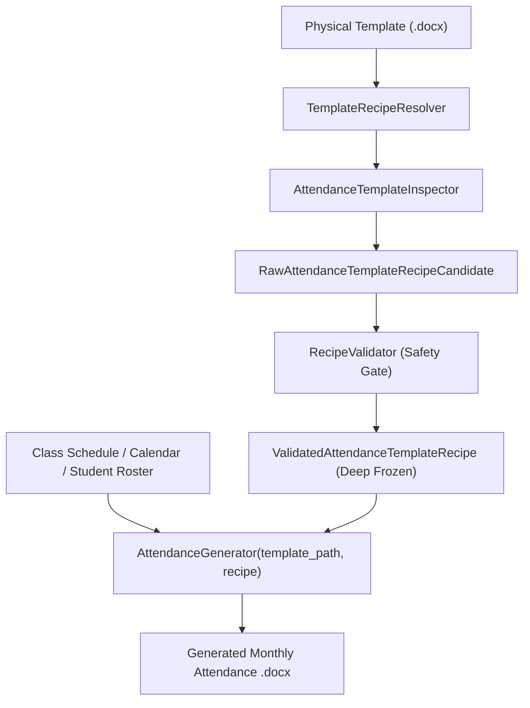

# Attendance Generator

The **Attendance Generator** (`modules/generators/attendance_gen.py`) builds monthly student attendance tracking sheets (CvSU Form VPAA-QF-09) dynamically tailored to class meeting days, calendar date ranges, and laboratory configurations. The generator is fully integrated into the authoritative template-driven architecture via `ValidatedAttendanceTemplateRecipe`.

Related notes:
- [[CvSU Document Generator MOC]]
- [[Generators Overview]]
- [[Attendance Templates]]
- [[Template Guidelines]]
- [[Template Discovery Pipeline]]

---

## 🏛️ Authoritative Recipe-Driven Architecture

The attendance generation pipeline adheres to the core system invariants:
> **"The inspector determines WHERE. The generator determines WHAT."**
> **"No production generator may establish, repair, or guess a template binding independently of a validated recipe."**

All hardcoded table indexing (`tables[0]`, `tables[1]`) and hardcoded cell coordinates have been completely eliminated from the attendance engine.



### 1. Authoritative Dynamic Inspection (`AttendanceTemplateInspector`)
The template inspector dynamically analyzes the Word document structure:
- **Info Table Evaluation**: Scans all tables to detect the metadata block by measuring semantic field pattern coverage (`course_code_title`, `month_year`, `class_schedule`, `semester_ay`, `room_assignment`, `instructor`). Requires coverage $\ge 3$ fields. Target cells are mapped dynamically to `(row_idx, col_idx)`.
- **Matrix Table Evaluation**: Scans table headers across evaluation rows to detect student columns (`no_col`, `name_col`, `id_col`), week markers (`WEEK \d+`), date indicators, and summary columns (`LB`, `LC`, `R`).
  - **Column Swap Robustness (Mutation M13)**: Dynamically binds student number and name columns based on cell text matching, eliminating hardcoded column index assumptions.
  - **Dynamic Prototype Student Row (Mutation M15, M20)**: Scans data rows following header rows to locate the empty prototype student row, correctly distinguishing and skipping decorative guidance banners (e.g. non-numeric labels like `"GUIDE"`, `"INSTRUCTIONS"`).
  - **Dynamic Date Columns Start (Mutation M19)**: Identifies the first week/date header column rather than assuming date columns directly follow student ID columns.
  - **Authoritative Summary Column Width Discovery**: Inspects actual prototype summary-cell widths (`<w:tcW>`) from row 1 and student prototype cells first. A semantic width fallback (`{"lb": 212, "lc": 208, "r": 133}`) is retained solely as a documented legacy compatibility fallback when explicit XML widths are absent.
  - **Prototype Row Cell Counts**: Captures cell counts (`row0_cell_count`, `row1_cell_count`, `student_row_cell_count`) to enable strict bound validation before generator execution.
  - **Capacity Measurement**: Measures `template_session_capacity` and `template_student_row_capacity` directly from table geometry.
- **Collision Detection**: Detects and flags ambiguous candidate tables or identity collisions where info and matrix bindings target the same table. Emits `RawAttendanceTemplateRecipeCandidate`.

### 2. Validation & Deep Immutability (`RecipeValidator`)
- **Strict Profile Conformance**: Validates against `PROFILE_ATTENDANCE_DOCX`. Rejects templates missing required info or matrix regions with fail-closed errors (`E11`–`E18`).
- **Unified Validation Authority**: `RecipeValidator.validate_dict()` converts serialized attendance dictionaries into a `RawAttendanceTemplateRecipeCandidate` and routes through `_validate_attendance()`, eliminating weaker duplicate validation paths while enforcing schema version 2 and private construction sentinel security.
- **Structural Coordinate Validation**: Validates all coordinates (`week_template_cell_col`, `summary_header0_cell_col`, `date_template_cell_col`, `summary_column_indices`, `summary_header1_cell_cols`, `student_date_template_cell_col`, `student_summary_cell_cols`, `summary_column_widths`, `summary_columns_count`). Enforces non-negative indices, bounds within prototype row cell counts, matching summary array lengths, no duplicate summary columns, distinct info and matrix tables, and non-overlapping date and summary regions.
- **Summary Column Widths Validation**: Validates that `len(summary_column_widths) == len(summary_column_names)` and that every width is a positive integer.
- **Private Construction Sentinel**: Direct construction of `ValidatedAttendanceTemplateRecipe` outside `RecipeValidator` is blocked by a private construction token.
- **Recursive Deep Immutability**: All recipe attributes are recursively frozen via `freeze_value()`: dictionaries become `MappingProxyType`, lists become `tuple`, and sets become `frozenset`. In-place mutations raise `AttributeError`.

### 3. Pure Recipe Execution (`AttendanceGenerator`)
The `AttendanceGenerator` class encapsulates the document generation:
```python
gen = AttendanceGenerator(template_path: str, recipe: ValidatedAttendanceTemplateRecipe)
gen.generate(
    output_path=output_path,
    course_code_title=course_code_title,
    class_schedule=class_schedule,
    semester_ay=semester_ay,
    room_assignment=room_assignment,
    instructor=instructor,
    months=months,
    year=year,
    weekdays=weekdays,
    students=students,
    start_bound=start_bound,
    end_bound=end_bound,
)
```
- **Header Field Injection**: Targets info table cells strictly via `recipe.info_binding.bindings[field_name]`.
- **Explicit 3-Region Dynamic Row Assembly**: Dynamic rows (header row 0, header row 1, and student rows) are assembled explicitly by region without structural slices (e.g. `row_cells[date_columns_start:]`):
  1. **Region 1: Lead / Extra Columns**: Columns `0` through `date_columns_start - 1` mapped to `no_col`, `name_col`, `id_col`, and any extra columns.
  2. **Region 2: Date / Session Columns**: Cloned from template date prototypes (`week_cell_template`, `date_cell_template`, `att_cell_template`).
  3. **Region 3: Summary Columns**: Cloned from prototype summary cells (`summary_header0_cell_col`, `summary_header1_cell_cols`, `student_summary_cell_cols`), applying recipe-provided `summary_column_widths`.
- **Capacity Policy & Over-Capacity Safety**:
  - Non-date column percentage width total: $248 (\text{NO}) + 1277 (\text{NAME}) + 499 (\text{STNUM}) + 212 (\text{LB}) + 208 (\text{LC}) + 133 (\text{R}) = 2577$ pct units ($51.54\%$).
  - Available date pool width is `DATE_POOL = 5000 - 2577 = 2423` pct units.
  - Date column width is calculated as `DATE_W = max(1, DATE_POOL // n_date_cols)`.
  - **Failsafe Limit**: If `DATE_W < 25` (representing ~360 dxa width, insufficient for readable two-digit dates), `AttendanceGenerator` raises `TemplateError(f"Schedule requires {n_date_cols} date columns which exceeds printable page width capacity.")`.
  - **Capacity Separation**:
    - `template_session_capacity`: Discovered template date column capacity (e.g. 4 columns in canonical template).
    - `required_session_columns`: Requested class meeting sessions ($n\_weeks \times sessions\_per\_week$). If required sessions exceed template capacity, legally expands grid columns provided `DATE_W >= 25`.
    - `template_student_row_capacity`: Measured student row capacity in template.
    - `GENERATOR_MIN_STUDENT_ROWS = 40`: Generator rendering floor ensuring minimum 40 rows are output even with small rosters (`target_rows = max(template_student_row_capacity, GENERATOR_MIN_STUDENT_ROWS, len(students))`).

---

## 📅 Domain Scheduling & ISO Calendar Geometry

The domain scheduling calculations remain preserved in the generator layer:
1. **Calendar Computation**: Evaluates class meeting days against the monthly calendar and semester date boundaries (`get_class_dates_for_weekdays`).
2. **ISO Week Grouping**: Groups valid meeting dates by ISO calendar week (`dates_to_weeks`).
3. **Name Auto-Scaling (`_auto_scale_attendance_name`)**: Implements a dedicated 5-tier font reduction ladder to ensure student names fit within the ~1.76-inch column without expanding table row heights:
   - $\le 24$ chars: 8pt (`sz="16"`, bold default)
   - $25–28$ chars: 7pt (`sz="14"`)
   - $29–33$ chars: 6.5pt (`sz="13"`)
   - $34–37$ chars: 5.5pt (`sz="11"`, unbold)
   - $\ge 38$ chars: 5pt (`sz="10"`, unbold)

---

## 🔄 Orchestration Contract & Return Signature

The entry point invoked by `orchestrator.py` is `generate_attendance_for_month`:

```python
def generate_attendance_for_month(
    template_path: str,
    output_path: str,
    info: dict,
    students: list,
    month: str,
    year: str,
    class_day: str,
    start_bound: tuple = None,
    end_bound: tuple = None
) -> str
```

### Delegation Mechanism
`generate_attendance_for_month` resolves the validated recipe through `TemplateRecipeResolver`:
```python
resolver = TemplateRecipeResolver.get_instance()
recipe = resolver.resolve(template_path, profile_id="attendance_docx")
gen = AttendanceGenerator(template_path, recipe)
return gen.generate(...)
```

### Return Contract Invariant
`generate_attendance_for_month` returns a **status string**, **never an integer**:
- **`"generated"`**: The monthly attendance sheet had valid meeting dates within bounds and was successfully built and saved to disk.
- **`"skipped_empty"`**: Raised internally via `EmptyDateError` when no calendar meeting dates match the month and bounding range. The orchestrator catches this status and appends `f"{month_out_name} (0 days)"` to `results["skipped"]["attendance"]` without treating it as an error.

---

## 📋 Complete Generator-by-Generator Mapping (Targets 8 & 9)

### Target 8: Attendance Generation — Lecture Only

- **Purpose**: Generates monthly student attendance tracking sheets for courses with pure lecture contact hours.
- **Actual entry point**: `generate_attendance_for_month(...)` delegating to `AttendanceGenerator`.
- **Upstream caller**: Orchestrator `process_all()` in `modules/services/orchestrator.py`.
- **Input object/data**:
  - `template_path: str`: Path to `attendance/template lec.docx`.
  - `output_path: str`: Destination file path.
  - `info: dict`: Class metadata (`course`, `schedule`, `semester`, `room`, `instructor`, `subject`).
  - `students: list`: List of `(name, student_number)` tuples.
  - `month: str`, `year: str`, `class_day: str`.
  - `start_bound: Optional[Tuple[int, int]]`, `end_bound: Optional[Tuple[int, int]]`.
- **Validation**:
  - Month parsing: `parse_months()` parses names, abbreviations, or ranges.
  - Weekday parsing: `parse_weekday()` validates day strings (0=Mon to 6=Sun).
  - Authoritative recipe validation via `AttendanceTemplateInspector` & `RecipeValidator`.
  - Empty date check: If `get_class_dates_for_weekdays` finds 0 valid dates, raises `EmptyDateError`.
- **Calculations**:
  - Fixed column widths: `NO_W = 248`, `NAME_W = 1277`, `STNUM_W = 499`, `LB_W = 212`, `LC_W = 208`, `R_W = 133` (Total fixed: `2577 pct`).
  - Date pool: `DATE_POOL = 5000 - 2577 = 2423 pct`.
  - Date column width: `DATE_W = 2423 // n_date_cols`. Remainder added to `NAME_W`.
  - Week header width: `WEEK_W = DATE_W * session_count`.
  - Summary column width: `SUM_W = LB_W + LC_W + R_W = 553 pct` (`gridSpan = 3`).
- **Authoritative template/recipe**:
  - Template: `attendance/template lec.docx`.
  - Recipe: `ValidatedAttendanceTemplateRecipe` resolved via `TemplateRecipeResolver`.
- **Output filename**: `<Course_Sec>_<SchedCode>_ATTENDANCE_<Day>_<Month>.docx`.
- **Output directory**: `<Output>/<Course_Sec>/Attendance/`.
- **Error handling**:
  - `EmptyDateError`: Caught in `generate_attendance_for_month`, returns `"skipped_empty"`.
  - `TemplateError`: Raised when template fails structural validation or capacity limits.
- **Automated tests**:
  - `tests/test_attendance_schedule_parsing.py`
  - `tests/test_attendance_name_scaling.py`
  - `tests/test_attendance_default_template.py`
  - `tests/test_invalid_templates.py::test_e11`..`test_e18`
  - `tests/test_template_mutations.py::test_m11`..`test_m20`
  - `tests/test_ast_rules.py`

---

### Target 9: Attendance Generation — Lecture + Lab

- **Purpose**: Generates monthly attendance sheets for technical courses featuring integrated lecture and laboratory components.
- **Actual entry point**: `generate_attendance_for_month(...)` delegating to `AttendanceGenerator`.
- **Upstream caller**: Orchestrator `process_all()`.
- **Input object/data**: Same signature as Target 8, with `template_path = "attendance/template lab and lec.docx"` and multi-slot `class_schedule`.
- **Processing/transformation logic**: Reconciles multiple schedule blocks (e.g. Lecture on Monday, Lab on Thursday) into combined schedule meetings. Multi-day meetings produce multiple sessions per ISO week.
- **Authoritative template/recipe**:
  - Template: `attendance/template lab and lec.docx`.
  - Recipe: `ValidatedAttendanceTemplateRecipe` resolved via `TemplateRecipeResolver`.
- **Output filename**: `<Course_Sec>_<SchedCode>_ATTENDANCE_<CombinedDays>_<Month>.docx`.
- **Output directory**: `<Output>/<Course_Sec>/Attendance/`.
- **Automated tests**:
  - `tests/test_attendance_schedule_parsing.py`
  - `tests/test_template_mutations.py`
  - `tests/test_invalid_templates.py`
