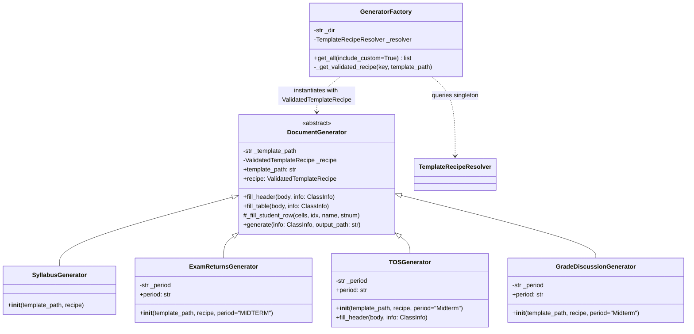

# CEIT Generator

The **CEIT Generator** module (`modules/generators/ceit_gen.py`) generates all official Microsoft Word (`.docx`) administrative documents required by the College of Engineering and Information Technology (CEIT).

Related notes:
- [[CvSU Document Generator MOC]]
- [[Generators Overview]]
- [[Template Discovery Pipeline]]
- [[CEIT Templates]]
- [[Generic Document Generator]]
- [[Template Guidelines]]

---

## 🏛️ Architectural Framework

The application uses immutable `ValidatedTemplateRecipe` objects constructed exclusively by `RecipeValidator` from inspector-produced `RawTemplateRecipeCandidate` objects and resolved/cached by `TemplateRecipeResolver`. Native CEIT generators contain no heuristic template discovery or positional fallback; binding targets are supplied by the validated recipe.

### Pure Recipe Execution Invariants
- **No Coordinate Hardcoding**: Neither `DocumentGenerator` nor its subclasses hardcode cell or row indices for metadata or student rosters. All target indices (`tbl_idx, r_idx, c_idx` or `para_idx`) are resolved by `DocxTemplateInspector`, validated into `recipe.header_bindings` and `recipe.roster_binding` by `RecipeValidator`, and consumed directly during rendering.
- **Construction Guard**: `DocumentGenerator.__init__` enforces that `recipe` must be an instance of `ValidatedTemplateRecipe`. Passing any non-validated object or dictionary raises `TypeError`.
- **Dynamic Table Row Reconstruction**:
  - `fill_table` reads `recipe.roster_binding.table_index` and `first_data_row_index`.
  - Removes pre-existing placeholder rows from `first_data_row_index` onward.
  - Clones `template_row` per student, empties all run text `<w:t>`, and delegates to `_fill_student_row`.
  - Name font auto-scaling ladder (`is_student_name=True` via `get_student_name_font_sz`): For native academic forms (`profile_id != "custom_docx"`), automatically reduces font size based on character count: $\le 30$ chars -> 8pt (`sz="16"`, template default), $31–35$ chars -> 7pt (`sz="14"`), $> 35$ chars -> 6pt (`sz="12"`). For `custom_docx`, preserves custom template base font and applies `shrink_threshold=32, shrink_sz="18"`.

---

## 📋 Complete Generator-by-Generator Mapping (Targets 1–7)

Each generator target was audited against the comprehensive 23-attribute checklist (purpose, actual entry point, upstream caller, input object/data, accepted input forms, validation, normalization, processing logic, calculations, authoritative template/recipe, exact template relationship, populated fields, untouched fields, output filename, output directory, error handling, dependencies, external resources, edge cases, automated tests, runtime verification status, known limitations, and evidence/source references). Any unavailable evidence (such as lack of direct automated generation tests for native templates) is explicitly marked.

### Target 1: SyllabusGenerator

- **Purpose**: Generates the official Course Syllabus Acceptance Form (CvSU Form VPAA-QF-12) confirming student receipt and acceptance of course syllabus policies and learning outcomes.
- **Actual entry point**: `SyllabusGenerator.generate(info: ClassInfo, output_path: str)` (inherited from `DocumentGenerator.generate`).
- **Upstream caller**:
  - Orchestrator: `modules/services/orchestrator.py` (`process_all`) via `GeneratorFactory.get_all()`.
  - Standalone CLI: `modules/generators/ceit_gen.py` `main()`.
- **Input object/data**: `info: ClassInfo` containing:
  - `instructor: str`
  - `course_section: str`
  - `schedule_code: str`
  - `subject: str`
  - `time_days_room: str`
  - `semester_ay: str`
  - `students: List[Tuple[str, str]]` (name, student_number)
  - `college: str` (optional institutional banner)
- **Accepted input forms**:
  - In application runtime: `ClassInfo` instance constructed by `orchestrator.py`.
  - CLI / Interactive: `--csv` roster path, individual CLI flags, `--class-data` / `--class-file` JSON payload, or interactive prompts.
- **Validation**:
  - `DocumentGenerator.__init__` validates `isinstance(recipe, ValidatedTemplateRecipe)`.
  - `GeneratorFactory._path("syllabus")` validates template existence on disk (`template_syllabus.docx`).
  - `RecipeValidator.validate` enforces `PROFILE_ACADEMIC_DOCX` (`required_fields: instructor, course_section, schedule_code, subject`).
  - `fill_table` asserts `rb.table_index < len(tables)` and `len(rows) > rb.first_data_row_index` (raises `TemplateError` on mismatch).
- **Normalization**:
  - `course_section` is sanitized for file paths via `sanitize_filename` (replacing slashes and special characters).
  - Student names are dynamically scaled via `get_student_name_font_sz` (8pt / 7pt / 6pt) to prevent row wrapping.
- **Processing/transformation logic**:
  1. `load_docx(template_path)` loads template archive and extracts XML DOM (`zin, root, body`).
  2. `fill_header(body, info)` binds `instructor`, `course_section`, `schedule_code`, `subject`, `time_days_room`, `semester_ay`, and empty `date` to target coordinates via `recipe.header_bindings`.
  3. `fill_table(body, info)` removes default rows, deep-copies the template row for each student, and invokes `_fill_student_row`.
  4. `save_docx(zin, root, output_path)` serializes modified XML into the destination document.
- **Calculations**: Row counter `idx + 1`, dynamic font scaling ladder (`is_student_name=True`: 8pt/7pt/6pt).
- **Authoritative template/recipe**:
  - Template: `templates/template_syllabus.docx`
  - Profile: `syllabus` (mapped to `PROFILE_ACADEMIC_DOCX`)
  - Recipe: `ValidatedTemplateRecipe` resolved via `TemplateRecipeResolver.get_instance().resolve(".../template_syllabus.docx", "syllabus")`
- **Exact template relationship**:
  - Table 0: Metadata header table.
  - Table 1: Student Acceptance table (Col 0: Item No., Col 1: Student Number, Col 2: Name of Student, Col 3: Signature, Col 4: Date).
- **Populated fields**: Instructor, Course / Year / Section, Schedule Code, Subject Code / Title, Time / Days / Room, Semester / Academic Year, Student Number, Student Name.
- **Untouched fields**: Col 3 (Signature) and Col 4 (Date) left blank for manual physical signing; institutional header graphics and document control codes.
- **Output filename**: `<Course_Sec>_<SchedCode>_SYLLABUS_ACCEPTANCE.docx`
- **Output directory**: `<Output>/<Course_Sec>/CEIT_Forms/`
- **Error handling**: Raises `TypeError`, `TemplateError`, `FileNotFoundError`. Caught in orchestrator loop, logged via `logger.error`, appended to `results["errors"]["ceit"]`.
- **Dependencies**: `lxml`, `zipfile`, `modules.common.docx_utils`, `modules.models.recipe`, `modules.services.template_recipe_service`.
- **External resources**: Local template file `templates/template_syllabus.docx`.
- **Edge cases**: Roster with 0 students (emits clean header with empty table), student names exceeding cell width (> 32 chars), multi-line schedule strings.
- **Automated tests**:
  - `tests/test_modules_generation.py::test_generator_factory_loads_all_7` (verifies factory registration, instantiation, and template path existence; does not invoke `generate()`).
  - *(Note: `tests/test_generic_doc_gen.py::test_generic_doc_gen_syllabus` exercises the generic `ConfigurableDocumentGenerator` on `template_syllabus.docx`, verifying template/recipe inspection and generic execution, but is not a direct test of the native `SyllabusGenerator` class).*
- **Runtime verification status**: **Source-verified**, **Factory-registration test-verified**, **Template-verified**. *(Successful native production-template generation not directly evidenced by the cited automated tests).*
- **Known limitations**: Signature and date columns require physical manual entry upon printing.
- **Evidence/source references**:
  - `modules/generators/ceit_gen.py:220–229`
  - `modules/generators/ceit_gen.py:323, 333, 364–367`

---

### Target 2: ExamReturnsGenerator — Midterm

- **Purpose**: Generates the official Midterm Examination Returns Form (CvSU Form CEIT-QF-03) recording returned midterm examination papers to students.
- **Actual entry point**: `ExamReturnsGenerator.generate(info: ClassInfo, output_path: str)`.
- **Upstream caller**: Orchestrator `process_all()` via `GeneratorFactory.get_all()`.
- **Input object/data**: `info: ClassInfo`, `period: str = "MIDTERM"`.
- **Accepted input forms**: `ClassInfo` instance.
- **Validation**:
  - Constructor guard validates `recipe` is `ValidatedTemplateRecipe`.
  - Resolves `template_exam_midterm.docx` via `GeneratorFactory._path("exam_midterm")`.
  - Recipe validated against `PROFILE_ACADEMIC_DOCX` (`profile_id="exam_returns"`).
- **Normalization**: Same as Target 1.
- **Processing/transformation logic**: Same recipe-driven template method pipeline as `DocumentGenerator`. Stores `self._period = "MIDTERM"`.
- **Calculations**: Auto-scaling for long student names (`is_student_name=True`: 8pt/7pt/6pt).
- **Authoritative template/recipe**:
  - Template: `templates/template_exam_midterm.docx`
  - Profile: `exam_returns` (`PROFILE_ACADEMIC_DOCX`)
  - Recipe: `ValidatedTemplateRecipe` resolved via `TemplateRecipeResolver`.
- **Exact template relationship**:
  - Table 0: Metadata header table.
  - Table 1: Returns roster (Col 0: Name of Student, Col 1: Student Number, Col 2: Score / Grade, Col 3: Signature, Col 4: Date).
- **Populated fields**: Header fields, Name of Student, Student Number.
- **Untouched fields**: Score / Grade, Signature, Date (completed by students during exam return).
- **Output filename**: `<Course_Sec>_<SchedCode>_EXAM_RETURNS_MIDTERM.docx`
- **Output directory**: `<Output>/<Course_Sec>/CEIT_Forms/`
- **Error handling**: Logged and aggregated in `results["errors"]["ceit"]`.
- **Dependencies**: `modules.generators.ceit_gen`, `modules.common.docx_utils`.
- **External resources**: `templates/template_exam_midterm.docx`.
- **Edge cases**: Missing student IDs, accented characters in student names.
- **Automated tests**:
  - `tests/test_modules_generation.py::test_generator_factory_loads_all_7` (verifies factory registration, instantiation, and template path existence; does not invoke `generate()`).
  - `tests/test_template_mutations.py::test_m4_exam_swap_roster_columns` (exercises `ExamReturnsGenerator.generate()` on a mutated template fixture).
  - *(Note: `tests/test_generic_doc_gen.py::test_generic_doc_gen_exam` exercises the generic `ConfigurableDocumentGenerator` on `template_exam_midterm.docx`, not native `ExamReturnsGenerator`).*
- **Runtime verification status**: **Source-verified**, **Factory-registration test-verified**, **Template-verified**. *(Successful native production-template generation not directly evidenced by the cited automated tests).*
- **Known limitations**: Requires physical signing and score entry.
- **Evidence/source references**:
  - `modules/generators/ceit_gen.py:231–253`
  - `modules/generators/ceit_gen.py:324, 334, 368–372`

---

### Target 3: ExamReturnsGenerator — Finals

- **Purpose**: Generates the official Finals Examination Returns Form (CvSU Form CEIT-QF-03) recording returned final examination test papers.
- **Actual entry point**: `ExamReturnsGenerator.generate(info: ClassInfo, output_path: str)`.
- **Upstream caller**: Orchestrator `process_all()` via `GeneratorFactory.get_all()`.
- **Input object/data**: `info: ClassInfo`, `period: str = "FINAL"`.
- **Accepted input forms**: `ClassInfo` instance.
- **Validation**: Same as Target 2.
- **Normalization**: Same as Target 1.
- **Processing/transformation logic**: Same execution pipeline as `DocumentGenerator`, instantiated with `period="FINAL"`.
- **Calculations**: Auto-scaling for long student names (`is_student_name=True`: 8pt/7pt/6pt).
- **Authoritative template/recipe**:
  - Template: `templates/template_exam_finals.docx`
  - Profile: `exam_returns` (`PROFILE_ACADEMIC_DOCX`)
  - Recipe: `ValidatedTemplateRecipe` resolved via `TemplateRecipeResolver`.
- **Exact template relationship**: Identical structural table schema to Midterm Exam Returns.
- **Populated fields**: Header metadata fields, Name of Student, Student Number.
- **Untouched fields**: Score / Grade, Signature, Date.
- **Output filename**: `<Course_Sec>_<SchedCode>_EXAM_RETURNS_FINALS.docx`
- **Output directory**: `<Output>/<Course_Sec>/CEIT_Forms/`
- **Error handling**: Aggregated in `results["errors"]["ceit"]`.
- **Dependencies**: `modules.generators.ceit_gen`, `modules.common.docx_utils`.
- **External resources**: `templates/template_exam_finals.docx`.
- **Edge cases**: Split student names, accented characters.
- **Automated tests**:
  - `tests/test_modules_generation.py::test_generator_factory_loads_all_7` (verifies factory registration, instantiation, and template path existence; does not invoke `generate()`).
- **Runtime verification status**: **Source-verified**, **Factory-registration test-verified**, **Template-verified**. *(Successful native generation not directly evidenced by the cited automated tests).*
- **Known limitations**: Manual score and signature entry required.
- **Evidence/source references**:
  - `modules/generators/ceit_gen.py:231–253`
  - `modules/generators/ceit_gen.py:325, 335, 373–377`

---

### Target 4: TOSGenerator — Midterm

- **Purpose**: Generates the Table of Specifications (TOS) Acknowledgment Form for Midterm examinations, certifying student acknowledgment of exam coverage.
- **Actual entry point**: `TOSGenerator.generate(info: ClassInfo, output_path: str)`.
- **Upstream caller**: Orchestrator `process_all()` via `GeneratorFactory.get_all()`.
- **Input object/data**: `info: ClassInfo`, `period: str = "Midterm"`.
- **Accepted input forms**: `ClassInfo` instance.
- **Validation**: Constructor requires `ValidatedTemplateRecipe`; template `template_tos_midterm.docx` verified via `GeneratorFactory._path("tos_midterm")`.
- **Normalization**: Same as Target 1.
- **Processing/transformation logic**:
  - **Special Header Override**: `TOSGenerator.fill_header(body, info)` intercepts header rendering and creates a temporary `ClassInfo` where `semester_ay = f"{info.semester_ay} ({self._period})"`. This cleanly appends `" (Midterm)"` to the academic semester string.
  - Table generation delegates to base `DocumentGenerator.fill_table`.
- **Calculations**: Font auto-scaling for long student names (`is_student_name=True`: 8pt/7pt/6pt).
- **Authoritative template/recipe**:
  - Template: `templates/template_tos_midterm.docx`
  - Profile: `tos` (`PROFILE_ACADEMIC_DOCX`)
  - Recipe: `ValidatedTemplateRecipe` resolved via `TemplateRecipeResolver`.
- **Exact template relationship**:
  - Table 0: Metadata header table.
  - Table 1: Acknowledgment roster (Col 0: Name of Student, Col 1: Student Number, Col 2: Signature, Col 3: Date).
- **Populated fields**: Instructor, Course / Section, Schedule Code, Subject Code, Time / Days / Room, Semester / AY (appended with `" (Midterm)"`), Student Name, Student Number.
- **Untouched fields**: Col 2 (Signature) and Col 3 (Date) for manual physical entry.
- **Output filename**: `<Course_Sec>_<SchedCode>_TOS_MIDTERM.docx`
- **Output directory**: `<Output>/<Course_Sec>/CEIT_Forms/`
- **Error handling**: Handled by orchestrator; logged to `results["errors"]["ceit"]`.
- **Dependencies**: `modules.generators.ceit_gen`, `modules.common.docx_utils`.
- **External resources**: `templates/template_tos_midterm.docx`.
- **Edge cases**: Roster formatting for small or large cohorts.
- **Automated tests**:
  - `tests/test_modules_generation.py::test_generator_factory_loads_all_7` (verifies factory registration, instantiation, and template path existence; does not invoke `generate()`).
- **Runtime verification status**: **Source-verified**, **Factory-registration test-verified**, **Template-verified**. *(Successful native generation not directly evidenced by the cited automated tests).*
- **Known limitations**: Signature and date columns require physical student signing.
- **Evidence/source references**:
  - `modules/generators/ceit_gen.py:255–288`
  - `modules/generators/ceit_gen.py:326, 336, 378–382`

---

### Target 5: TOSGenerator — Finals

- **Purpose**: Generates the Table of Specifications (TOS) Acknowledgment Form for Finals examinations.
- **Actual entry point**: `TOSGenerator.generate(info: ClassInfo, output_path: str)`.
- **Upstream caller**: Orchestrator `process_all()` via `GeneratorFactory.get_all()`.
- **Input object/data**: `info: ClassInfo`, `period: str = "Finals"`.
- **Accepted input forms**: `ClassInfo` instance.
- **Validation**: Same as Target 4.
- **Normalization**: Same as Target 1.
- **Processing/transformation logic**: Subclass override appends `" (Finals)"` to `semester_ay` before delegating to `super().fill_header()`.
- **Calculations**: Font auto-scaling for long student names (`is_student_name=True`: 8pt/7pt/6pt).
- **Authoritative template/recipe**:
  - Template: `templates/template_tos_finals.docx`
  - Profile: `tos` (`PROFILE_ACADEMIC_DOCX`)
  - Recipe: `ValidatedTemplateRecipe` resolved via `TemplateRecipeResolver`.
- **Exact template relationship**: Identical structural schema to Midterm TOS.
- **Populated fields**: Header fields (appended with `" (Finals)"`), Student Name, Student Number.
- **Untouched fields**: Signature and Date.
- **Output filename**: `<Course_Sec>_<SchedCode>_TOS_FINALS.docx`
- **Output directory**: `<Output>/<Course_Sec>/CEIT_Forms/`
- **Error handling**: Logged in `results["errors"]["ceit"]`.
- **Dependencies**: `modules.generators.ceit_gen`, `modules.common.docx_utils`.
- **External resources**: `templates/template_tos_finals.docx`.
- **Edge cases**: Long semester/AY strings wrapping with appended period suffix.
- **Automated tests**:
  - `tests/test_modules_generation.py::test_generator_factory_loads_all_7` (verifies factory registration, instantiation, and template path existence; does not invoke `generate()`).
- **Runtime verification status**: **Source-verified**, **Factory-registration test-verified**, **Template-verified**. *(Successful native generation not directly evidenced by the cited automated tests).*
- **Known limitations**: Signature and date columns require physical signing.
- **Evidence/source references**:
  - `modules/generators/ceit_gen.py:255–288`
  - `modules/generators/ceit_gen.py:327, 337, 383–387`

---

### Target 6: GradeDiscussionGenerator — Midterm

- **Purpose**: Generates the Midterm Grade Discussion Form documenting that the instructor has reviewed and discussed midterm grade standings with students.
- **Actual entry point**: `GradeDiscussionGenerator.generate(info: ClassInfo, output_path: str)`.
- **Upstream caller**: Orchestrator `process_all()` via `GeneratorFactory.get_all()`.
- **Input object/data**: `info: ClassInfo`, `period: str = "Midterm"`.
- **Accepted input forms**: `ClassInfo` instance.
- **Validation**: Constructor requires `ValidatedTemplateRecipe`; template verified at `templates/Midterm-Grade-Discussion_LATEST.docx`.
- **Normalization**: Same as Target 1.
- **Processing/transformation logic**: Standard `DocumentGenerator` template method execution driven by recipe. Stores `self._period = "Midterm"`.
- **Calculations**: Font auto-scaling for long names (`is_student_name=True`: 8pt/7pt/6pt).
- **Authoritative template/recipe**:
  - Template: `templates/Midterm-Grade-Discussion_LATEST.docx`
  - Profile: `grade_discussion` (`PROFILE_ACADEMIC_DOCX`)
  - Recipe: `ValidatedTemplateRecipe` resolved via `TemplateRecipeResolver`.
- **Exact template relationship**:
  - Table 0: Metadata header table (Instructor's Name/Signature, Course / Year / Section, Schedule Code, Subject Code / Title, Semester / Academic Year, Date).
  - Table 1: Student Discussion roster (Col 0: Name of Student, Col 1: Student ID Number, Col 2: Midterm Grade, Col 3: Signature, Col 4: Date).
- **Populated fields**: Instructor, Course / Year / Section, Schedule Code, Subject Code / Title, Semester / Academic Year, Date (`""`), Name of Student, Student ID Number.
- **Untouched fields**: Col 2 (Midterm Grade), Col 3 (Signature), Col 4 (Date) left blank for faculty entry and student signing.
- **Output filename**: `<Course_Sec>_<SchedCode>_GRADE_DISCUSSION_MIDTERM.docx`
- **Output directory**: `<Output>/<Course_Sec>/CEIT_Forms/`
- **Error handling**: Logged in `results["errors"]["ceit"]`.
- **Dependencies**: `modules.generators.ceit_gen`, `modules.common.docx_utils`.
- **External resources**: `templates/Midterm-Grade-Discussion_LATEST.docx`.
- **Edge cases**: Roster table with multi-line student name cells.
- **Automated tests**:
  - `tests/test_grade_discussion_generator.py::GradeDiscussionGeneratorTests::test_generate_midterm_grade_discussion`
  - `tests/test_modules_generation.py::test_generator_factory_loads_all_7`
- **Runtime verification status**: **Source-verified**, **Test-verified**, **Template-verified**.
- **Known limitations**: Midterm grade and student signature completed manually.
- **Evidence/source references**:
  - `modules/generators/ceit_gen.py:291–313`
  - `modules/generators/ceit_gen.py:328, 338, 388–392`
  - `tests/test_grade_discussion_generator.py:41–72`

---

### Target 7: GradeDiscussionGenerator — Finals

- **Purpose**: Generates the Finals Grade Discussion Form documenting that the instructor has presented and reviewed final course grades with enrolled students.
- **Actual entry point**: `GradeDiscussionGenerator.generate(info: ClassInfo, output_path: str)`.
- **Upstream caller**: Orchestrator `process_all()` via `GeneratorFactory.get_all()`.
- **Input object/data**: `info: ClassInfo`, `period: str = "Finals"`.
- **Accepted input forms**: `ClassInfo` instance.
- **Validation**: Constructor requires `ValidatedTemplateRecipe`; template verified at `templates/Final-Grade-Discussion_LATEST.docx`.
- **Normalization**: Same as Target 1.
- **Processing/transformation logic**: Standard `DocumentGenerator` template method execution driven by recipe. Stores `self._period = "Finals"`.
- **Calculations**: Font auto-scaling for long names (`is_student_name=True`: 8pt/7pt/6pt).
- **Authoritative template/recipe**:
  - Template: `templates/Final-Grade-Discussion_LATEST.docx`
  - Profile: `grade_discussion` (`PROFILE_ACADEMIC_DOCX`)
  - Recipe: `ValidatedTemplateRecipe` resolved via `TemplateRecipeResolver`.
- **Exact template relationship**: Identical structural schema to Midterm Grade Discussion.
- **Populated fields**: Instructor, Course / Year / Section, Schedule Code, Subject Code / Title, Semester / Academic Year, Date (`""`), Name of Student, Student ID Number.
- **Untouched fields**: Col 2 (Final Grade), Col 3 (Signature), Col 4 (Date) left blank for physical consultation.
- **Output filename**: `<Course_Sec>_<SchedCode>_GRADE_DISCUSSION_FINALS.docx`
- **Output directory**: `<Output>/<Course_Sec>/CEIT_Forms/`
- **Error handling**: Logged in `results["errors"]["ceit"]`.
- **Dependencies**: `modules.generators.ceit_gen`, `modules.common.docx_utils`.
- **External resources**: `templates/Final-Grade-Discussion_LATEST.docx`.
- **Edge cases**: Roster table with multi-line student name cells.
- **Automated tests & Verification Evidence**:
  - `tests/test_grade_discussion_generator.py::GradeDiscussionGeneratorTests::test_generate_finals_grade_discussion` (passes 100% and confirms recipe resolution, table extraction, header binding, and student row generation).
  - Current `test_grade_discussion_finals_formatting_parity` directly verifies the Finals Grade Discussion formatting after actual generator execution. Record a discrepancy only if a fresh current test run reproduces one.
- **Runtime verification status**: **Source-verified**, **Test-verified**, **Template-verified**.
- **Known limitations**: Final grade and signature must be signed during final consultation.
- **Evidence/source references**:
  - `modules/generators/ceit_gen.py:291–313`
  - `modules/generators/ceit_gen.py:329, 339, 393–397`
  - `tests/test_grade_discussion_generator.py:73–104`
  - `tests/test_output_parity.py:192–225`

