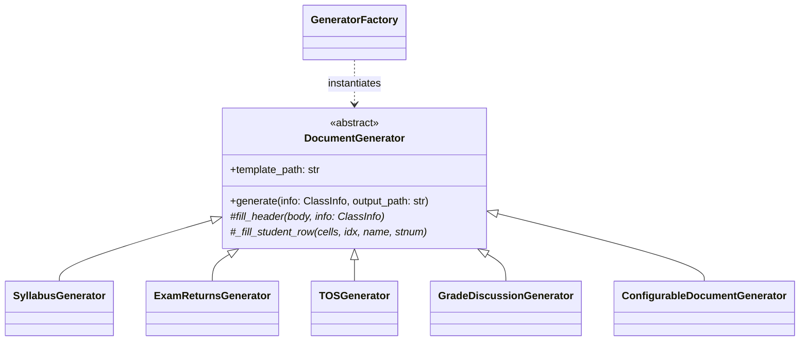

# CEIT Generator

The **CEIT Generator** module (`modules/generators/ceit_gen.py`) generates all official Microsoft Word (`.docx`) administrative documents required by the College of Engineering and Information Technology (CEIT), as well as user-defined custom templates.

Related notes:
- [[CvSU Document Generator MOC]]
- [[Generators Overview]]
- [[CEIT Templates]]
- [[Template Guidelines]]

---

## 🏛️ Class Hierarchy



---

## 📋 The 7 Registered Native Forms

`GeneratorFactory.get_all()` statically registers 7 native generators:

1. **Syllabus Acceptance**:
   - Class: `SyllabusGenerator`
   - Template: `template_syllabus.docx`
   - Output Suffix: `_SYLLABUS_ACCEPTANCE`
2. **Exam Returns (Midterm)**:
   - Class: `ExamReturnsGenerator` (`period="MIDTERM"`)
   - Template: `template_exam_midterm.docx`
   - Output Suffix: `_EXAM_RETURNS_MIDTERM`
3. **Exam Returns (Finals)**:
   - Class: `ExamReturnsGenerator` (`period="FINAL"`)
   - Template: `template_exam_finals.docx`
   - Output Suffix: `_EXAM_RETURNS_FINALS`
4. **Table of Specifications (Midterm)**:
   - Class: `TOSGenerator` (`period="Midterm"`)
   - Template: `template_tos_midterm.docx`
   - Output Suffix: `_TOS_MIDTERM`
5. **Table of Specifications (Finals)**:
   - Class: `TOSGenerator` (`period="Finals"`)
   - Template: `template_tos_finals.docx`
   - Output Suffix: `_TOS_FINALS`
6. **Grade Discussion Form (Midterm)**:
   - Class: `GradeDiscussionGenerator` (`period="Midterm"`)
   - Template: `Midterm-Grade-Discussion_LATEST.docx`
   - Output Suffix: `_GRADE_DISCUSSION_MIDTERM`
7. **Grade Discussion Form (Finals)**:
   - Class: `GradeDiscussionGenerator` (`period="Finals"`)
   - Template: `Final-Grade-Discussion_LATEST.docx`
   - Output Suffix: `_GRADE_DISCUSSION_FINALS`

## ⚙️ Custom Configurable Templates

In addition to the 7 native forms, `GeneratorFactory` dynamically queries `ConfigManager` for any registered custom templates. For each enabled custom template, it instantiates `ConfigurableDocumentGenerator` using a JSON `recipe` to map `ClassInfo` fields to docx structure paragraphs and tables.

---

## 🛡️ Critical Implementation Details

### Long Student Name Protection
```python
set_cell_text(cells[col], name, shrink_threshold=32, shrink_sz="18")
```
If a student's full name is longer than 32 characters, the text size is scaled down from 10pt/11pt to 9pt (`shrink_sz="18"` in OpenXML) to preserve document table formatting without line breaks.

### Table Borders & Alignment
Templates contain pre-styled table grids. The generator clones existing row height, XML nodes, and paragraph cell properties when adding rows for students beyond the template's initial row capacity.

### Safe Empty Text Replacement
Before replacing the student table row template, the loop explicitly empties all text runs `<w:t>` inside the copied row XML to prevent artifacting from the template placeholder text.
