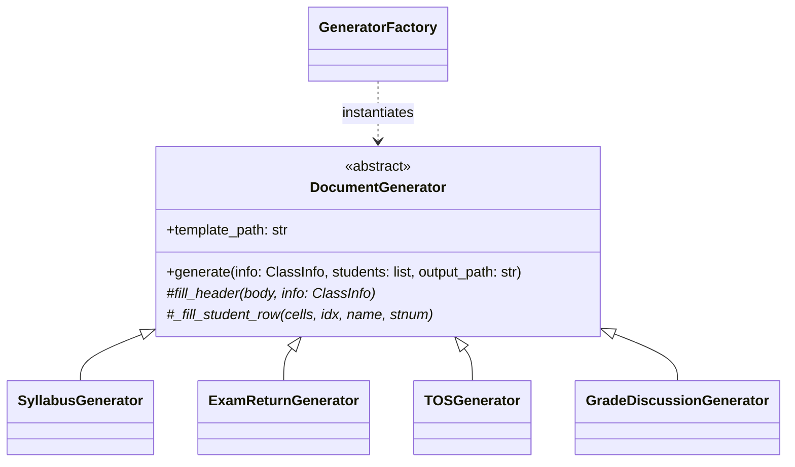

# CEIT Generator

The **CEIT Generator** module (`modules/generators/ceit_gen.py`) generates all official Microsoft Word (`.docx`) administrative documents required by the College of Engineering and Information Technology (CEIT).

Related notes:
- [[CvSU Document Generator MOC]]
- [[Generators Overview]]
- [[CEIT Templates]]
- [[Template Guidelines]]

---

## 🏛️ Class Hierarchy



---

## 📋 The 7 Registered CEIT Forms

`GeneratorFactory.get_all()` registers the following 7 generators:

1. **Syllabus Acceptance**:
   - Class: `SyllabusGenerator`
   - Template: `template_syllabus.docx`
   - Output Suffix: `_SYLLABUS_ACCEPTANCE.docx`
2. **Exam Returns (Midterm)**:
   - Class: `ExamReturnGenerator` (`term="MIDTERM"`)
   - Template: `template_exam_return.docx`
   - Output Suffix: `_EXAM_RETURNS_MIDTERM.docx`
3. **Exam Returns (Finals)**:
   - Class: `ExamReturnGenerator` (`term="FINALS"`)
   - Template: `template_exam_return.docx`
   - Output Suffix: `_EXAM_RETURNS_FINALS.docx`
4. **Table of Specifications (Midterm)**:
   - Class: `TOSGenerator` (`term="MIDTERM"`)
   - Template: `template_tos.docx`
   - Output Suffix: `_TOS_MIDTERM.docx`
5. **Table of Specifications (Finals)**:
   - Class: `TOSGenerator` (`term="FINALS"`)
   - Template: `template_tos.docx`
   - Output Suffix: `_TOS_FINALS.docx`
6. **Grade Discussion Form (Midterm)**:
   - Class: `GradeDiscussionGenerator` (`term="MIDTERM"`)
   - Template: `template_grade_discussion.docx`
   - Output Suffix: `_GRADE_DISCUSSION_MIDTERM.docx`
7. **Grade Discussion Form (Finals)**:
   - Class: `GradeDiscussionGenerator` (`term="FINALS"`)
   - Template: `template_grade_discussion.docx`
   - Output Suffix: `_GRADE_DISCUSSION_FINALS.docx`

---

## 🛡️ Critical Implementation Details

### Long Student Name Protection
```python
set_cell_text(cells[col], name, shrink_threshold=32, shrink_sz="18")
```
If a student's full name is longer than 32 characters, the text size is scaled down from 10pt/11pt to 9pt (`sz="18"` in OpenXML) to preserve document table formatting without line breaks.

### Table Borders & Alignment
Templates contain pre-styled table grids. The generator clones existing row height and paragraph cell properties when adding rows for students beyond the template's initial row capacity.
