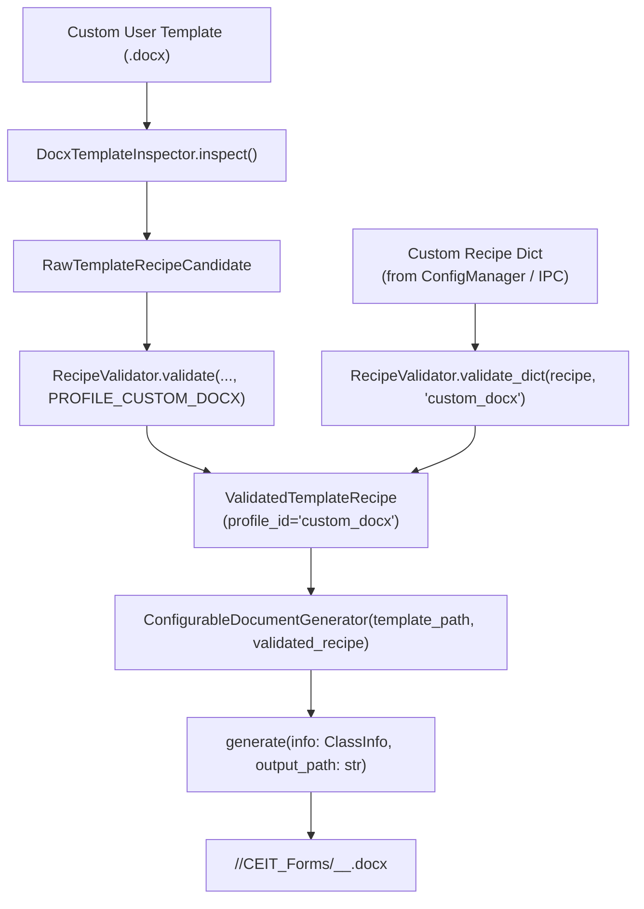

# Generic Document Generator

The **Generic Document Generator** (`modules/generators/generic_doc_gen.py`) provides dynamic document generation for arbitrary user-supplied Microsoft Word (`.docx`) templates through the `ConfigurableDocumentGenerator` class.

Related notes:
- [[CvSU Document Generator MOC]]
- [[Generators Overview]]
- [[CEIT Generator]]
- [[Template Discovery Pipeline]]
- [[CEIT Templates]]
- [[Template Guidelines]]

---

## 🏛️ Architectural Framework

`ConfigurableDocumentGenerator` subclasses `DocumentGenerator` to provide dynamic, recipe-driven document rendering for custom forms. It operates with zero mutable dictionary access during execution, delegating core rendering to the validated recipe lifecycle.

### Validation & Deserialization Invariants
- **Dynamic Recipe Validation**: `ConfigurableDocumentGenerator` validates serialized recipe dictionaries through `RecipeValidator.validate_dict(..., "custom_docx")` when a validated recipe object is not already supplied.
- **Strict Schema Policy**: `validate_dict()` strictly enforces `schema_version == 2`. Unversioned dictionaries, legacy v1 schemas, or invalid version numbers raise `InvalidRecipeError`.
- **Construction Token Guard**: `validate_dict()` explicitly verifies that no external `_construction_token` is present in the dictionary, preventing spoofed recipe construction.
- **Dynamic Roster Indexing**: When `recipe.profile_id == "custom_docx"` and `rb.index_col` is defined, `_fill_student_row` automatically populates the 1-based sequential row index (`idx + 1`).
- **Two-Pass Placeholder Replacement**: For templates using textual tokens (e.g. `{{INSTRUCTOR}}`, `{{SUBJECT}}`), the engine replaces tokens at the text node level, and then evaluates paragraph-level runs to merge tokens fragmented across multiple XML `<w:r>` runs.

---

## 📋 Complete Generator-by-Generator Mapping (Target 12)

Target 12 was audited against the comprehensive 23-attribute checklist, and any unavailable evidence is explicitly marked.

### Target 12: ConfigurableDocumentGenerator / Generic Custom Template Pipeline

- **Purpose**: Generates dynamic academic and administrative Word documents from custom, user-imported `.docx` templates without requiring changes to application source code.
- **Actual entry point**: `ConfigurableDocumentGenerator(template_path, recipe, profile_id="custom_docx").generate(info: ClassInfo, output_path: str)`.
- **Upstream caller**:
  - `GeneratorFactory.get_all(include_custom=True)`: Discovers enabled custom templates in `ConfigManager.get_custom_templates()`, resolves recipes, and appends generator callables.
  - UI API Bridge (`modules/ui/api_bridge.py`): Invokes inspection and test generation for custom templates imported through the settings modal.
- **Input object/data**:
  - `template_path: str`: Path to the custom `.docx` template file.
  - `recipe: Union[ValidatedTemplateRecipe, Dict[str, Any]]`: Validated recipe instance or recipe dictionary.
  - `profile_id: str = "custom_docx"`: Profile identifier.
  - `info: ClassInfo`: Standard class metadata and student roster.
  - `output_path: str`: Target document destination.
- **Accepted input forms**:
  - `ValidatedTemplateRecipe` object directly.
  - Serialized dictionary matching Schema Version 2.
- **Validation**:
  - If a `dict` is passed, `ConfigurableDocumentGenerator` validates serialized recipe dictionaries through `RecipeValidator.validate_dict(..., "custom_docx")` when a validated recipe object is not already supplied.
  - Rejects foreign `_construction_token` with `InvalidRecipeError`.
  - Rejects `schema_version != 2`.
  - Enforces `PROFILE_CUSTOM_DOCX` constraints (supports auto-scaling, permits optional roster table).
  - Validates that template path exists on disk.
- **Normalization**:
  - Sanitizes output filename suffix from recipe metadata (`suffix = recipe.metadata.get("suffix") or "CUSTOM_FORM"`).
  - Student names exceeding 32 characters are scaled to 9pt (`sz="18"`).
  - Erases existing run text in cloned template rows before populating student data.
- **Processing/transformation logic**:
  1. Base class `DocumentGenerator.generate` calls `load_docx(template_path)`.
  2. `fill_header` binds metadata via:
     - `table_cell`: Maps to `(tbl_idx, r_idx, c_idx)`.
     - `docx_paragraph`: Injects text after colons in designated paragraphs.
     - `placeholders`: Replaces `{{TAG}}` tokens in `<w:t>` text nodes, handling cross-run fragmentation.
  3. `fill_table` dynamically clones `template_row` per student:
     - Populates row number in `rb.index_col` (if defined).
     - Populates student name in `rb.name_col`.
     - Populates student number in `rb.id_col`.
  4. `save_docx` saves the final document.
- **Calculations**: Row counter `idx + 1` for `index_col`, font auto-scaling thresholds.
- **Authoritative template/recipe**:
  - Template: Dynamically specified user template path.
  - Profile: `custom_docx` (`PROFILE_CUSTOM_DOCX`).
  - Recipe: `ValidatedTemplateRecipe` resolved via `TemplateRecipeResolver` or validated via `RecipeValidator.validate_dict`.
- **Exact template relationship**: Flexible; governed by the custom recipe's `header_bindings`, `roster_binding`, and `placeholders`.
- **Populated fields**: Mapped fields configured in the recipe (e.g. `instructor`, `course_section`, `schedule_code`, `subject`, `time_days_room`, `semester_ay`, student roster columns).
- **Untouched fields**: Unbound template tables, headers, footers, graphics, and signature placeholders.
- **Output filename**: `<Course_Sec>_<SchedCode>_<CUSTOM_SUFFIX>.docx` (e.g. `CS1-4_202612040_CONSULTATION_LOG.docx`).
- **Output directory**: `<Output>/<Course_Sec>/CEIT_Forms/`.
- **Error handling**:
  - **Custom template loading / validation failures**: Caught and logged inside `GeneratorFactory.get_all(include_custom=True)` (`try/except Exception as e: logger.error(f"Failed to load custom templates in GeneratorFactory: {e}")`). If a custom template fails inspection or recipe validation, it is logged and skipped so that native forms and remaining valid custom templates continue loading uninterrupted.
  - **Document generation failures**: If `ConfigurableDocumentGenerator.generate(info, output_path)` encounters an error during orchestrator execution, it is caught and logged by orchestrator CEIT error handling (`try/except Exception as e: err_msg = f"Failed CEIT ({suffix}): {str(e)}"; logger.error(err_msg, exc_info=True); results["errors"]["ceit"].append(err_msg); _notify(...)`), allowing other document engines and sections to proceed.
  - In addition, standalone dictionary validation via `RecipeValidator.validate_dict` raises `InvalidRecipeError` or `TemplateError` on invalid schemas or structure.
- **Dependencies**: `lxml`, `zipfile`, `modules.generators.ceit_gen`, `modules.parsers.recipe_validator`, `modules.models.recipe`.
- **External resources**: User-provided `.docx` template files.
- **Edge cases**:
  - Word documents with placeholders split across 3 or more XML runs (resolved by 2-pass string replacement).
  - Custom templates without a student roster table (valid under `PROFILE_CUSTOM_DOCX`; `fill_table` safely exits).
  - Roster table with missing optional `index_col` (skips index population without error).
- **Automated tests**:
  - `tests/test_generic_doc_gen.py::test_generic_doc_gen_syllabus` (directly instantiates and executes `ConfigurableDocumentGenerator` on `template_syllabus.docx`, verifying table extraction, header binding, and student row generation)
  - `tests/test_generic_doc_gen.py::test_generic_doc_gen_exam` (directly instantiates and executes `ConfigurableDocumentGenerator` on `template_exam_midterm.docx`, verifying table extraction and student row population)
  - `tests/test_custom_template_pipeline.py::test_custom_template_crud`
  - `tests/test_custom_template_pipeline.py::test_generator_factory_includes_custom_templates`
  - `tests/test_custom_template_pipeline.py::test_script_api_custom_template_endpoints`
  - `tests/test_recipe_stage1.py::test_strict_schema_version_rejection`
  - `tests/test_recipe_stage1.py::test_recipe_to_dict_never_contains_construction_token`
- **Runtime verification status**: **Source-verified**, **Test-verified**, **Template-verified**.
- **Known limitations**: Only supports Microsoft Word `.docx` custom templates; custom Excel grading templates require dedicated profile extensions.
- **Evidence/source references**:
  - `modules/generators/generic_doc_gen.py:1–49`
  - `modules/generators/ceit_gen.py:202–208` (`_fill_student_row` index col logic)
  - `modules/generators/ceit_gen.py:400–422` (`GeneratorFactory` custom template loader)
  - `modules/parsers/recipe_validator.py:100–190` (`validate_dict`)
  - `modules/services/orchestrator.py:385–403` (orchestrator CEIT error handling)
