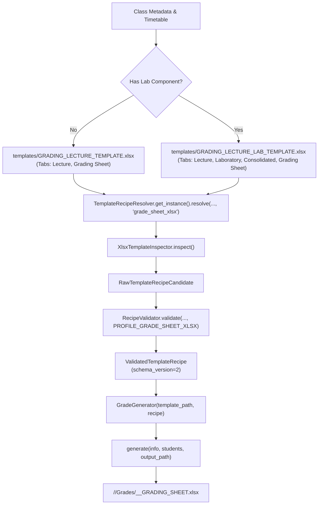

# Grading Generator

The **Grading Generator** (`modules/generators/grade_gen.py`) populates official CvSU Excel grading sheet workbooks using pure recipe-driven execution. It preserves workbook formula engines, conditional formatting, cross-sheet references, and institutional signature lines.

Related notes:
- [[CvSU Document Generator MOC]]
- [[Generators Overview]]
- [[Template Discovery Pipeline]]
- [[Grading Templates]]
- [[Template Guidelines]]

---

## 🏛️ Architectural Framework & Recipe Invariants

The application uses immutable `ValidatedTemplateRecipe` objects constructed exclusively by `RecipeValidator` from inspector-produced `RawTemplateRecipeCandidate` objects and resolved/cached by `TemplateRecipeResolver`.

No generator-owned hardcoded template cell coordinates are used for recipe-bound field placement; structural targets are supplied by the validated recipe. Structural semantic knowledge still exists within `GradeGenerator`, such as requiring the `Lecture` worksheet and handling known worksheet roles (`laboratory`, `consolidated`, `grading sheet`).

### Key Engineering Invariants
1. **Formula Preservation via `openpyxl(data_only=False)`**: The template is loaded with formula definitions preserved. Evaluation equations (`SUM`, `AVERAGE`, `VLOOKUP`, transmutation brackets) remain intact for Excel runtime evaluation upon opening.
2. **Formula Injection Sanitization (`sanitize_excel`)**: Any string value starting with formula trigger tokens (`=`, `+`, `-`, `@`) is safely escaped with a leading single quote (`'`) to prevent formula injection attacks.
3. **Capacity Enforcement**: The validated grade-sheet recipe supplies the capacity limit; current production grade-sheet recipes resolve to a 40-student capacity, and `GradeGenerator` clamps the roster to that validated capacity (`recipe.roster_binding.capacity_limit`).
4. **Structural Merged Cell Signature Geometry (Mutation M8)**: Signatures are located by discovering the merged label block containing `"INSTRUCTOR"`, then scanning for the merged box directly above it (`min_col == label.min_col`, `max_col == label.max_col`, `max_row == label.min_row - 1`). The target is resolved to its top-left coordinate (`BI57` in Lecture, `AO59` in Lab, `J56` in Consolidated).
5. **Atomic File Safety**: Writes to a temporary `.tmp.xlsx` file inside the destination directory, closing `openpyxl` before replacing the destination via atomic `os.replace`.

---

## 📋 Complete Generator-by-Generator Mapping (Targets 10 & 11)

Each generator target was audited against the comprehensive 23-attribute checklist, and any unavailable evidence is explicitly marked.

### Target 10: GradeGenerator — Lecture Only

- **Purpose**: Populates official grading sheets for courses with pure lecture contact hours, computing term grades and institutional transmutations across two linked sheets.
- **Actual entry point**: `GradeGenerator.generate(info: dict, students: list, output_path: str) -> bool`.
  - Factory constructor: `GradeGenerator.for_class(templates_dir, info, resolver=None) -> GradeGenerator`.
- **Upstream caller**: Orchestrator `process_all()` in `modules/services/orchestrator.py`.
- **Input object/data**:
  - `info: dict`: Dictionary containing:
    - `"instructor"`: Instructor name (e.g. `"DAN JOSEPH A. ORTEGA"`).
    - `"course"`: Course section (e.g. `"BSCS 1-4"`).
    - `"sched"`: Schedule code (e.g. `"202612040"`).
    - `"subject"`: Subject title (e.g. `"DCIT 21 - INTRODUCTION TO COMPUTING"`).
    - `"semester"`: Semester string (e.g. `"1st Semester / 2026-2027"`).
    - `"time"`: Schedule days/time/room.
    - `"has_lab"`: `False`.
    - `"college"`: College title (defaults to `"COLLEGE OF ENGINEERING AND INFORMATION TECHNOLOGY"`).
    - `"units"`: Optional course units (e.g. `3`).
  - `students: list`: List of `(name, student_number)` tuples or dictionaries.
  - `output_path: str`: Destination file path.
- **Accepted input forms**:
  - `info: dict`, `students: list` containing tuples `(name, stnum)` or dictionaries `{"student_name": ..., "student_number": ...}`.
- **Validation**:
  - `GradeGenerator.__init__` enforces `isinstance(recipe, ValidatedTemplateRecipe)`.
  - Asserts recipe contains valid `recipe.roster_binding` (raises `TemplateError` if missing).
  - Asserts template contains required `"Lecture"` sheet (raises `ValueError` if missing).
  - `RecipeValidator` verifies `PROFILE_GRADE_SHEET_XLSX` (`requires_capacity=True, capacity_limit > 0`).
- **Normalization**:
  - `_parse_semester_and_year`: Standardizes semester to `"1st Semester"`, `"2nd Semester"`, or `"Midyear"` and extracts 4-digit academic year bounds (e.g. `"2026-2027"`).
  - `_parse_subject`: Splits course code and title across hyphen, en-dash, or em-dash separators.
  - `_normalize_course_section`: Normalizes spacing (e.g. `"BSCS1-4"` &rarr; `"BSCS 1-4"`).
  - Student names/numbers stripped of whitespace; numeric student numbers converted to integers if no leading zeros.
- **Processing/transformation logic**:
  1. Copies template to temporary `.tmp.xlsx` file via `shutil.copy2`.
  2. Opens workbook with `openpyxl.load_workbook(tmp_path, data_only=False)`.
  3. Binds discrete header fields via `recipe.header_bindings`:
     - `schedule_code` &rarr; `ws["C1"]`
     - `course_section` &rarr; `ws["M1"]`
     - `subject_code` &rarr; `ws["C2"]`
     - `semester` &rarr; `ws["M2"]`
     - `subject_title` &rarr; `ws["C3"]`
     - `school_year` &rarr; `ws["M3"]`
     - `units` &rarr; `ws["C4"]` (if present)
     - `instructor` &rarr; `ws["M4"]`
  4. Injects institutional college banner into `recipe.get_header_target("college")` (typically `Grading Sheet!A9`).
  5. Injects instructor signature into scope-aware signature target (`ws["BI57"]`).
  6. Injects student roster starting at `recipe.roster_binding.first_data_row_index` (Row 11):
     - Col 1 (`index_col`): Row index `1..40`.
     - Col 2 (`name_col`): Student full name.
     - Col 3 (`id_col`): Student ID number.
  7. Clears unused student rows up to `capacity_limit` (sets cell values to `None`).
  8. Saves workbook, closes file handle, and atomically moves to `output_path` via `os.replace`.
- **Calculations**:
  - The validated grade-sheet recipe supplies the capacity limit; current production grade-sheet recipes resolve to a 40-student capacity, and `GradeGenerator` clamps the roster to that validated capacity.
  - Unused slot clearing up to `total_slots = max_capacity`.
- **Authoritative template/recipe**:
  - Template: `templates/GRADING_LECTURE_TEMPLATE.xlsx` (2 sheets: `Lecture`, `Grading Sheet`).
  - Profile: `grade_sheet_xlsx` (`PROFILE_GRADE_SHEET_XLSX`).
  - Recipe: `ValidatedTemplateRecipe` resolved via `TemplateRecipeResolver.get_instance().resolve(template_path, "grade_sheet_xlsx")`.
- **Exact template relationship**:
  - Sheet 1 (`Lecture`): Contains student roster, attendance, quiz scores, exam columns, and percentage computation formulas.
  - Sheet 2 (`Grading Sheet`): Contains institutional transcript summary with cell references linking directly to `Lecture` sheet computed grades.
- **Populated fields**: `schedule_code`, `course_section`, `subject_code`, `semester`, `subject_title`, `school_year`, `instructor`, `units`, `college`, instructor signature cell (`BI57`), student index numbers, student names, student ID numbers.
- **Untouched fields**: Pre-formatted grading columns (quizzes, midterms, final exam scores, 60/40 weighted values, transmutation lookup formulas, passing status).
- **Output filename**: `<Course_Sec>_<SchedCode>_GRADING_SHEET.xlsx` (e.g. `CS1-4_202612040_GRADING_SHEET.xlsx`).
- **Output directory**: `<Output>/<Course_Sec>/Grades/`.
- **Error handling**: Temporary `.tmp.xlsx` cleaned up in `except` block on failure. Errors raised as `TemplateError`, `ValueError`, or `Exception`, logged by orchestrator and appended to `results["errors"]["grades"]`.
- **Dependencies**: `openpyxl`, `shutil`, `tempfile`, `modules.models.recipe`, `modules.parsers.recipe_validator`.
- **External resources**: Physical workbook `templates/GRADING_LECTURE_TEMPLATE.xlsx`.
- **Edge cases**:
  - Rosters exceeding 40 students: Safely clamped to 40 with logger warning, preventing corruption of bottom summary formulas.
  - Student numbers with leading zeros (e.g. `"091234"`): Retained as strings rather than cast to integers.
  - Formula injection attempts: Escaped with leading single quote.
- **Automated tests**:
  - `tests/test_grade_generator.py::GradeGeneratorTests::test_generate_lecture_only`
  - `tests/test_xlsx_template_contract.py`
  - `tests/test_template_mutations.py`
  - `tests/test_template_inspector.py`
- **Runtime verification status**: **Source-verified**, **Test-verified**, **Template-verified**.
- **Known limitations**: Maximum capacity of 40 students is bounded by template formula rows.
- **Evidence/source references**:
  - `modules/generators/grade_gen.py:25–270`
  - `modules/parsers/template_inspector.py:480–635` (`XlsxTemplateInspector`)
  - `modules/services/orchestrator.py:488–521`

---

### Target 11: GradeGenerator — Lecture + Lab

- **Purpose**: Populates official 4-tab Excel grading workbooks for courses with integrated lecture and laboratory components, linking 60% lecture weight and 40% lab weight into consolidated marks.
- **Actual entry point**: `GradeGenerator.generate(info: dict, students: list, output_path: str) -> bool`.
- **Upstream caller**: Orchestrator `process_all()`.
- **Input object/data**: Same signature as Target 10, with `"has_lab": True` and multi-tab template.
- **Accepted input forms**: Same as Target 10.
- **Validation**: Same as Target 10, plus verifies multi-sheet structure (`Lecture`, `Laboratory`, `Consolidated`, `Grading Sheet`).
- **Normalization**: Same as Target 10.
- **Processing/transformation logic**:
  - Roster insertion starts at Row 12 (`recipe.roster_binding.first_data_row_index` = 12).
  - Signature targets resolved across multiple tabs:
    - Lecture signature: `ws["BI57"]`
    - Laboratory signature: `wb["Laboratory"]["AO59"]`
    - Consolidated signature: `wb["Consolidated"]["J56"]`
  - Student names and IDs populated in `Lecture` sheet; formulas automatically propagate roster data and marks to `Laboratory` and `Consolidated` tabs.
- **Calculations**:
  - The validated grade-sheet recipe supplies the capacity limit; current production grade-sheet recipes resolve to a 40-student capacity, and `GradeGenerator` clamps the roster to that validated capacity.
- **Authoritative template/recipe**:
  - Template: `templates/GRADING_LECTURE_LAB_TEMPLATE.xlsx` (4 sheets: `Lecture`, `Laboratory`, `Consolidated`, `Grading Sheet`).
  - Profile: `grade_sheet_xlsx` (`PROFILE_GRADE_SHEET_XLSX`).
  - Recipe: `ValidatedTemplateRecipe` resolved via `TemplateRecipeResolver`.
- **Exact template relationship**:
  - Sheet 1 (`Lecture`): 60% lecture component.
  - Sheet 2 (`Laboratory`): 40% laboratory component.
  - Sheet 3 (`Consolidated`): Weighted consolidation formula tab.
  - Sheet 4 (`Grading Sheet`): Final transcript summary.
- **Populated fields**: Same header fields as Target 10, plus signatures across Lecture, Laboratory, and Consolidated tabs.
- **Untouched fields**: All activity, lab performance, consolidated weighted columns, and formula evaluation ranges.
- **Output filename**: `<Course_Sec>_<SchedCode>_GRADING_SHEET.xlsx`.
- **Output directory**: `<Output>/<Course_Sec>/Grades/`.
- **Error handling**: Same as Target 10.
- **Dependencies**: Same as Target 10.
- **External resources**: `templates/GRADING_LECTURE_LAB_TEMPLATE.xlsx`.
- **Edge cases**: Clamping rosters exceeding 40 students; missing laboratory sheets.
- **Automated tests**:
  - `tests/test_grade_generator.py::GradeGeneratorTests::setUpClass` (validates `GRADING_LECTURE_LAB_TEMPLATE.xlsx` recipe resolution and generator construction)
  - `tests/test_xlsx_template_contract.py`
  - `tests/test_template_mutations.py`
- **Runtime verification status**: **Source-verified**, **Test-verified**, **Template-verified**.
- **Known limitations**: Maximum capacity of 40 students bounded by workbook formula rows.
- **Evidence/source references**:
  - `modules/generators/grade_gen.py:77–81` (`eval_has_lab` / template selection)
  - `modules/generators/grade_gen.py:206–222` (scope-aware signatures)
  - `modules/parsers/template_inspector.py:611–620` (multi-sheet signature discovery)
  - `modules/services/orchestrator.py:504–515`
