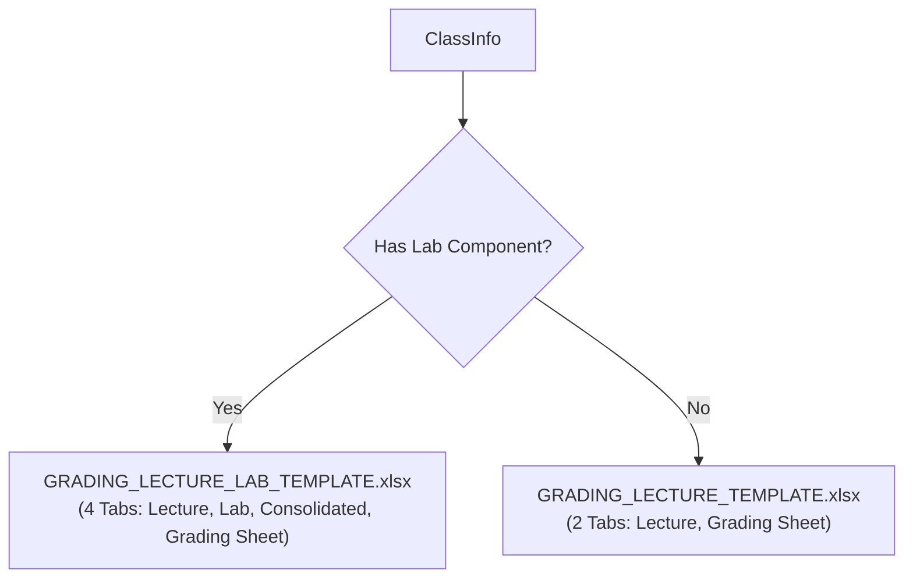

# Grading Generator

The **Grading Generator** (`modules/generators/grade_gen.py`) populates official CvSU Excel grade sheets while strictly maintaining workbook formula structures, conditional formatting, and multi-tab architectures.

Related notes:
- [[CvSU Document Generator MOC]]
- [[Generators Overview]]
- [[Grading Templates]]
- [[Template Guidelines]]

---

## 📊 Template Selection

The generator automatically selects between two master templates based on the subject's lab hours and department directory:



The Lab Component check is evaluated in the Orchestrator with the following priority:
1. `type_overrides` configuration from UI.
2. `LAB` or `LABORATORY` in the subject name string.
3. Schedule block explicitly labeled as `LAB`.
4. `KNOWN_LAB_SUBJECT_CODES` check (e.g. `ITEC 50`) stored in the JSON configuration.

---

## 🔒 Formula & Cell Integrity Rules

1. **`openpyxl` with `data_only=False`**:
   - The template workbook is loaded with formulas enabled so Excel formula definitions (`SUM`, `AVERAGE`, `VLOOKUP`, transmutation formulas) are preserved when the file is saved.
2. **Student Row Insertion**:
   - Locates student entry coordinates (starting at Row 11).
   - Writes Student Number into Column B and Student Name into Column C.
   - Preserves formula references in grading columns across all worksheet tabs.
3. **Metadata Headers**:
   - Updates official college banner, course code, section, semester, academic year, and instructor name.
4. **Signatures**:
   - Injects the instructor's name into the instructor signature block and department chairperson into the reviewer block.

---

## 📁 Output Location & Naming

Grading spreadsheets are saved in the root folder of each class section:
```text
<Output Directory>/<Course_Section>/Grades/<Course_Sec>_<SchedCode>_GRADING_SHEET.xlsx
```
*(Note: Output paths are sanitized to replace invalid characters like slashes before file writes).*
