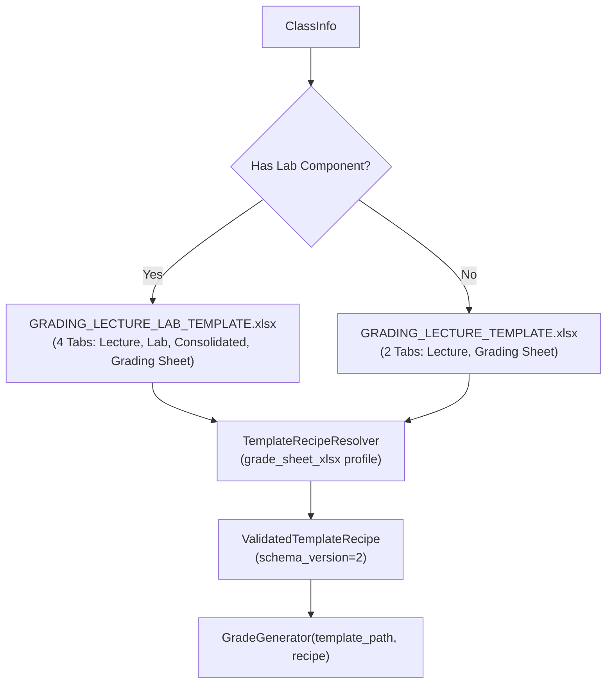

# Grading Generator

The **Grading Generator** (`modules/generators/grade_gen.py`) populates official CvSU Excel grade sheets using pure recipe-driven execution. It strictly maintains workbook formula structures, conditional formatting, multi-tab architectures, and dynamic student row capacities without hardcoded cell coordinates.

Related notes:
- [[CvSU Document Generator MOC]]
- [[Generators Overview]]
- [[Template Discovery Pipeline]]
- [[Grading Templates]]
- [[Template Guidelines]]

---

## 📊 Template Selection & Lifecycle

The generator uses business logic in `orchestrator.py` to select template identity, then resolves the validated recipe through `TemplateRecipeResolver`:



The Lab Component check is evaluated in the Orchestrator with the following priority:
1. `type_overrides` configuration from UI.
2. `LAB` or `LABORATORY` in the subject name string.
3. Schedule block explicitly labeled as `LAB`.
4. `KNOWN_LAB_SUBJECT_CODES` check (e.g. `ITEC 50`) stored in the JSON configuration.

---

## 🔒 Recipe-Driven Discovery & Cell Integrity Rules

1. **`openpyxl` with `data_only=False`**:
   - The template workbook is loaded with formulas enabled so Excel formula definitions (`SUM`, `AVERAGE`, `VLOOKUP`, transmutation formulas) are preserved when the file is saved.
2. **Dynamic Header Metadata**:
   - Discrete header fields are mapped through `recipe.header_bindings`:
     - Schedule Code (`C1`), Course & Section (`M1`), Subject Code (`C2`), Semester (`M2`), Subject Title (`C3`), School Year (`M3`), Units (`C4`), Instructor (`M4`).
     - Institutional College banner is discovered dynamically (`Grading Sheet!A9`).
3. **Student Roster & Capacity Enforcement**:
   - Student starting row is derived from `recipe.roster_binding.first_data_row_index` (Row 11 for lecture only, Row 12 for lecture/lab).
   - Writes Student Name into Column B and Student Number into Column C.
   - Enforces `capacity_limit` (40 students max based on template formulas). Students exceeding capacity are clamped and never overwrite footer summary formulas.
4. **Structural Merged Cell Signature Discovery (Mutation M8)**:
   - Instructor signature target (`BI57` in Lecture, `AO59` in Lab, `J56` in Consolidated) is discovered by identifying the merged label range containing `"INSTRUCTOR"` (`BI60:BR62`), and scanning for the merged block directly above it (`min_col == label.min_col`, `max_col == label.max_col`, `max_row == label.min_row - 1`). Discovery is purely structural and does not rely on a naive row offset.

---

## 📁 Output Location & Naming

Grading spreadsheets are saved in the root folder of each class section:
```text
<Output Directory>/<Course_Section>/Grades/<Course_Sec>_<SchedCode>_GRADING_SHEET.xlsx
```
*(Note: Output paths are sanitized to replace invalid characters like slashes before file writes).*
