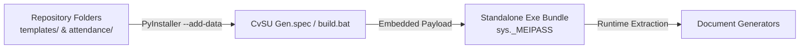

# Template Guidelines

This note details architectural standards, packaging requirements, and auto-scaling rules for templates used across the application.

Related notes:
- [[CvSU Document Generator MOC]]
- [[CEIT Templates]]
- [[Attendance Templates]]
- [[Grading Templates]]
- [[Generators Overview]]

---

## 🏛️ Template Storage & Packaging



1. **Repository Layout**:
   - Academic forms (`.docx`) and Grade Sheets (`.xlsx`): Placed in `templates/`.
   - Attendance templates (`.docx`): Placed in `attendance/`.
2. **Bundling Rules**:
   - `build.bat` and `CvSU Gen.spec` embed both directories using:
     ```text
     --add-data "..\templates;templates/"
     --add-data "..\attendance;attendance/"
     ```
3. **Template Immutability**:
   - Master templates must never be modified in-place or overwritten during execution.
   - All document generation reads master templates into memory and saves to new files in the user's selected output destination.
4. **Custom User Templates**:
   - Registered at runtime by the user via the `TemplateMixin` API.
   - Files are physically copied to the `%APPDATA%/CVSU_Generators/templates/` application data directory.
   - Not bundled in the executable; they persist locally per-user.

---

## 📏 Auto-Scaling & Formatting Safeguards

### Long Student Names
Filipino names and long surnames often wrap awkwardly on standard 1-page administrative tables. The application enforces a strict threshold in `modules.common.docx_utils:set_cell_text`:
```python
set_cell_text(cell, name, shrink_threshold=32, shrink_sz="18")
```
- Strings $\le 32$ characters retain default template font size (typically 10pt or 11pt).
- Strings $> 32$ characters automatically scale down to 9pt (`sz="18"` in OpenXML) to prevent breaking table height.

### Table Row Cloning
When generating student rosters, the engines isolate a "template row" from the master template table.
- To prevent template placeholder text from ghosting or artifacting into the generated file, the engine explicitly clears all `<w:t>` (text) nodes in the cloned row's XML before injecting student data.
