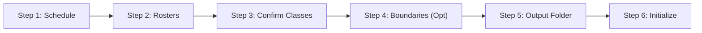

# User Manual

A complete guide for faculty members using the **CvSU Document Generator** desktop application.

Related notes:
- [[CvSU Document Generator MOC]]
- [[Input File Conventions]]
- [[Troubleshooting]]
- [[v1.0.1]]

---

## 💻 System Requirements

- **Operating System**: Windows 10 or Windows 11 (64-bit).
- **Dependencies**: **None**. Fully standalone portable executable (`CvSU Gen.exe`) with embedded runtime. No Python installation required.
- **Microsoft Edge WebView2 Runtime**: Required system prerequisite. Included with Windows 11; present on most Windows 10 installations (version 1803+ with November 2022 update baseline), though some LTSC, managed, or clean setups may lack it. Missing runtime must be detected or reported by the system (no automatic installer is bundled).
- **.NET Framework 4.7.2+**: Supported Windows baseline required for the native desktop window host and drag-and-drop integration. While Python.NET supports older versions, 4.7.2+ is the repository's verified baseline.
- **Office Software**: Microsoft Word & Excel or any compatible office suite (only required to view and edit generated documents; the generator itself creates files natively).

---

## 🚀 The 6-Step Workflow

### Step 1: Select Instructor Schedule
Click **"Browse File"** under Section 1 or drag and drop your master schedule file (`.xls` or `.xlsx`) directly onto the application window. The system extracts your instructor name, college header, semester, and schedule blocks.

### Step 2: Select Student Rosters
Click **"Browse Data"** under Section 2 or drag and drop all class rosters (`.xlsx` or `.csv`). You can multi-select files or drop entire batches at once. If any files are missing the standard portal naming pattern, use the dropdown menus to manually link them to the correct schedule code.

### Step 3: Confirm Detected Classes & Subject Types
Review the detected sections. For each class:
- **Lecture only**: Uses `GRADING_LECTURE_TEMPLATE.xlsx`.
- **Lecture and Lab**: Uses `GRADING_LECTURE_LAB_TEMPLATE.xlsx`.
Use the dropdown selector to manually override the auto-detected classification if needed.

### Step 4: (Optional) Set Semester Date Boundaries
Select a **Start Date** and **End Date** if you want attendance logs to cover a specific window. Leaving this blank defaults to the full institutional semester calendar.

### Step 5: Choose Target Output Folder
Click **"Browse Path"** and choose any directory on your drive where the output folders should be generated.

### Step 6: Initialize Workflow
Click **"Initialize Workflow"**. Real-time progress is displayed with animated status indicators. You can click **"Cancel Generation"** at any moment to abort processing safely. Output files that are already completed will remain intact on your drive.
