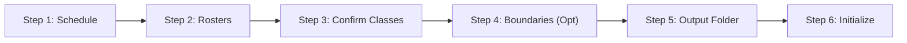

# User Manual

A complete guide for faculty members using the **CvSU Document Generator** desktop application.

Related notes:
- [[CvSU Document Generator MOC]]
- [[Input File Conventions]]
- [[Troubleshooting]]
- [[v1.0.1]]

---

## 💻 System Requirements

- **Operating System**: Windows 10 or Windows 11 (64-bit).
- **Dependencies**: **None**. Fully standalone portable executable.
- **Office Software**: Microsoft Word & Excel or any compatible suite.

---

## 🚀 The 6-Step Workflow

### Step 1: Select Instructor Schedule
Click **"Browse File"** under Section 1 and select your master schedule file (`.xls` or `.xlsx`). The system extracts your instructor name, college header, semester, and schedule blocks.

### Step 2: Select Student Rosters
Click **"Browse Data"** under Section 2 or drag and drop files onto the dropzone. You can multi-select all class rosters at once (`Ctrl+A`).

### Step 3: Confirm Detected Classes & Subject Types
Review the detected sections. For each class:
- **Lecture only**: Uses `GRADING_LECTURE_TEMPLATE.xlsx`.
- **Lecture and Lab**: Uses `GRADING_LECTURE_LAB_TEMPLATE.xlsx`.
Use the dropdown selector to change course classification if needed.

### Step 4: (Optional) Set Semester Date Boundaries
Select a **Start Date** and **End Date** if you want attendance logs to cover a specific window. Leaving this blank defaults to the full institutional semester calendar.

### Step 5: Choose Target Output Folder
Click **"Browse Path"** and choose any directory on your drive where the output folders should be generated.

### Step 6: Initialize Workflow
Click **"Initialize Workflow"**. Real-time progress is displayed with animated status indicators. You can click **"Cancel Generation"** at any moment to abort processing safely.
