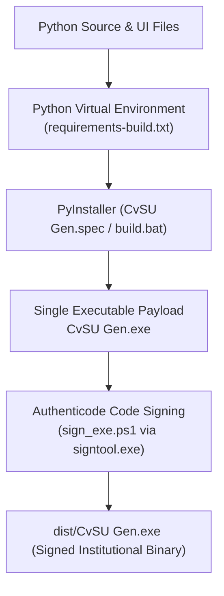

# Build & Packaging

This note documents the process for packaging the Python codebase into a standalone, single-file Windows executable (`CvSU Gen.exe`) with embedded PE version information and Authenticode code signing.

Related notes:
- [[CvSU Document Generator MOC]]
- [[Development Workflow]]
- [[Testing Strategy]]
- [[Troubleshooting]]
- [[UI Architecture]]

---

## 📦 PyInstaller Packaging Workflow

The build workflow is driven by `executable_test/build.bat`:



### 1. Embedded Metadata (`file_version_info.txt`)
Contains official PE version details:
- **Company / Author**: Dan Joseph Ortega
- **Legal Copyright**: `Copyright © 2026 Dan Joseph Ortega. All rights reserved.`
- **Product Name**: CvSU Document Generator
- **Version**: Synchronized with `ui.html` badge (e.g. `1.1.0.0`).

### 2. PyInstaller Configuration (`CvSU Gen.spec`)
- `--onefile`: Generates a single standalone binary.
- `--windowed`: Suppresses the console window.
- `--add-data`: Bundles `ui.html`, `css/`, `js/`, `templates/`, and `attendance/`.
- `--collect-submodules modules`: Ensures all dynamic generator imports are packaged.
- `--hidden-import pycparser.lextab --hidden-import pycparser.yacctab`: Required by `cffi`/`pythonnet`.
- **Runtime Unpacking & `file:///` Resolution**: In the packaged binary, PyInstaller unpacks bundled resources into a transient directory (`sys._MEIPASS`). Because the application addresses assets using resolved file URIs (`Path(html_template).resolve().as_uri()`), WebView2 accesses the unpacked files directly via `file:///`, completely avoiding the need to bind a localhost HTTP socket inside the packaged executable.

### 3. Windows System Prerequisites & Packaging Dependencies
The standalone binary executes without requiring a local Python interpreter, but depends on the following host environment baseline:
- **Microsoft Edge WebView2 Runtime**: Required system prerequisite. WebView2 is included with Windows 11; Microsoft documents Windows 10 v1803+ with the November 2022 update as the pre-installed baseline. However, some Windows 10, LTSC, managed, or clean systems may lack the Runtime. The application currently has no verified automated bootstrapper implementation; missing-runtime handling must be detected and reported by the system.
- **.NET Framework 4.7.2+ Baseline**: Supported Windows baseline required for the Python.NET (`pythonnet`) `System.Windows.Forms` native desktop host and OLE drag-and-drop subsystem (`executable_test/native/dnd.py`). While Python.NET itself supports older runtimes and pywebview 6.2+ has a CoreCLR fallback, CvSU Generators' own `System.Windows.Forms` / native DnD path has not been established as CoreCLR-compatible; .NET Framework 4.7.2+ is the repository's supported baseline.
- **Packaging Manifest (`requirements-build.txt`)**: Bundles `pyinstaller==6.22.2` alongside core production runtime dependencies. `executable_test/requirements-build.txt` acts as a forwarding manifest (`-r ../requirements-build.txt`). Extraneous packages (`pypiwin32` and `python-docx`) are strictly excluded from packaging.

### 4. Authenticode Code Signing (`sign_exe.ps1`)
Digitally signs `dist/CvSU Gen.exe` using `signtool.exe` with Dan Joseph Ortega's institutional code signing certificate and RFC 3161 timestamping:
```powershell
signtool.exe sign /fd SHA256 /a /tr http://timestamp.digicert.com /td SHA256 "dist\CvSU Gen.exe"
```
Ensures Windows UAC and SmartScreen prompts identify the verified publisher (`CN=Dan Joseph Ortega`).

> [!IMPORTANT]
> **PE Binary Signing vs. Git Commit Signing**:
> Windows PE Authenticode binary signing (applied to `.exe` files) and Git commit signing (applied to Git commits) are strictly separate mechanisms:
> - The compiled standalone executable `dist/CvSU Gen.exe` is signed with the institutional Authenticode certificate.
> - Git commits on GitHub are tracked independently and are not signed with PE certificates.
