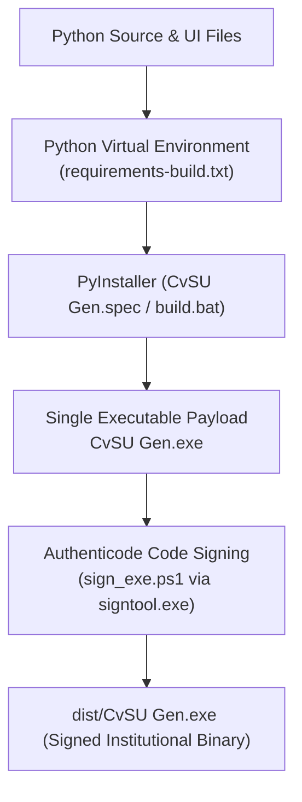

# Build & Packaging

This note documents the process for packaging the Python codebase into a standalone, single-file Windows executable (`CvSU Gen.exe`) with embedded PE version information and Authenticode code signing.

Related notes:
- [[CvSU Document Generator MOC]]
- [[Development Workflow]]
- [[Testing Strategy]]
- [[Troubleshooting]]
- [[UI Architecture]]

---

## 📦 PyInstaller Packaging Workflow

The build workflow is driven by `executable_test/build.bat`:



### 1. Embedded Metadata (`file_version_info.txt`)
Contains official PE version details:
- **Company / Author**: Dan Joseph Ortega
- **Legal Copyright**: `Copyright © 2026 Dan Joseph Ortega. All rights reserved.`
- **Product Name**: CvSU Document Generator
- **Version**: Synchronized with `ui.html` badge (e.g. `1.0.1.0`).

### 2. PyInstaller Configuration (`CvSU Gen.spec`)
- `--onefile`: Generates a single standalone binary.
- `--windowed`: Suppresses the console window.
- `--add-data`: Bundles `ui.html`, `css/`, `js/`, `templates/`, and `attendance/`.
- `--collect-submodules modules`: Ensures all dynamic generator imports are packaged.
- **Runtime Unpacking & `file:///` Resolution**: In the packaged binary, PyInstaller unpacks bundled resources into a transient directory (`sys._MEIPASS`). Because the application addresses assets using resolved file URIs (`Path(html_template).resolve().as_uri()`), WebView2 accesses the unpacked files directly via `file:///`, completely avoiding the need to bind a localhost HTTP socket inside the packaged executable.

### 3. WebView2 Runtime Dependency Mechanics
The application relies on `pywebview` using the Edge/WebView2 rendering engine on Windows.
- Windows 11 and up-to-date Windows 10 machines include the WebView2 Evergreen Bootstrapper natively.
- If WebView2 is missing, `pywebview` will attempt to automatically download and install the Evergreen Runtime when the application first starts.
- Because of this behavior, the PyInstaller bundle (`CvSU Gen.exe`) does not need to embed the full multi-hundred megabyte WebView2 fixed runtime, keeping the executable size small.

### 4. Authenticode Code Signing (`sign_exe.ps1`)
Digitally signs `dist/CvSU Gen.exe` using `signtool.exe` with Dan Joseph Ortega's institutional code signing certificate and RFC 3161 timestamping:
```powershell
signtool.exe sign /fd SHA256 /a /tr http://timestamp.digicert.com /td SHA256 "dist\CvSU Gen.exe"
```
Ensures Windows UAC and SmartScreen prompts identify the verified publisher (`CN=Dan Joseph Ortega`).

> [!IMPORTANT]
> **PE Binary Signing vs. Git Commit Signing**:
> Windows PE Authenticode binary signing (applied to `.exe` files) and Git commit signing (applied to Git commits) are strictly separate mechanisms:
> - The compiled standalone executable `dist/CvSU Gen.exe` is signed with the institutional Authenticode certificate.
> - Git commits on GitHub are tracked independently and are not signed with PE certificates.
