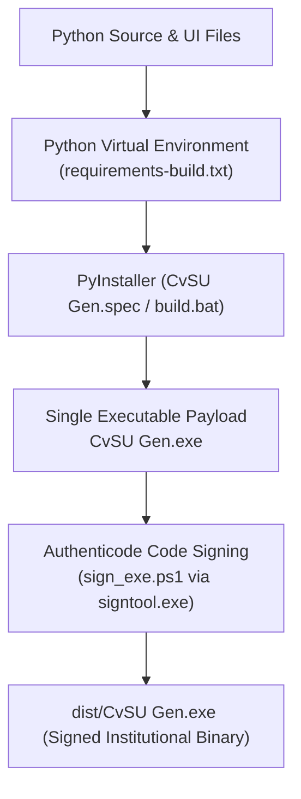

# Build & Packaging

This note documents the process for packaging the Python codebase into a standalone, single-file Windows executable (`CvSU Gen.exe`) with embedded PE version information and Authenticode code signing.

Related notes:
- [[CvSU Document Generator MOC]]
- [[Development Workflow]]
- [[Testing Strategy]]
- [[Troubleshooting]]

---

## 📦 PyInstaller Packaging Workflow

The build workflow is driven by `executable_test/build.bat`:



### 1. Embedded Metadata (`file_version_info.txt`)
Contains official PE version details:
- **Company / Author**: Dan Joseph Ortega
- **Legal Copyright**: `Copyright © 2026 Dan Joseph Ortega. All rights reserved.`
- **Product Name**: CvSU Document Generator
- **Version**: Synchronized with `ui.html` badge (e.g. `1.0.1.0`).

### 2. PyInstaller Configuration (`CvSU Gen.spec`)
- `--onefile`: Generates a single standalone binary.
- `--windowed`: Suppresses the console window.
- `--add-data`: Bundles `ui.html`, `css/`, `js/`, `templates/`, and `attendance/`.
- `--collect-submodules modules`: Ensures all dynamic generator imports are packaged.

### 3. Authenticode Code Signing (`sign_exe.ps1`)
Digitally signs `dist/CvSU Gen.exe` using `signtool.exe` with Dan Joseph Ortega's institutional code signing certificate and RFC 3161 timestamping:
```powershell
signtool.exe sign /fd SHA256 /a /tr http://timestamp.digicert.com /td SHA256 "dist\CvSU Gen.exe"
```
Ensures Windows UAC and SmartScreen prompts identify the verified publisher.
