# Testing Strategy

Comprehensive testing philosophy and automated test suites for the **CvSU Document Generator**.

Related notes:
- [[CvSU Document Generator MOC]]
- [[Development Workflow]]
- [[Build & Packaging]]
- [[UI Architecture]]
- [[PyWebView Bridge]]

---

## 📁 Tests Location Rule

All automated tests, fixtures, mocks, regression scripts, and verification utilities must be placed in `tests/`. No test scripts are permitted in the project root.

---

## 🧪 Test Suite Categories

```mermaid
graph TD
    Tests["tests/ Suite"] --> Unit["Unit & Parsing Tests"]
    Tests --> DocxXlsx["Generator & Template Tests"]
    Tests --> Integ["UI Bridge & Consistency Tests"]
    Tests --> Resilience["UI Resilience & Transport Tests"]
    Tests --> Diag["Diagnostic Hook Tests"]
    Tests --> E2E["Playwright Browser Tests"]
    Tests --> Lifecycle["Native PyWebView Lifecycle Tests"]
    Tests --> Build["PyInstaller Executable Tests"]
    Tests --> Manifests["Dependency Manifest Tests"]
    Tests --> Vault["Obsidian Vault Integrity Tests"]

    Unit --> T1["test_modules_parsing.py<br>test_roster_parser.py"]
    DocxXlsx --> T2["test_modules_generation.py<br>test_grade_generator.py"]
    Integ --> T3["test_ui_consistency.py<br>test_executable_test_api_bindings.py"]
    Resilience --> T4["test_ui_asset_resilience.py"]
    Diag --> T5["test_diagnostic_probe.py"]
    E2E --> T6["test_playwright_*.py"]
    Lifecycle --> T7["test_executable_lifecycle.py"]
    Build --> T8["test_pe_version_info.py"]
    Manifests --> T9["test_dependency_manifests.py"]
    Vault --> T10["test_obsidian_vault_integrity.py"]
```




### 1. Fast Unit & Integration Testing
```bash
pytest tests/ -k "not test_playwright"
```
Runs automated unit tests covering parser edge cases, name shrinking thresholds, schedule tokenization, and UI consistency checks in under 20 seconds.

### 2. UI Consistency & Bridge Mock Testing (`test_ui_consistency.py`, `test_executable_test_api_bindings.py`)
Validates that:
- All step titles and button action names in `ui.html` match `executable_test/README.md`.
- All `getElementById` calls in JavaScript exist in `ui.html`.
- Release version badge in header matches the expected current release.
- Python API mixin methods correctly resolve to JavaScript window binding properties (`window.pywebview.api`).

### 3. UI Asset Resilience & Transport Testing (`tests/test_ui_asset_resilience.py`)
Registered under the custom `@pytest.mark.desktop_integration` marker in `pytest.ini`. Validates:
- **Critical Inline Failsafe**: Asserts that `ui.html` contains the inline `<style>.d-none { display: none !important; }</style>` in `<head>`.
- **CSS Architecture Coverage**: Verifies that `.d-none` is defined in `base.css`, component styles reside in `components.css`, and `drawers.css` maintains isolated rules.
- **URI Transport Resolution**: Confirms that document URLs resolve to explicit `file:///` URIs rather than `http://localhost`.
- **Lifecycle Sentinels**: Verifies that `app.js` defines `bootstrapApp()` and inspects `document.readyState`.

### 4. Diagnostic Hook & Probe Testing (`tests/test_diagnostic_probe.py`)
Validates the diagnostic tracing subsystem in `executable_test/main.py`:
- **Zero-I/O Fast Path**: Asserts that `on_request` and `on_response` callbacks perform zero synchronous filesystem `open()` calls and zero JSON serialization.
- **Callback Signature Conformance**: Asserts that `on_response(response)` accepts exactly one argument matching PyWebView 6.2.1 dispatch and extracts `response.status_code`.
- **Production Dormancy**: Verifies that when `CVSU_DIAGNOSTIC_MODE` is unset or `"0"`, diagnostic listeners and flusher threads are not installed.

### 5. Playwright UI Browser Testing
Validates the user interface within a real browser engine, testing file drag-and-drop ingestion, stepper navigation, theme switching performance, and modal interaction:
```bash
# Browser prerequisite: install Chromium binary
python -m playwright install chromium

# Execute complete Playwright UI test suite
pytest tests/test_playwright_*.py
```
> [!NOTE]
> **Separation of Testing Concerns**:
> Playwright UI tests run in headless Chromium against the mock bridge (`MOCK_API_INIT_SCRIPT`). They are strictly separate from native desktop pywebview lifecycle testing.

### 6. Native Desktop PyWebView Lifecycle Testing (`tests/test_executable_lifecycle.py`)
Validates actual native `pywebview` window creation, WinForms thread dispatch, event loops, and clean termination without hanging threads or orphaned processes.

### 7. PyInstaller Build & Packaged Smoke Tests (`test_pe_version_info.py`, `test_packaged_executable_smoke.py`)
Validates the executable packaging output:
- Ensures the generated `CvSU Gen.exe` contains the correct FileVersion, ProductVersion, and Copyright metadata.
- Validates the PE (Portable Executable) headers using `pefile`.
- Verifies packaged executable live launch, 2-second startup stability, and process tree termination.

### 8. Dependency Architecture & Manifest Testing (`tests/test_dependency_manifests.py`)
Validates that:
- All four manifests (`requirements-runtime.txt`, `requirements-test.txt`, `requirements-build.txt`, `requirements.txt`) and `executable_test/requirements-build.txt` exist.
- All production third-party imports in `modules/` and `executable_test/` map via explicit `IMPORT_TO_DIST` to packages declared in `requirements-runtime.txt`.
- All direct package declarations in runtime, test, and build manifests use exact pins (`==`), while aggregate `requirements.txt` contains `-r` forwarding lines.
- The complete normalized forbidden distribution set (PEP 503 canonicalized: `pypiwin32`, `pywin32`, `pytest-mock`, `pytest-playwright`, `pandas`, `numpy`, `pillow`, `pyqt5`, `pyqt6`, `pyside2`, `pyside6`, `pywinauto`) is strictly absent from all manifests.
- Packaging identity precision: asserts that legitimate transitive dependencies like `pywin32-ctypes` are not falsely rejected by `pywin32` exclusion.
- `python-docx` is strictly a test dependency.
- `executable_test/requirements-build.txt` forwards to `../requirements-build.txt`, validated via static path resolution and pip dry-run direct-requirement / forwarding-manifest validation (`pip install --dry-run --no-deps`).

### 9. Obsidian Documentation Vault Integrity (`test_obsidian_vault_integrity.py`)
Validates that all documentation notes in `cvsu-generator_documentation`:
- Exist in their required folders (`00` to `06`).
- Contain valid YAML frontmatter (`title`, `status`, `last_modified`, `source_of_truth`).
- Have valid wikilinks with zero broken targets.

