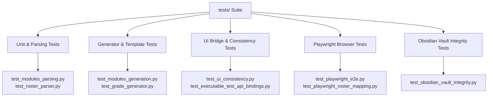

# Testing Strategy

Comprehensive testing philosophy and automated test suites for the **CvSU Document Generator**.

Related notes:
- [[CvSU Document Generator MOC]]
- [[Development Workflow]]
- [[Build & Packaging]]

---

## 📁 Tests Location Rule

All automated tests, fixtures, mocks, regression scripts, and verification utilities must be placed in `tests/`. No test scripts are permitted in the project root.

---

## 🧪 Test Suite Categories



### 1. Fast Unit & Integration Testing
```bash
pytest tests/ -k "not test_playwright"
```
Runs ~200 automated unit tests covering parser edge cases, name shrinking thresholds, schedule tokenization, and UI consistency checks in under 20 seconds.

### 2. UI Consistency Test (`test_ui_consistency.py`)
Validates that:
- All step titles and button action names in `ui.html` match `executable_test/README.md`.
- All `getElementById` calls in JavaScript exist in `ui.html`.
- Release version badge in header matches the expected current release.

### 3. Playwright End-to-End Testing
```bash
pytest tests/test_playwright_e2e.py
```
Validates the UI in an actual browser engine, testing file drag-and-drop ingestion, stepper navigation, theme switching performance, and modal interaction.

### 4. Obsidian Documentation Vault Integrity (`test_obsidian_vault_integrity.py`)
Validates that all documentation notes in `cvsu-generator_documentation`:
- Exist in their required folders (`00` to `06`).
- Contain valid YAML frontmatter (`title`, `status`, `last_modified`, `source_of_truth`).
- Have valid wikilinks with zero broken targets.
